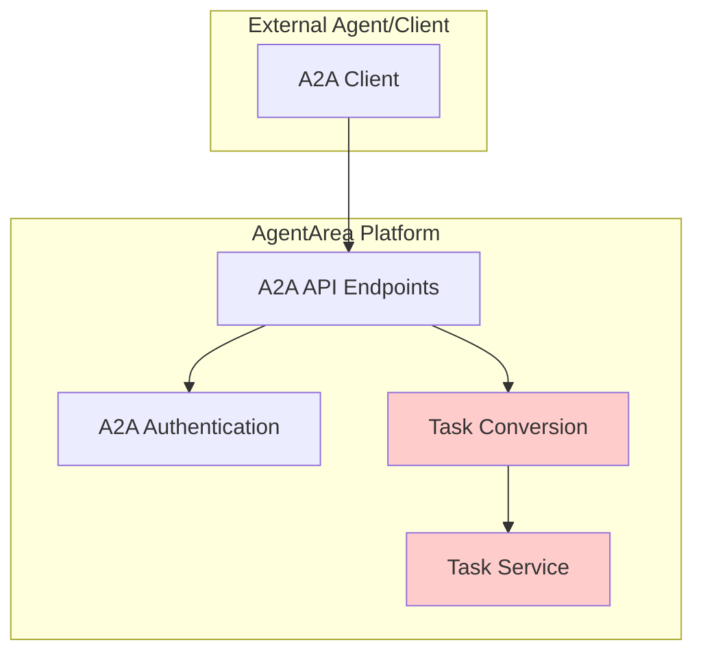
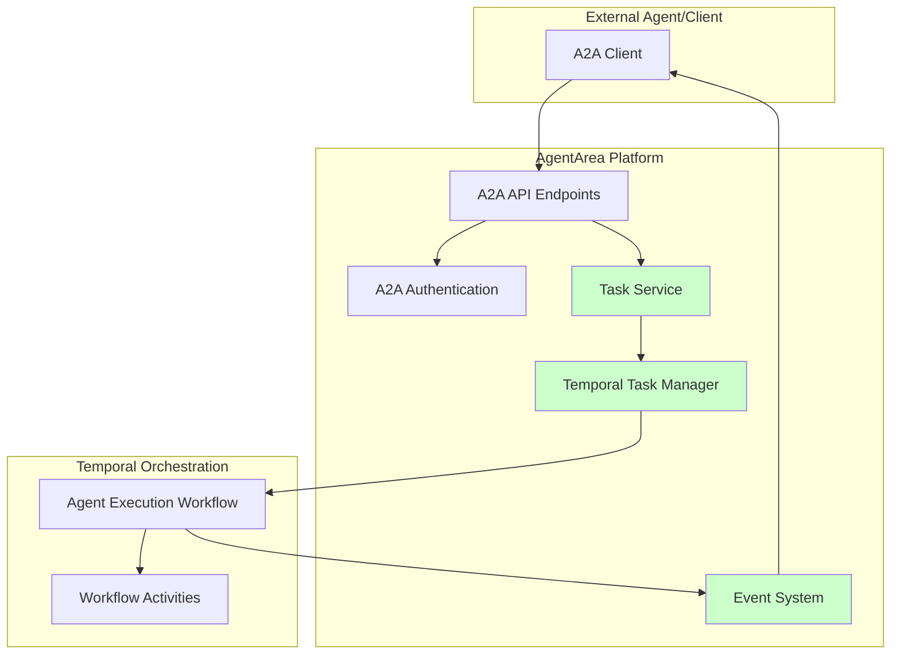

# Design Document

## Overview

The A2A Protocol endpoints are already implemented in AgentArea but need to be properly integrated with the task system and Temporal workflows to function correctly. The existing implementation includes:

- **A2A API endpoints** (`/agents/{agent_id}/a2a/rpc`) with JSON-RPC protocol support
- **Authentication and authorization** system for A2A communications  
- **Agent discovery** via well-known endpoints
- **Basic task conversion** from A2A messages to SimpleTask objects

**Current Issues:**
- A2A endpoints create tasks but don't properly integrate with Temporal workflows
- Task streaming through A2A endpoints is not working correctly
- A2A task execution doesn't use the existing task orchestration system
- Missing proper event publishing for A2A-created tasks

**Goal:** Make the existing A2A endpoints work seamlessly with the task system, Temporal workflows, and event streaming infrastructure.

## Architecture

### Current A2A Flow (What Exists)



### Target A2A Flow (What We Need)



### Integration Points

1. **A2A → Task Service**: A2A endpoints create tasks through the existing TaskService
2. **Task Service → Temporal**: Tasks are executed via Temporal workflows  
3. **Temporal → Events**: Workflow events are published for A2A streaming
4. **Events → A2A**: A2A endpoints stream events back to clients

## Components and Interfaces

### 1. A2A API Endpoints (Existing - Fix Integration)

The existing A2A endpoints need to be properly integrated with the task system:

#### Current Implementation Issues
- `handle_task_send()` and `handle_message_send()` create SimpleTask objects but don't use TaskService properly
- `handle_message_stream_sse()` returns fake streaming data instead of real task events
- Task execution doesn't go through Temporal workflows
- No proper event publishing for A2A-created tasks

#### Required Fixes
```python
# In agents_a2a.py - Fix task submission
async def handle_task_send(request_id, params, task_service, agent_id):
    # Create task using TaskService.submit_task() instead of direct creation
    # This ensures Temporal workflow execution
    
async def handle_message_stream_sse(request, request_id, params, task_service, agent_id):
    # Use TaskService.stream_task_events() for real event streaming
    # Remove fake event generation
```

### 2. Task Service Integration (Enhance Existing)

#### TaskService Enhancements
The existing TaskService needs minor enhancements to support A2A:
- Ensure A2A-created tasks are properly submitted to Temporal
- Add A2A metadata to task creation
- Support A2A-specific task parameters

```python
# Enhanced task creation for A2A
async def create_a2a_task(
    self,
    agent_id: UUID,
    message_content: str,
    a2a_metadata: dict = None
) -> SimpleTask:
    """Create task from A2A message with proper metadata."""
```

### 3. Event Streaming Integration (Use Existing)

#### Current Event System
The platform already has comprehensive event streaming via:
- `TaskService.stream_task_events()` for real-time task events
- Redis pub/sub for event distribution
- SSE endpoints for client streaming

#### A2A Integration
A2A endpoints need to use the existing event streaming system:
- Connect A2A streaming endpoints to TaskService event streams
- Ensure A2A tasks publish events through the existing workflow system
- Format events appropriately for A2A protocol responses

### 4. Temporal Workflow Integration (Use Existing)

#### Current Workflow System
The existing `AgentExecutionWorkflow` already handles:
- Task execution through Temporal
- Event publishing during execution
- Tool execution and LLM calls
- Error handling and retries

#### A2A Integration
A2A tasks should use the existing workflow system:
- A2A-created tasks go through the same Temporal workflows
- No special A2A workflow activities needed initially
- Existing event publishing works for A2A streaming

## Data Models

### Use Existing A2A Protocol Models

The A2A protocol already has standardized models defined in `agentarea_common.utils.types`:

#### JSON-RPC Models (Existing)
- `JSONRPCRequest` / `JSONRPCResponse` - Base JSON-RPCprotocol
- `MessageSendParams` / `MessageSendResponse` - Message sending
- `TaskSendParams` / `SendTaskResponse` - Task delegation
- `GetTaskResponse` / `CancelTaskResponse` - Task management
- `AgentCard` - Agent discovery information

#### Message Models (Existing)
- `Message` - Core message structure with role and parts
- `TextPart` / `FilePart` / `DataPart` - Message content types
- `Task` / `TaskStatus` - Task representation and status

#### Integration with SimpleTask

A2A-created tasks will use the existing `SimpleTask` model with metadata:

```python
# A2A task creation
task = SimpleTask(
    title="A2A Message Task",
    description="Task created from A2A message",
    query=message_content,
    user_id="a2a_user",  # or from auth context
    agent_id=agent_id,
    status="submitted",
    task_parameters={},
    metadata={
        "source": "a2a",
        "a2a_method": "message/send",  # or "tasks/send"
        "a2a_request_id": request_id,
        # Additional A2A-specific metadata
    }
)
```

No custom A2A models needed - use the existing protocol-compliant types.

## Error Handling

### Current Error Handling Issues

1. **Task Creation Failures**
   - A2A endpoints don't properly handle task creation errors
   - Missing validation of agent existence before task creation
   - No proper error responses for invalid requests

2. **Streaming Failures**
   - Fake streaming implementation doesn't handle real errors
   - No connection cleanup on client disconnect
   - Missing timeout handling for long-running tasks

3. **Authentication Failures**
   - Already properly handled by existing A2A auth system
   - Need to ensure error responses follow JSON-RPC format

### Required Error Handling Improvements

```python
# Proper error handling in A2A endpoints
async def handle_task_send(request_id, params, task_service, agent_id):
    try:
        # Validate agent exists
        # Create task through TaskService
        # Handle Temporal submission errors
        return success_response
    except ValueError as e:
        return JSONRPCResponse(
            jsonrpc="2.0",
            id=request_id,
            error={"code": -32602, "message": f"Invalid parameters: {e}"}
        )
    except Exception as e:
        return JSONRPCResponse(
            jsonrpc="2.0", 
            id=request_id,
            error={"code": -32603, "message": f"Internal error: {e}"}
        )
```

## Testing Strategy

### Integration Testing Focus
Since we're fixing existing endpoints, focus on integration testing:

1. **A2A Task Creation**
   - Test A2A endpoints create tasks through TaskService
   - Verify tasks are submitted to Temporal workflows
   - Validate task metadata includes A2A information

2. **A2A Task Streaming**
   - Test A2A streaming endpoints return real task events
   - Verify event format matches A2A protocol expectations
   - Test connection handling and cleanup

3. **A2A Authentication**
   - Test existing authentication continues to work
   - Verify error responses follow JSON-RPC format
   - Test permission enforcement

### Test Scenarios

1. **Basic A2A Task Execution**
   - Send task via A2A endpoint
   - Verify task executes through Temporal workflow
   - Check task completion and result

2. **A2A Task Streaming**
   - Send task via A2A streaming endpoint
   - Verify real-time events are streamed
   - Test client disconnect handling

3. **Error Scenarios**
   - Invalid agent ID
   - Authentication failures
   - Task execution failures
   - Streaming connection errors

## Security Considerations

### Existing Security (Keep)
The current A2A implementation already has:
- Bearer token and API key authentication
- Permission-based authorization (read, write, execute, stream, admin)
- Agent existence validation
- Request validation and sanitization

### Security Enhancements Needed
- Ensure A2A-created tasks inherit proper user context
- Add rate limiting for A2A endpoints
- Improve audit logging for A2A task creation
- Validate task parameters from A2A requests

## Performance Considerations

### Current Performance Issues
- A2A endpoints don't use connection pooling for task service calls
- Fake streaming implementation wastes resources
- No timeout handling for long-running A2A tasks

### Performance Improvements
- Use existing TaskService connection pooling
- Implement proper streaming with connection management
- Add timeout configuration for A2A tasks
- Reuse existing Redis connections for event streaming

## Monitoring and Observability

### Use Existing Monitoring
The platform already has comprehensive monitoring:
- Task execution metrics and events
- Temporal workflow monitoring
- Redis event streaming metrics
- API endpoint monitoring

### A2A-Specific Monitoring Needs
- Track A2A task creation rates
- Monitor A2A streaming connection health
- Log A2A authentication events
- Track A2A task success/failure rates

## Implementation Approach

### Fix Existing A2A Endpoints
1. **Fix Task Creation**: Update A2A endpoints to use TaskService.submit_task()
2. **Fix Task Streaming**: Replace fake streaming with real TaskService.stream_task_events()
3. **Fix Error Handling**: Improve error responses and validation
4. **Fix Integration**: Ensure A2A tasks go through Temporal workflows

### Backward Compatibility
- Keep existing A2A API interface unchanged
- Maintain JSON-RPC protocol compatibility
- Preserve authentication and authorization behavior

### Configuration
- No new configuration needed
- Use existing TaskService and Temporal configuration
- Reuse existing Redis and database connections