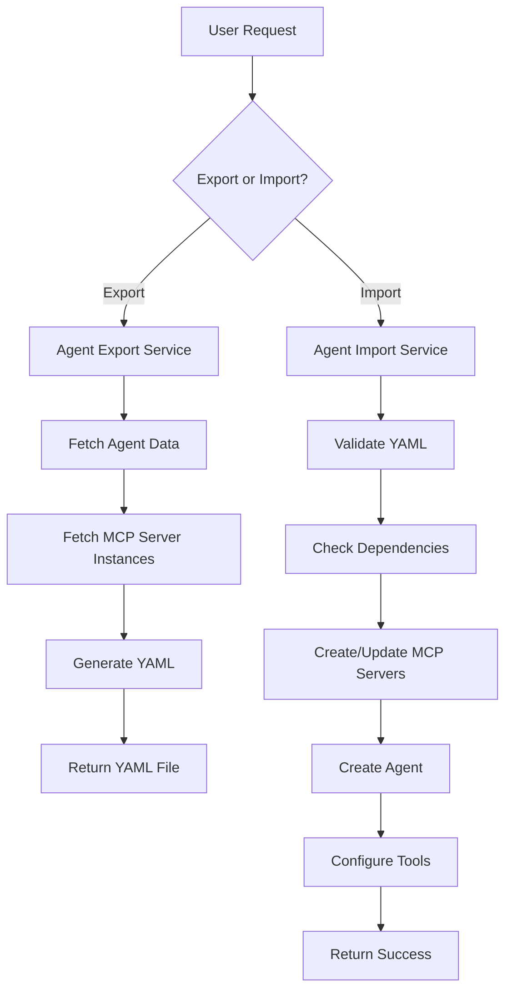

# Design Document

## Overview

The Agent Import/Export feature enables users to export agents with their complete configuration (including tools, MCP servers, and settings) to YAML format and import them back into the system. This design leverages the existing AgentArea architecture with FastAPI endpoints, domain services, and event-driven patterns to provide a robust and secure import/export mechanism.

## Architecture

### High-Level Flow



### Component Architecture

The feature integrates with existing AgentArea components:

- **API Layer**: New FastAPI endpoints for export/import operations
- **Application Layer**: Export/Import services orchestrating the process
- **Domain Layer**: YAML schema definitions and validation logic
- **Infrastructure Layer**: File handling and dependency resolution

## Components and Interfaces

### 1. API Endpoints

#### Export Endpoint
```python
@router.get("/agents/{agent_id}/export")
async def export_agent(
    agent_id: UUID,
    include_secrets: bool = False,
    format: str = "yaml"
) -> Response
```

#### Import Endpoint
```python
@router.post("/agents/import")
async def import_agent(
    file: UploadFile = None,
    yaml_content: str = None,
    overwrite_existing: bool = False,
    import_mode: str = "create"  # create, update, or merge
) -> AgentImportResponse
```

### 2. Service Layer

#### AgentExportService
```python
class AgentExportService:
    async def export_agent(
        self, 
        agent_id: UUID, 
        include_secrets: bool = False
    ) -> AgentExportData
    
    async def generate_yaml(
        self, 
        export_data: AgentExportData
    ) -> str
```

#### AgentImportService
```python
class AgentImportService:
    async def validate_yaml(self, yaml_content: str) -> ValidationResult
    
    async def import_agent(
        self, 
        import_data: AgentImportData,
        import_options: ImportOptions
    ) -> Agent
    
    async def resolve_dependencies(
        self, 
        import_data: AgentImportData
    ) -> DependencyResolution
```

### 3. Data Models

#### YAML Schema Structure
```yaml
# Agent Export Format v1.0
apiVersion: agentarea.io/v1
kind: Agent
metadata:
  name: "example-agent"
  description: "Example agent with tools"
  exportedAt: "2025-02-08T10:30:00Z"
  exportedBy: "user-id"
  version: "1.0.0"
  
spec:
  agent:
    name: "example-agent"
    description: "A helpful assistant"
    instruction: "You are a helpful AI assistant..."
    status: "active"
    planning: true
    
  model:
    modelId: "gpt-4"
    provider: "openai"
    # Model instance details will be resolved during import
    
  tools:
    builtin:
      - name: "calculator"
        enabled: true
        config:
          precision: 10
          
    mcp_servers:
      - name: "filesystem-server"
        description: "File system operations"
        spec:
          docker_image_url: "mcp/filesystem:latest"
          version: "1.0.0"
          env_schema:
            - name: "ROOT_PATH"
              description: "Root path for file operations"
              required: true
              type: "string"
        instance:
          name: "fs-instance-1"
          description: "File system instance"
          env_vars:
            ROOT_PATH: "/workspace"
          status: "running"
          
  events:
    triggers: []
    conditions: []
    
dependencies:
  mcp_servers:
    - name: "filesystem-server"
      required: true
      fallback_action: "create"
  secrets:
    - name: "OPENAI_API_KEY"
      required: true
      description: "OpenAI API key for model access"
```

#### Python Data Models
```python
@dataclass
class AgentExportData:
    metadata: ExportMetadata
    agent: AgentSpec
    model: ModelSpec
    tools: ToolsSpec
    events: EventsSpec
    dependencies: DependenciesSpec

@dataclass
class AgentImportData:
    api_version: str
    kind: str
    metadata: ImportMetadata
    spec: AgentSpec
    dependencies: DependenciesSpec
```

## Data Models

### Export Data Structure

The export process collects data from multiple sources:

1. **Agent Data**: From `agents` table via `AgentService`
2. **MCP Server Specs**: From `mcp_servers` table via `MCPServerService`  
3. **MCP Server Instances**: From `mcp_server_instances` table via `MCPServerInstanceService`
4. **Model Configuration**: From `model_instances` table via `ModelInstanceService`
5. **Tool Configuration**: From agent's `tools_config` JSON field

### Import Data Validation

The import process validates:

1. **Schema Validation**: YAML structure matches expected format
2. **Dependency Validation**: Required MCP servers and models exist or can be created
3. **Security Validation**: No sensitive data in unexpected places
4. **Compatibility Validation**: API version compatibility

## Error Handling

### Export Error Scenarios

1. **Agent Not Found**: Return 404 with clear message
2. **Permission Denied**: Return 403 if user lacks access
3. **Missing Dependencies**: Include warnings in export metadata
4. **Serialization Errors**: Return 500 with technical details

### Import Error Scenarios

1. **Invalid YAML**: Return validation errors with line numbers
2. **Missing Dependencies**: Provide resolution options
3. **Name Conflicts**: Offer rename/overwrite options
4. **Permission Errors**: Clear messages about workspace access
5. **Resource Limits**: Handle quota/limit violations

### Error Response Format
```python
@dataclass
class ImportError:
    code: str
    message: str
    field_path: str | None = None
    line_number: int | None = None
    suggestions: list[str] = field(default_factory=list)
```

## Testing Strategy

### Unit Tests

1. **YAML Serialization/Deserialization**: Test all data model conversions
2. **Validation Logic**: Test schema validation with various invalid inputs
3. **Service Methods**: Mock dependencies and test business logic
4. **Error Handling**: Test all error scenarios with appropriate responses

### Integration Tests

1. **End-to-End Export/Import**: Full cycle with real database
2. **MCP Server Creation**: Test automatic server provisioning
3. **Dependency Resolution**: Test various dependency scenarios
4. **File Upload**: Test multipart file handling

### Test Data

Create test fixtures with:
- Simple agent with builtin tools only
- Complex agent with multiple MCP servers
- Agent with missing dependencies
- Invalid YAML formats for validation testing

## Security Considerations

### Secret Handling

1. **Export Sanitization**: Remove actual secret values, keep references
2. **Import Validation**: Ensure secrets exist before agent creation
3. **Audit Logging**: Log all import/export operations
4. **Access Control**: Verify workspace permissions

### YAML Security

1. **Safe Loading**: Use `yaml.safe_load()` to prevent code execution
2. **Size Limits**: Limit YAML file size to prevent DoS
3. **Content Validation**: Strict schema validation
4. **Sanitization**: Remove potentially dangerous content

## Implementation Plan

### Phase 1: Core Export/Import Services
- Implement basic export service with agent data
- Implement basic import service with validation
- Add YAML serialization/deserialization
- Create API endpoints

### Phase 2: MCP Server Integration
- Add MCP server export functionality
- Implement MCP server dependency resolution
- Add automatic MCP server creation during import
- Handle MCP server instance configuration

### Phase 3: Advanced Features
- Add web UI components
- Implement batch import/export
- Add import preview functionality
- Enhanced error reporting and recovery

### Phase 4: Production Readiness
- Comprehensive testing
- Performance optimization
- Security audit
- Documentation and examples

## API Specifications

### Export Response Format
```json
{
  "success": true,
  "data": {
    "filename": "example-agent-20250208.yaml",
    "size": 2048,
    "checksum": "sha256:abc123..."
  }
}
```

### Import Response Format
```json
{
  "success": true,
  "data": {
    "agent_id": "uuid-here",
    "name": "imported-agent",
    "created_resources": {
      "mcp_servers": ["server-1", "server-2"],
      "mcp_instances": ["instance-1", "instance-2"]
    },
    "warnings": [
      "Secret OPENAI_API_KEY needs to be configured"
    ]
  },
  "errors": []
}
```

## Configuration

### Environment Variables
- `AGENT_EXPORT_MAX_SIZE`: Maximum export file size (default: 10MB)
- `AGENT_IMPORT_TIMEOUT`: Import operation timeout (default: 300s)
- `AGENT_EXPORT_INCLUDE_SECRETS`: Allow secret export (default: false)

### Feature Flags
- `ENABLE_AGENT_EXPORT`: Enable export functionality
- `ENABLE_AGENT_IMPORT`: Enable import functionality
- `ENABLE_AUTO_MCP_CREATION`: Allow automatic MCP server creation

This design provides a comprehensive foundation for implementing agent import/export functionality while maintaining security, reliability, and integration with the existing AgentArea architecture.