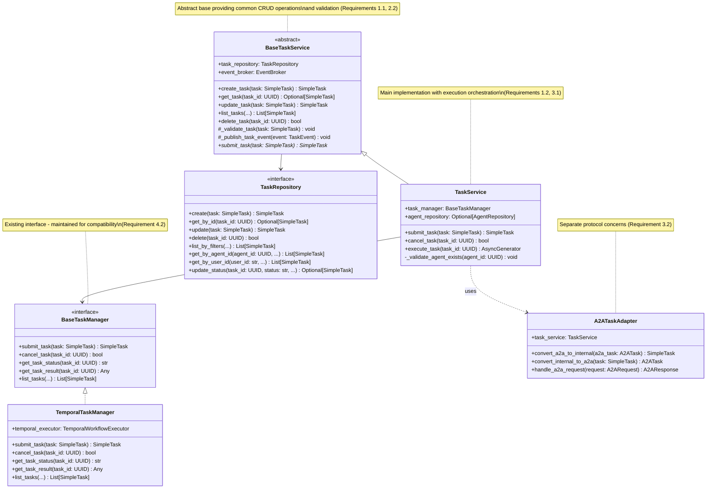
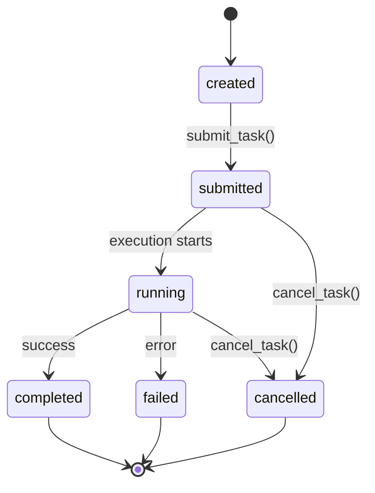
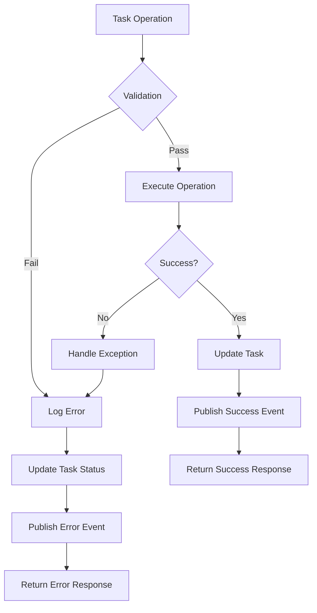

# Design Document

## Overview

This design establishes a clean, hierarchical task service architecture that eliminates duplication and provides clear separation of concerns. The solution introduces an abstract base task service class that handles common operations, while allowing specialized implementations for different execution backends and protocols.

**Scope**: This refactoring focuses on backend service layer architecture and does not affect the existing API endpoints or frontend integration work covered in the `task-ui-integration` spec. The goal is to clean up internal service duplication while maintaining API compatibility.

## Architecture

### Core Components

The architecture follows a hierarchical design pattern with clear separation of concerns, addressing the need for a clean task service hierarchy (Requirement 1) and elimination of code duplication (Requirement 2).



### Layer Separation

The architecture is designed with clear layer separation to address Requirements 1 and 3:

1. **Base Layer**: `BaseTaskService` - Common CRUD operations and validation (Requirement 1.1)
2. **Service Layer**: `TaskService` - Orchestration and business logic (Requirement 1.2, 3.1)
3. **Manager Layer**: `BaseTaskManager` implementations - Execution backends (Requirement 3.3)
4. **Adapter Layer**: Protocol-specific adapters (A2A, etc.) (Requirement 3.2, 3.4)

### Design Rationale

**Inheritance over Composition**: We chose inheritance for the base service pattern because:

- It ensures consistent interface contracts across all task services (Requirement 1.2)
- Common functionality is automatically available to all implementations (Requirement 2.2)
- Method overriding allows for specialized behavior while maintaining base contracts (Requirement 1.4)

**Protocol Separation**: A2A and other protocol concerns are handled by separate adapter classes because:

- It keeps the core task service focused on internal operations (Requirement 3.1)
- Protocol-specific logic is isolated and maintainable (Requirement 3.2)
- New protocols can be added without modifying core services (Requirement 3.4)

## Components and Interfaces

### Existing Components Strategy

**BaseTaskManager**: The existing `BaseTaskManager` interface in `domain/interfaces.py` will be kept as-is since it's already well-designed. The `TemporalTaskManager` already implements this interface correctly.

**Task Services Consolidation**: We'll consolidate the three task service classes:

1. Keep the main `TaskService` as the primary implementation
2. Remove the duplicate `TaskService` from `application/service.py`
3. Create `BaseTaskService` to extract common functionality

### BaseTaskService (Abstract Base Class)

```python
class BaseTaskService(ABC):
    """Abstract base class for all task services providing common functionality."""

    def __init__(self, task_repository: TaskRepository, event_broker: EventBroker):
        self.task_repository = task_repository
        self.event_broker = event_broker

    # Common CRUD operations
    async def create_task(self, task: Task) -> Task: ...
    async def get_task(self, task_id: UUID) -> Optional[Task]: ...
    async def update_task(self, task: Task) -> Task: ...
    async def list_tasks(self, **filters) -> List[Task]: ...
    async def delete_task(self, task_id: UUID) -> bool: ...

    # Protected methods for subclasses
    async def _validate_task(self, task: Task) -> None: ...
    async def _publish_task_event(self, event: TaskEvent) -> None: ...

    # Abstract methods that subclasses must implement
    @abstractmethod
    async def submit_task(self, task: Task) -> Task: ...
```

### TaskService (Main Implementation)

```python
class TaskService(BaseTaskService):
    """Main task service that orchestrates task lifecycle and execution."""

    def __init__(
        self,
        task_repository: TaskRepository,
        event_broker: EventBroker,
        task_manager: BaseTaskManager,
        agent_repository: Optional[AgentRepository] = None,
    ):
        super().__init__(task_repository, event_broker)
        self.task_manager = task_manager
        self.agent_repository = agent_repository

    async def submit_task(self, task: Task) -> Task:
        """Submit task for execution with validation."""
        await self._validate_agent_exists(task.agent_id)
        created_task = await self.create_task(task)
        return await self.task_manager.submit_task(created_task)

    async def cancel_task(self, task_id: UUID) -> bool:
        """Cancel a task through the task manager."""
        return await self.task_manager.cancel_task(task_id)
```

### Task Model Strategy

The current system has two task models:

- `SimpleTask` (used by existing `BaseTaskManager`)
- `Task` (used by application service)

**Decision**: Extend `SimpleTask` to include missing fields rather than creating a new unified model, maintaining compatibility with existing `BaseTaskManager` interface (Requirement 4.4).

```python
@dataclass
class SimpleTask:
    """Enhanced SimpleTask model - extends existing model with additional fields."""
    # Existing fields (keep for compatibility)
    id: UUID = field(default_factory=uuid4)
    title: str
    description: str
    query: str
    user_id: str
    agent_id: UUID
    status: str = "submitted"
    task_parameters: Dict[str, Any] = field(default_factory=dict)
    result: Optional[Any] = None
    error_message: Optional[str] = None
    created_at: datetime = field(default_factory=datetime.utcnow)
    updated_at: Optional[datetime] = None

    # Additional fields for enhanced functionality
    started_at: Optional[datetime] = None
    completed_at: Optional[datetime] = None
    execution_id: Optional[str] = None
    metadata: Dict[str, Any] = field(default_factory=dict)
```

### Dependency Injection Strategy

To address Requirement 5 (proper dependency injection and testability), the architecture implements constructor-based dependency injection:

**Service Factory Pattern**: A factory class manages service instantiation and dependency wiring:

```python
class TaskServiceFactory:
    """Factory for creating properly configured task services."""

    def __init__(self, config: TaskServiceConfig):
        self.config = config

    def create_task_service(self) -> TaskService:
        """Create TaskService with all dependencies injected."""
        task_repository = self._create_task_repository()
        event_broker = self._create_event_broker()
        task_manager = self._create_task_manager()
        agent_repository = self._create_agent_repository()

        return TaskService(
            task_repository=task_repository,
            event_broker=event_broker,
            task_manager=task_manager,
            agent_repository=agent_repository
        )

    def _create_task_manager(self) -> BaseTaskManager:
        """Create appropriate task manager based on configuration."""
        if self.config.execution_backend == "temporal":
            return TemporalTaskManager(...)
        # Additional backends can be added here
        raise ValueError(f"Unknown execution backend: {self.config.execution_backend}")
```

**Interface-Based Dependencies**: All dependencies are injected as interfaces, enabling easy mocking and testing (Requirement 5.2):

- `TaskRepository` - Interface for data persistence
- `EventBroker` - Interface for event publishing
- `BaseTaskManager` - Interface for task execution
- `AgentRepository` - Interface for agent validation

**Swappable Implementations**: The factory pattern allows different implementations to be swapped based on configuration (Requirement 5.3):

```python
@dataclass
class TaskServiceConfig:
    execution_backend: str = "temporal"  # or "local", "kubernetes", etc.
    repository_type: str = "postgresql"  # or "mongodb", "memory", etc.
    event_broker_type: str = "redis"     # or "rabbitmq", "memory", etc.
```

## Data Models

### Task Status Lifecycle



### Repository Interface

```python
class TaskRepository(BaseRepository[Task]):
    """Repository for task persistence with specialized query methods."""

    async def get_by_agent_id(self, agent_id: UUID, limit: int, offset: int) -> List[Task]: ...
    async def get_by_user_id(self, user_id: str, limit: int, offset: int) -> List[Task]: ...
    async def get_by_status(self, status: str) -> List[Task]: ...
    async def update_status(self, task_id: UUID, status: str, **fields) -> Optional[Task]: ...
```

## Error Handling

### Validation Strategy

1. **Agent Validation**: Verify agent exists before task submission
2. **Task Validation**: Validate task structure and required fields
3. **Status Validation**: Ensure valid status transitions
4. **Parameter Validation**: Validate task parameters against schema

### Error Types

```python
class TaskValidationError(Exception): ...
class AgentNotFoundError(Exception): ...
class TaskNotFoundError(Exception): ...
class InvalidStatusTransitionError(Exception): ...
class TaskExecutionError(Exception): ...
```

### Error Handling Flow



## Testing Strategy

### Unit Testing

1. **BaseTaskService Tests**: Test common CRUD operations
2. **TaskService Tests**: Test orchestration logic with mocked dependencies
3. **TaskManager Tests**: Test execution backend implementations
4. **Repository Tests**: Test data persistence and queries

### Integration Testing

1. **Service Integration**: Test service interactions with real repositories
2. **Workflow Integration**: Test task execution through Temporal workflows
3. **Event Integration**: Test event publishing and handling

### Test Structure

```python
class TestBaseTaskService:
    """Test common functionality in base service."""

class TestTaskService:
    """Test main task service with mocked dependencies."""

    @pytest.fixture
    def mock_task_manager(self):
        return Mock(spec=BaseTaskManager)

    @pytest.fixture
    def task_service(self, mock_task_repository, mock_event_broker, mock_task_manager):
        return TaskService(mock_task_repository, mock_event_broker, mock_task_manager)
```

## Migration Strategy

### Phase 1: Create Base Classes

1. Implement `BaseTaskService` abstract class
2. Create unified `Task` model
3. Update `TaskRepository` interface

### Phase 2: Refactor Existing Services

1. Migrate main `TaskService` to extend `BaseTaskService`
2. Consolidate duplicate methods
3. Update dependency injection

### Phase 3: Clean Up

1. Remove duplicate service classes
2. Update API endpoints to use unified service
3. Update tests and documentation

### Backward Compatibility

- Maintain existing API contracts during migration
- Use adapter pattern for legacy interfaces
- Gradual migration of dependent services
