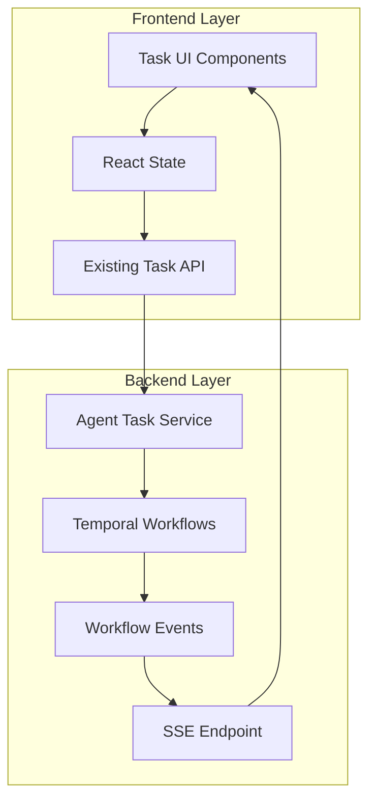

# Design Document

## Overview

The Task UI Integration feature transforms the existing mock-based task management interface into a fully functional task monitoring and control system. This design leverages the existing frontend architecture while integrating with the backend's task management APIs to provide real task data, filtering capabilities, execution control, and performance monitoring. The focus is on replacing mock data with real API integration while adding essential missing functionality for task management.

## Architecture

### High-Level Architecture



### Data Flow

1. **Initial Load**: UI requests task data via API client using existing getAllTasks
2. **Real-time Updates**: SSE connection streams task status changes from Temporal workflow events
3. **User Actions**: Control commands sent through existing API endpoints (cancel task)
4. **State Management**: React state manages task data with SSE updates
5. **Temporal Integration**: Workflow status changes trigger SSE events to update UI

## Components and Interfaces

### Real-time Update System Design

#### SSE Integration Strategy
The system will use per-task SSE connections for targeted real-time updates:

1. **Temporal Workflow Events**: Workflow status changes (start, complete, fail, cancel) trigger events
2. **Event Bridge**: Events are captured and formatted for SSE streaming
3. **Per-Task SSE Endpoint**: `/v1/agents/{agent_id}/tasks/{task_id}/events/stream` streams events for specific tasks
4. **Frontend SSE Client**: Establishes connection when viewing task details, disconnects when leaving
5. **Connection Management**: Tasks list uses polling/refresh, real-time updates only for active task views

#### Task State Management
```typescript
// Task status mapping based on Temporal workflow states
enum TaskStatus {
  PENDING = 'pending',       // Task created but not started
  RUNNING = 'running',       // Actively executing
  PAUSED = 'paused',        // Manually paused, can be resumed
  COMPLETED = 'completed',   // Successfully finished
  FAILED = 'failed',        // Failed with error
  CANCELLED = 'cancelled'   // User cancelled
}

// Task control operations available based on current status
interface TaskControlOperations {
  pause: (taskId: string) => Promise<void>     // Pause Temporal workflow
  resume: (taskId: string) => Promise<void>    // Resume paused workflow  
  cancel: (taskId: string) => Promise<void>    // Terminate workflow completely
}

// Task control state determines which actions are available
interface TaskControlState {
  canPause: boolean     // Can pause (running tasks)
  canResume: boolean    // Can resume (paused tasks)
  canCancel: boolean    // Can cancel (running or paused tasks)
  isControlling: boolean // Currently executing a control operation
}
```

### Frontend Components

#### Enhanced TaskTable Component
- **Purpose**: Display real tasks from getAllTasks API with SSE updates
- **Current State**: Uses mock data, needs real API integration
- **Enhancements Needed**:
  - Replace mock data with getAllTasks API call
  - Add SSE connection for real-time status updates
  - Implement proper error handling and loading states
  - Add filtering and search functionality

#### Enhanced TaskDetail Component  
- **Purpose**: Show real task information from task status API
- **Current State**: Uses mock data with hardcoded task details
- **Enhancements Needed**:
  - Fetch real task data using existing task status endpoint
  - Display actual Temporal workflow execution information
  - Add real-time updates via SSE
  - Implement task cancellation using existing DELETE endpoint

### API Integration

#### Existing Endpoints to Leverage
```typescript
// Already available in api.ts
getAllTasks(): Promise<TaskWithAgent[]>
getAgentTask(agentId: string, taskId: string): Promise<TaskResponse>
getAgentTaskStatus(agentId: string, taskId: string): Promise<WorkflowStatus>
cancelAgentTask(agentId: string, taskId: string): Promise<void>
```

#### New Endpoints Needed
```typescript
// Per-task SSE endpoint for real-time updates
GET /v1/agents/{agent_id}/tasks/{task_id}/events/stream - SSE stream for specific task events

// Enhanced task endpoints
GET /v1/agents/{agent_id}/tasks/{task_id}/events - Get task execution events (paginated)
POST /v1/agents/{agent_id}/tasks/{task_id}/pause - Pause task execution
POST /v1/agents/{agent_id}/tasks/{task_id}/resume - Resume paused task
```

### SSE Event Types
```typescript
interface TaskSSEEvent {
  type: 'task_status_changed' | 'task_event'
  data: {
    taskId: string
    agentId: string
    executionId: string
    timestamp: string
    payload: TaskStatusUpdate | TaskEvent
  }
}

interface TaskStatusUpdate {
  status: string
  progress?: number
  error?: string
  result?: any
}

interface TaskEvent {
  id: string
  type: 'tool_executed' | 'workflow_started' | 'workflow_completed' | 'activity_started' | 'activity_completed' | 'error_occurred'
  message: string
  metadata?: Record<string, any>
}
```

### Temporal Integration Challenges

#### Challenge 1: Workflow Event Capture
- **Problem**: Need to capture Temporal workflow events and convert to task updates
- **Solution**: Implement workflow event listeners that publish to SSE stream
- **Implementation**: Use Temporal's workflow history API or event handlers

#### Challenge 2: Task-to-Workflow Mapping
- **Problem**: Map UI task IDs to Temporal execution IDs
- **Current Pattern**: `execution_id = f"agent-task-{task_id}"`
- **Solution**: Maintain consistent mapping between task IDs and execution IDs

#### Challenge 3: Event Streaming
- **Problem**: Temporal workflow events need to be captured and streamed to UI
- **Solution Options**:
  1. Store events in database during workflow execution
  2. Use Temporal's workflow history to reconstruct events
  3. Implement custom event logging within workflow activities

## Data Models

### Task Model
```typescript
interface Task {
  id: string
  name: string
  description?: string
  status: TaskStatus
  agent: string
  createdAt: Date
  updatedAt: Date
  startedAt?: Date
  completedAt?: Date
  executionId: string
  progress?: number
  error?: string
}

enum TaskStatus {
  PENDING = 'pending',
  RUNNING = 'running',
  PAUSED = 'paused',
  COMPLETED = 'completed',
  FAILED = 'failed',
  CANCELLED = 'cancelled'
}

// Task control operations
interface TaskControlOperations {
  pause: (taskId: string) => Promise<void>     // Pause Temporal workflow
  resume: (taskId: string) => Promise<void>    // Resume paused workflow  
  cancel: (taskId: string) => Promise<void>    // Terminate workflow completely
}

// Task control states and available actions
interface TaskControlState {
  canPause: boolean    // Can pause (running tasks)
  canResume: boolean   // Can resume (paused tasks)
  canCancel: boolean   // Can cancel (running or paused tasks)
  isControlling: boolean // Currently executing a control operation
}
```

### Task Detail Model
```typescript
interface TaskDetail extends Task {
  events: TaskEvent[]
  configuration?: Record<string, any>
}
```

### Event Model
```typescript
interface TaskEvent {
  id: string
  taskId: string
  timestamp: Date
  type: 'tool_executed' | 'workflow_started' | 'workflow_completed' | 'activity_started' | 'activity_completed' | 'error_occurred'
  message: string
  metadata?: Record<string, any>
}
```

## Error Handling

### Frontend Error Handling
- **API Errors**: Display user-friendly error messages with retry options
- **SSE Disconnection**: Automatic reconnection with exponential backoff
- **Network Timeouts**: Graceful degradation with cached data
- **Validation Errors**: Inline form validation with clear messaging

### Backend Error Handling
- **Task Control Errors**: Return specific error codes for different failure types
- **Database Errors**: Proper error logging and generic user messages
- **SSE Errors**: Connection management and error broadcasting

## Testing Strategy

### Unit Tests
- Component rendering and prop handling
- API client methods and error scenarios
- State management logic
- Utility functions and data transformations

### Integration Tests
- API endpoint functionality
- SSE connection and message handling
- Database operations and data consistency
- Task control workflow end-to-end

### E2E Tests
- Complete user workflows (view tasks, filter, control)
- Real-time update scenarios
- Error handling and recovery
- Performance under load

### Performance Tests
- Large dataset rendering (1000+ tasks)
- SSE message throughput
- Memory usage during long sessions
- API response times under load

## Security Considerations

### Authentication & Authorization
- JWT token validation for API requests
- SSE connection authentication
- Role-based access control for task operations
- Rate limiting on control endpoints

### Data Protection
- Sensitive task data encryption
- Log data sanitization
- Secure artifact storage and access
- Input validation and sanitization

## Performance Optimizations

### Frontend Optimizations
- Virtual scrolling for large task lists
- Debounced search and filtering
- Memoized component rendering
- Efficient SSE message handling
- Lazy loading of task details and events

### Backend Optimizations
- Database query optimization with indexes
- Caching frequently accessed task data
- Efficient SSE broadcasting
- Pagination for large result sets
- Background processing for event aggregation

## Deployment Considerations

### Environment Configuration
- SSE endpoint configuration
- API base URL configuration
- Feature flags for gradual rollout
- Monitoring and logging configuration

### Monitoring & Observability
- Task operation metrics
- SSE connection health
- API response time monitoring
- Error rate tracking
- User interaction analytics