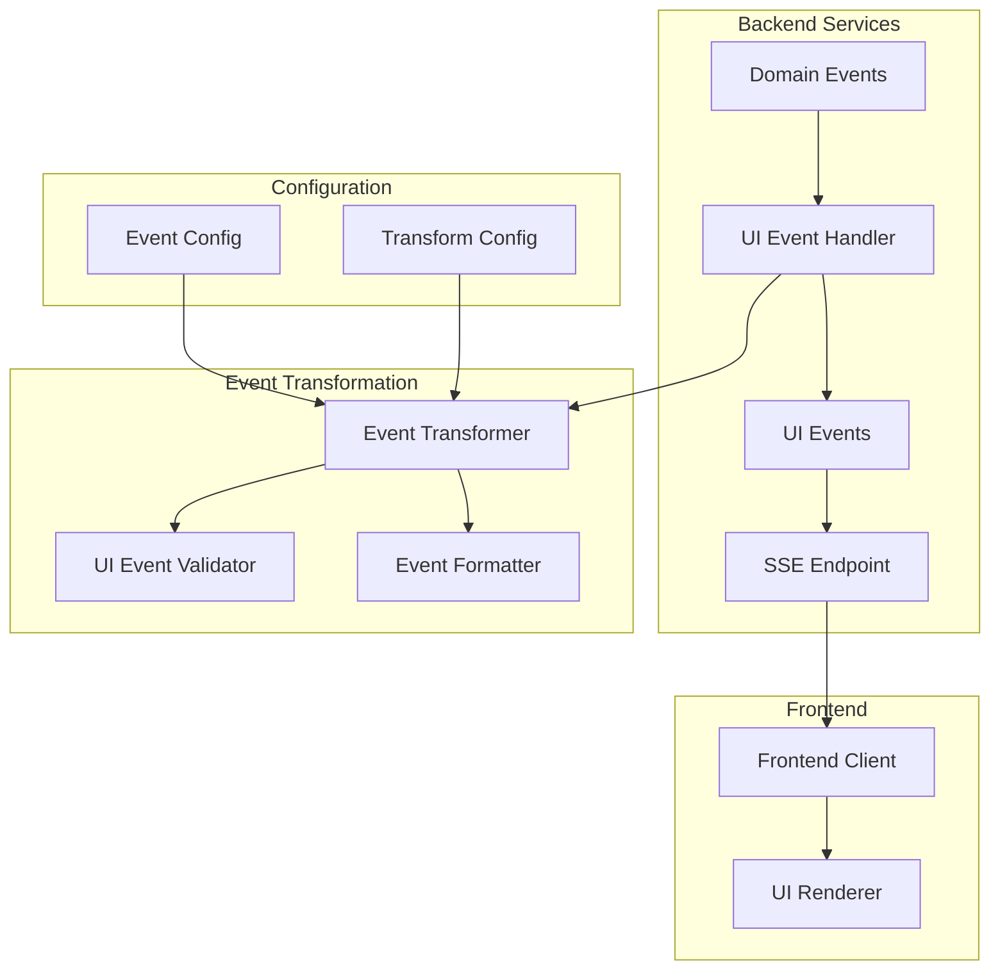

# AG-UI Protocol Compatible Event Handler System Design

## Overview

This design addresses the issue of sending raw domain events from the backend to the UI via Server-Sent Events (SSE). The proposed system will align with the AG-UI (Agent User Interaction) Protocol to implement proper event sourcing for UI actions, enabling real-time streaming of agent activities like LLM responses, tool executions, and workflow progress.

The AG

## Problem Statement

### Current Issues
- Raw domain events are sent via SSE containing internal implementation details
- Frontend must parse complex domain event structures and transform them
- Inconsistent event formats requiring extensive mapping logic in the client
- Tight coupling between domain model and UI representation
- Poor separation of concerns between backend domain logic and frontend presentation

### Examples of Current Problems
```typescript
// Current: Complex domain event structure sent to UI
{
  "event_id": "uuid",
  "event_type": "workflow.LLMCallStarted", 
  "timestamp": "2024-01-01T10:00:00Z",
  "data": {
    "aggregate_id": "task-123",
    "aggregate_type": "task",
    "original_event_type": "LLMCallStarted",
    "original_timestamp": "2024-01-01T10:00:00Z",
    "original_data": {
      "task_id": "task-123",
      "execution_id": "exec-456",
      "iteration": 1,
      "content": "LLM response data..."
    }
  }
}
```

## Architecture

### Component Overview



### System Components

#### 1. UI Event Handler
- **Purpose**: Central orchestrator for domain-to-UI event transformation
- **Location**: `core/libs/common/agentarea_common/ui_events/handler.py`
- **Responsibilities**:
  - Subscribe to domain events from EventBroker
  - Route events to appropriate transformers
  - Publish UI events to dedicated channels

#### 2. Event Transformers
- **Purpose**: Transform specific domain event types to UI events
- **Location**: `core/libs/common/agentarea_common/ui_events/transformers/`
- **Types**:
  - `TaskEventTransformer`: Task lifecycle events
  - `WorkflowEventTransformer`: Workflow execution events
  - `LLMEventTransformer`: LLM call events
  - `ToolEventTransformer`: Tool execution events

#### 3. UI Event Models
- **Purpose**: Define clean UI event structures
- **Location**: `core/libs/common/agentarea_common/ui_events/models.py`

## UI Event Models

### Base UI Event Structure
```python
class UIEvent(BaseModel):
    """Base UI event model optimized for frontend consumption."""
    
    id: str = Field(..., description="Unique event identifier")
    type: UIEventType = Field(..., description="UI event type")
    timestamp: datetime = Field(..., description="Event timestamp")
    
    # Core UI fields
    title: str = Field(..., description="Human-readable event title")
    description: str = Field(..., description="Event description for UI")
    level: EventLevel = Field(..., description="UI severity level")
    icon: str | None = Field(None, description="Icon identifier")
    
    # Context
    context: UIEventContext = Field(..., description="Event context")
    
    # Payload optimized for UI
    payload: dict[str, Any] = Field(default_factory=dict, description="UI-specific data")
    
    # Optional metadata
    metadata: dict[str, Any] = Field(default_factory=dict, description="Additional metadata")
```

### UI Event Types
```python
class UIEventType(str, Enum):
    """UI-focused event types."""
    
    # Task Events
    TASK_STARTED = "task.started"
    TASK_PROGRESS = "task.progress"
    TASK_COMPLETED = "task.completed"
    TASK_FAILED = "task.failed"
    TASK_CANCELLED = "task.cancelled"
    
    # AI Interaction Events
    AI_THINKING = "ai.thinking"
    AI_RESPONDING = "ai.responding"
    AI_RESPONSE_CHUNK = "ai.response.chunk"
    AI_RESPONSE_COMPLETE = "ai.response.complete"
    AI_ERROR = "ai.error"
    
    # Tool Events
    TOOL_STARTED = "tool.started"
    TOOL_PROGRESS = "tool.progress"
    TOOL_COMPLETED = "tool.completed"
    TOOL_FAILED = "tool.failed"
    
    # System Events
    SYSTEM_STATUS = "system.status"
    SYSTEM_WARNING = "system.warning"
    SYSTEM_ERROR = "system.error"
    
    # User Interaction Events
    USER_INPUT_REQUIRED = "user.input.required"
    USER_APPROVAL_REQUIRED = "user.approval.required"
```

### Event Context Model
```python
class UIEventContext(BaseModel):
    """Context information for UI events."""
    
    task_id: str = Field(..., description="Associated task ID")
    agent_id: str | None = Field(None, description="Associated agent ID")
    workspace_id: str = Field(..., description="Workspace context")
    user_id: str | None = Field(None, description="User context")
    
    # Navigation hints for UI
    route_hint: str | None = Field(None, description="Suggested UI route")
    view_hint: str | None = Field(None, description="Suggested UI view")
```

## Event Transformation Logic

### Transformation Rules

#### LLM Events Transformation
```python
class LLMEventTransformer:
    """Transform LLM domain events to UI events."""
    
    def transform_llm_call_started(self, domain_event: DomainEvent) -> UIEvent:
        return UIEvent(
            id=f"ui-{domain_event.event_id}",
            type=UIEventType.AI_THINKING,
            timestamp=domain_event.timestamp,
            title="AI is thinking...",
            description="Analyzing your request and preparing response",
            level=EventLevel.INFO,
            icon="brain",
            context=UIEventContext(
                task_id=domain_event.data["task_id"],
                agent_id=domain_event.data.get("agent_id"),
                workspace_id=domain_event.data.get("workspace_id", "default")
            ),
            payload={
                "iteration": domain_event.data.get("iteration", 1),
                "estimated_duration": self._estimate_duration(domain_event),
            }
        )
    
    def transform_llm_call_chunk(self, domain_event: DomainEvent) -> UIEvent:
        chunk_data = domain_event.data.get("original_data", {})
        
        return UIEvent(
            id=f"ui-{domain_event.event_id}",
            type=UIEventType.AI_RESPONSE_CHUNK,
            timestamp=domain_event.timestamp,
            title="AI is responding",
            description=f"Receiving response... ({chunk_data.get('chunk_index', 0)} chunks)",
            level=EventLevel.INFO,
            icon="message-circle",
            context=UIEventContext(
                task_id=domain_event.data["task_id"],
                agent_id=domain_event.data.get("agent_id"),
                workspace_id=domain_event.data.get("workspace_id", "default")
            ),
            payload={
                "chunk": chunk_data.get("chunk", ""),
                "chunk_index": chunk_data.get("chunk_index", 0),
                "is_final": chunk_data.get("is_final", False),
                "content_type": chunk_data.get("content_type", "text")
            }
        )
```

#### Task Events Transformation
```python
class TaskEventTransformer:
    """Transform task domain events to UI events."""
    
    def transform_task_completed(self, domain_event: DomainEvent) -> UIEvent:
        task_data = domain_event.data.get("original_data", {})
        
        # Extract meaningful result for UI
        result_summary = self._extract_result_summary(task_data)
        
        return UIEvent(
            id=f"ui-{domain_event.event_id}",
            type=UIEventType.TASK_COMPLETED,
            timestamp=domain_event.timestamp,
            title="Task Completed Successfully",
            description=result_summary,
            level=EventLevel.SUCCESS,
            icon="check-circle",
            context=UIEventContext(
                task_id=domain_event.data["task_id"],
                agent_id=domain_event.data.get("agent_id"),
                workspace_id=domain_event.data.get("workspace_id", "default"),
                route_hint=f"/tasks/{domain_event.data['task_id']}"
            ),
            payload={
                "execution_time": task_data.get("execution_time"),
                "cost": task_data.get("cost"),
                "artifacts_count": len(task_data.get("artifacts", [])),
                "result_preview": self._create_result_preview(task_data)
            }
        )
```

### Configuration-Driven Transformations

```python
# Event transformation configuration
EVENT_TRANSFORM_CONFIG = {
    "workflow.LLMCallStarted": {
        "ui_type": UIEventType.AI_THINKING,
        "title": "AI is thinking...",
        "description_template": "Analyzing your request (iteration {iteration})",
        "level": EventLevel.INFO,
        "icon": "brain",
        "extract_fields": ["iteration", "model_name"],
        "duration_estimate": True
    },
    "workflow.LLMCallCompleted": {
        "ui_type": UIEventType.AI_RESPONSE_COMPLETE,
        "title": "AI response received",
        "description_template": "Response ready ({token_count} tokens)",
        "level": EventLevel.SUCCESS,
        "icon": "message-circle",
        "extract_fields": ["content", "token_count", "cost"],
        "content_preview": {"max_length": 100, "truncate": True}
    }
}
```

## SSE Channel Architecture

### Dedicated UI Event Channels
```python
class UIEventChannels:
    """UI-specific SSE channels."""
    
    @staticmethod
    def task_events(task_id: str) -> str:
        return f"ui.task.{task_id}"
    
    @staticmethod
    def user_events(user_id: str) -> str:
        return f"ui.user.{user_id}"
    
    @staticmethod
    def workspace_events(workspace_id: str) -> str:
        return f"ui.workspace.{workspace_id}"
    
    @staticmethod
    def global_events() -> str:
        return "ui.global"
```

### SSE Endpoint Updates
```python
# Updated SSE endpoint structure
@router.get("/v1/ui/events/tasks/{task_id}/stream")
async def stream_task_ui_events(
    task_id: str,
    user_context: UserContext = Depends(get_user_context)
):
    """Stream UI-optimized events for a specific task."""
    
    channel = UIEventChannels.task_events(task_id)
    
    async def event_generator():
        async with get_ui_event_broker() as broker:
            async for ui_event in broker.subscribe(channel):
                # Events are already UI-ready, no transformation needed
                yield {
                    "event": ui_event.type.value,
                    "data": ui_event.model_dump_json(),
                    "id": ui_event.id
                }
    
    return EventSourceResponse(event_generator())
```

## Implementation Strategy

### Phase 1: Core Infrastructure
1. **UI Event Models**: Create base UI event models and types
2. **UI Event Handler**: Implement central event handling service
3. **Basic Transformers**: Create transformers for common events
4. **UI Event Broker**: Set up dedicated channels for UI events

### Phase 2: Event Transformers
1. **Task Event Transformer**: Transform task lifecycle events
2. **LLM Event Transformer**: Transform LLM interaction events
3. **Tool Event Transformer**: Transform tool execution events
4. **System Event Transformer**: Transform system and error events

### Phase 3: SSE Integration
1. **New SSE Endpoints**: Create UI event-specific endpoints
2. **Channel Management**: Implement proper channel routing
3. **Event Filtering**: Add user-specific event filtering
4. **Performance Optimization**: Optimize for real-time delivery

### Phase 4: Frontend Migration
1. **Update Frontend Hooks**: Modify `useTaskEvents` to consume UI events
2. **Simplify Event Processing**: Remove complex domain event parsing
3. **Enhance UI Components**: Leverage richer UI event data
4. **Backward Compatibility**: Maintain support during transition

## Event Examples

### Before (Domain Event)
```json
{
  "event_id": "550e8400-e29b-41d4-a716-446655440000",
  "event_type": "workflow.LLMCallStarted",
  "timestamp": "2024-01-01T10:00:00Z",
  "data": {
    "aggregate_id": "task-123",
    "aggregate_type": "task",
    "original_event_type": "LLMCallStarted",
    "original_timestamp": "2024-01-01T10:00:00Z",
    "original_data": {
      "task_id": "task-123",
      "agent_id": "agent-456",
      "execution_id": "exec-789",
      "iteration": 2,
      "model_name": "gpt-4",
      "estimated_tokens": 150
    }
  }
}
```

### After (UI Event)
```json
{
  "id": "ui-550e8400-e29b-41d4-a716-446655440000",
  "type": "ai.thinking",
  "timestamp": "2024-01-01T10:00:00Z",
  "title": "AI is thinking...",
  "description": "Analyzing your request (iteration 2)",
  "level": "info",
  "icon": "brain",
  "context": {
    "task_id": "task-123",
    "agent_id": "agent-456",
    "workspace_id": "default",
    "route_hint": "/tasks/task-123"
  },
  "payload": {
    "iteration": 2,
    "model_name": "gpt-4",
    "estimated_duration": "5-10 seconds",
    "estimated_tokens": 150
  },
  "metadata": {
    "execution_id": "exec-789"
  }
}
```

## Migration Strategy

### Backward Compatibility
1. **Dual Channel Support**: Maintain both domain and UI event channels temporarily
2. **Feature Flags**: Use feature flags to control UI event usage
3. **Gradual Rollout**: Migrate components incrementally
4. **Fallback Mechanism**: Ensure graceful degradation if UI events fail

### Testing Strategy
1. **Unit Tests**: Test individual event transformers
2. **Integration Tests**: Test end-to-end event flow
3. **Performance Tests**: Ensure real-time delivery requirements
4. **UI Tests**: Validate frontend rendering with UI events

## Benefits

### For Frontend Development
- **Simplified Event Handling**: No complex domain event parsing required
- **Consistent Event Structure**: Standardized UI event format
- **Rich UI Context**: Events include navigation hints and display metadata
- **Better User Experience**: Optimized descriptions and progress indicators

### For Backend Development
- **Clean Separation**: Domain logic separated from UI concerns
- **Maintainability**: Centralized transformation logic
- **Flexibility**: Easy to modify UI representation without changing domain events
- **Performance**: Reduced client-side processing overhead

### For System Architecture
- **Loose Coupling**: UI and domain models are decoupled
- **Scalability**: Dedicated UI event channels reduce load
- **Observability**: Clear UI event monitoring and debugging
- **Evolution**: UI events can evolve independently of domain events