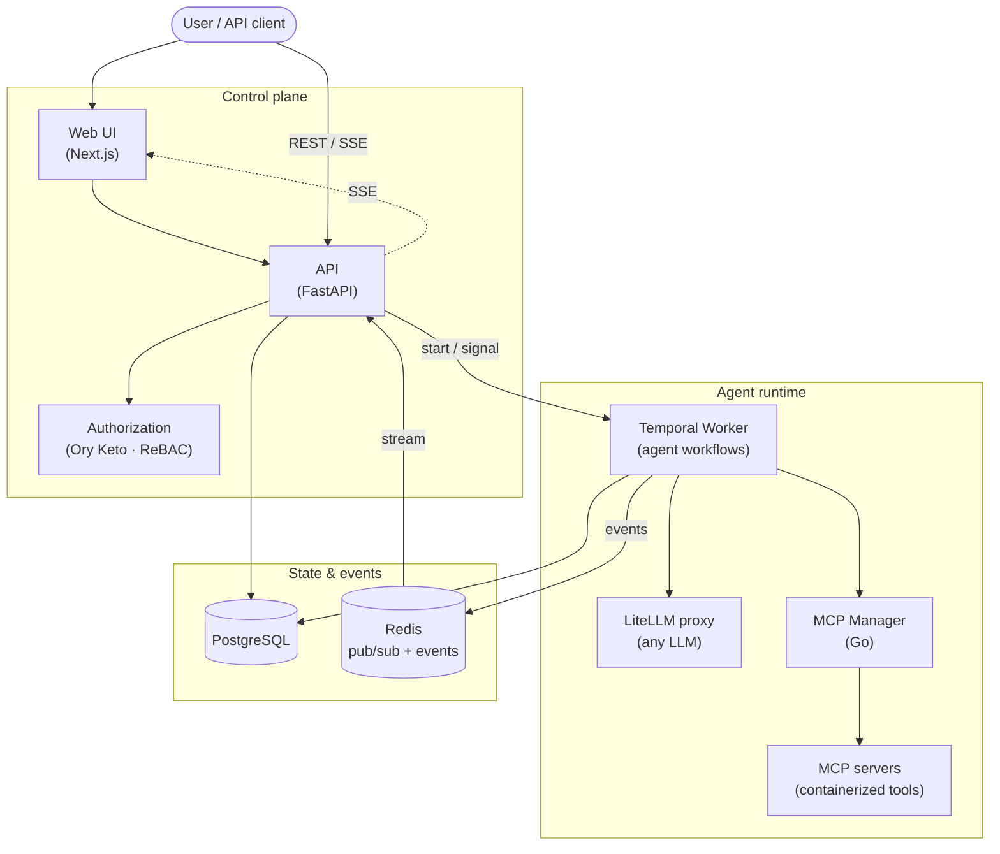

<div align="center">


## The platform for building governed agentic networks

[](LICENSE.md)
[](https://github.com/agentarea/agentarea/actions/workflows/ci.yml)
[](https://docs.agentarea.ai)
[](https://discord.gg/5tduPwheYQ)
[](https://github.com/agentarea/agentarea/stargazers)
[](https://app.fossa.com/projects/git%2Bgithub.com%2Fagentarea%2Fagentarea?ref=badge_shield)

[📖 Documentation](https://docs.agentarea.ai) •
[🚀 Quick Start](#-quick-start) •
[💬 Discord](https://discord.gg/5tduPwheYQ) •
[🐛 Report Bug](https://github.com/agentarea/agentarea/issues/new?template=bug_report.md) •
[✨ Request Feature](https://github.com/agentarea/agentarea/issues/new?template=feature_request.md)

</div>

---

## 🚀 What is AgentArea?

AgentArea is an open-source platform for building **agentic networks** — multi-agent systems with governance, isolation, and approval controls built in.

Most agent tools are **libraries**: you import them and orchestrate agents inside your own app. AgentArea is **infrastructure**: a self-hosted runtime where agents run durably, in isolated networks, under governance and approval policy. Reach for it when "an agent in a script" has outgrown what a library can safely run — when you need many agents, scoped permissions between them, human-in-the-loop approvals, audit trails, and a runtime built for long-running work.

## 🎯 Why AgentArea?

Traditional agent frameworks focus on individual agents. AgentArea is built for networks of them:

- **🌐 Agentic Networks First** — VPC-inspired architecture with granular network permissions between agents
- **🛡️ Governance Built-In** — tool approvals, permission boundaries, ReBAC authorization, and audit trails from day one
- **⚡ Production-Ready** — Temporal-based execution, Kubernetes-native, edge deployment, enterprise authentication
- **🔌 Provider-Agnostic** — any LLM via LiteLLM proxy, any tool via MCP, multiple secret backends
- **📖 Truly Open Source** — Apache 2.0 licensed, no feature gates

### ✨ Core Capabilities

<table>
<tr>
<td width="50%">

#### 🌐 Agentic Networks
VPC-inspired network architecture with isolated agent groups. Configure granular permissions between agents, control inter-agent communication, and build secure multi-agent topologies.

#### 🛡️ Agent Governance
Granular tool permissions with approval workflows. Select which tools agents can use, require human approval for sensitive operations, and maintain full audit trails for compliance.

#### 🤝 Agent Collaboration
Agents discover, delegate to, and coordinate with each other. Direct delegation is the default; the [A2A protocol](https://docs.agentarea.ai) is also supported for interoperability with external agent systems.

#### ⚡ Event-Driven Triggers
Fire agents on timers, webhooks, or third-party events. Build reactive agent systems that respond to external stimuli in real time.

</td>
<td width="50%">

#### 🔌 MCP Server Management
Create and host MCP servers from templates or custom Dockerfiles. Add remote MCPs, verify updates with hash checking, and extend agent capabilities with external tools.

#### 🤖 Flexible Agent Creation
Build agents with custom instructions and tool configurations. Long-running task support with flexible termination criteria (goal achievement, budget limits, timeouts).

#### 🏗️ Production Infrastructure
Temporal for distributed execution and edge deployment. Kubernetes-native architecture. Multi-LLM support via LiteLLM proxy. Multiple secret backends (database, Infisical, AWS).

#### 🔐 Fine-Grained Authorization
Relationship-based access control (ReBAC) via Ory Keto. Model who can see and act on which agents, networks, and tools — down to the individual resource.

</td>
</tr>
</table>

### 🧩 What You Can Build

- **Research networks** — a coordinator agent delegates to specialist agents (search, summarize, fact-check), each with its own scoped tool access, then merges the results.
- **Governed ops automation** — agents triggered by webhooks or schedules that can act on real systems, with human approval required before any sensitive tool runs.
- **Long-running task agents** — durable agents that work for minutes or hours toward a goal, surviving restarts via Temporal, stopping on goal achievement, budget, or timeout.
- **Tool-rich assistants** — agents backed by your own MCP servers (internal APIs, databases, SaaS), hosted and version-checked by the platform.

## 🏃 Quick Start

### Prerequisites

- Docker & Docker Compose

### 1. Start the platform without cloning

```bash
curl -fsSL https://raw.githubusercontent.com/agentarea/agentarea/main/scripts/install.sh | sh
```

The bootstrap downloads only the runtime bundle into `./agentarea`: Docker Compose, auth/Temporal config, and a small local launcher. It does not clone the repository and does not install Docker, Node, Python, or Go.

Then run:

```bash
./agentarea/agentarea doctor
./agentarea/agentarea pull
./agentarea/agentarea up
```

Open the web UI at **http://localhost:3000**.

Edit configuration anytime in `./agentarea/.env` or run:

```bash
./agentarea/agentarea config --edit
```

To inspect the installer before running:

```bash
curl -fsSL https://raw.githubusercontent.com/agentarea/agentarea/main/scripts/install.sh -o agentarea-install.sh
sh agentarea-install.sh
```

For local development from source, clone the repository and use `make up`.

### 2. Create your first agent

1. Open http://localhost:3000 and add an **LLM provider** (e.g. an OpenAI or Anthropic API key) under Settings.
2. Create an **agent** — give it instructions and pick the tools it can use.
3. Send it a task and watch it run.

Full walkthrough: **[Getting Started →](docs/getting-started.md)**

## 📚 Documentation

- **[Getting Started](docs/getting-started.md)** — complete setup guide
- **[Building Agents](docs/building-agents.md)** — create and customize agents
- **[Agent Communication](docs/agent-communication.md)** — multi-agent workflows
- **[Agentic Networks](docs/agentic-networks.md)** — network isolation and permissions
- **[Agent Governance](docs/agent-governance.md)** — approvals, permissions, audit
- **[MCP Integration](docs/mcp-integration.md)** — external tool integration
- **[Deployment](docs/deployment.md)** — production deployment guide
- **[Architecture](docs/architecture.md)** — system design deep dive
- **[API Reference](docs/api-reference.md)** — complete API documentation

## 🛠️ Project Structure

```
agentarea/
├── agentarea-platform/      # Backend API, Temporal worker, domain libs (Python)
├── agentarea-webapp/        # Web interface (Next.js / React)
├── agentarea-mcp-manager/   # MCP server orchestration (Go)
├── agentarea-operator/      # Kubernetes operator (catalog, LLM providers)
├── agentarea-event-service/ # Event ingestion and triggers
├── agentarea-cli/           # Command-line interface (Node.js)
├── charts/                  # Helm charts
├── docs/                    # Documentation (Mintlify)
└── scripts/                 # Build and deployment utilities
```

## 🏗️ Architecture



AgentArea is built for production agentic workloads:

- **Agent Networks** — VPC-inspired isolation with granular inter-agent permissions
- **Temporal** — distributed workflow orchestration for long-running, durable agent tasks
- **Event Flow** — workflows publish to Redis pub/sub + DB, streamed to the UI over SSE
- **Multi-LLM Support** — provider-agnostic through the LiteLLM proxy
- **MCP Infrastructure** — extensible tool system with custom and remote server support
- **ReBAC Authorization** — fine-grained access control via Ory Keto

For details, see [docs/architecture.md](docs/architecture.md) and the [full roadmap](docs/roadmap.md).

## 🤝 Contributing

Contributions are welcome! See [CONTRIBUTING.md](CONTRIBUTING.md) to get started, and please review our [Code of Conduct](CODE_OF_CONDUCT.md).

## 🌟 Community

Join our community of AI developers:

- **💬 Discord** — [get help and share ideas](https://discord.gg/5tduPwheYQ)
- **💭 GitHub Discussions** — [Q&A and feature requests](https://github.com/agentarea/agentarea/discussions)
- **🐛 Issues** — [bug reports and feature requests](https://github.com/agentarea/agentarea/issues)
- **🐦 Twitter/X** — [follow for updates](https://twitter.com/agentarea_hq)

## 📄 License

Licensed under the Apache License 2.0 — see [LICENSE.md](LICENSE.md) for details.

[](https://app.fossa.com/projects/git%2Bgithub.com%2Fagentarea%2Fagentarea?ref=badge_large)

---

<div align="center">

### ⭐ Star History

[](https://star-history.com/#agentarea/agentarea&Date)

---

**[⭐ Star us on GitHub](https://github.com/agentarea/agentarea) • [📖 Read the Docs](https://docs.agentarea.ai) • [💬 Join Discord](https://discord.gg/5tduPwheYQ) • [🐦 Follow on Twitter](https://twitter.com/agentarea_hq)**

Made with ❤️ by the AgentArea community

</div>
