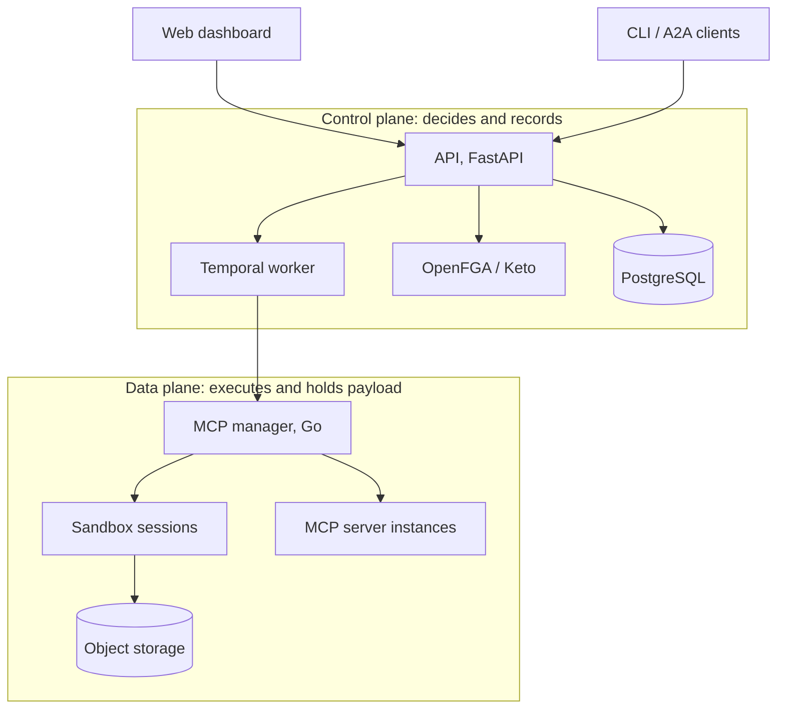

<div align="center">


**Run AI agents you can govern.**

[](LICENSE.md)
[](https://github.com/agentarea/agentarea/actions/workflows/ci.yml)
[](https://docs.agentarea.ai)
[](https://discord.gg/5tduPwheYQ)

[Docs](https://docs.agentarea.ai) · [Quickstart](#quickstart) · [How it works](https://docs.agentarea.ai/how-it-works) · [Discord](https://discord.gg/5tduPwheYQ)

</div>

AgentArea is a self-hosted platform for running AI agents under controls you
configure: which tools an agent may call, whose data it may read, what it may
spend, and what a human has to approve before it proceeds. Agents run in
isolated sandboxes on durable workflows, and every decision is recorded.

Getting one agent to work takes a weekend. Running agents where a mistake costs
something is a different problem, and it is mostly not about the model:

- An agent acts with someone's authority. Whose, and how far does it reach?
- Model output is untrusted input, and it arrives as a shell command or a tool call.
- Agents run for a long time. A crash mid-task should not lose the task.
- When something goes wrong, someone will ask what happened and why it was allowed.

Agent frameworks leave these to you. AgentArea makes them the platform's job.

## Quickstart

You need Docker with Docker Compose.

```bash
curl -fsSL https://raw.githubusercontent.com/agentarea/agentarea/main/scripts/install.sh | sh
```

The installer downloads the runtime bundle into `./agentarea`, generates the
credentials the stack needs, and offers to start it. It does not clone the
repository or install anything else. Want to read it first?
`curl -fsSL … -o install.sh && less install.sh`.

Then open **http://localhost:3000**, add an LLM provider key, create an agent,
and send it a task.

From then on it is plain Docker Compose in `./agentarea`:
`docker compose up -d`, `logs -f`, `down`. Settings live in `./agentarea/.env`.
It is safe to re-run the installer: it refreshes the bundle and leaves your
values alone.

Full walkthrough: [Quickstart](https://docs.agentarea.ai/quickstart). For
Kubernetes, see [Self-host](https://docs.agentarea.ai/self-host/requirements).

## What you get

| | |
|---|---|
| **Governed tool calls** | Every tool call passes a policy pipeline (budget gates, security filters, approvals) before it runs. The same policy decides which tools an agent is even shown. [→](https://docs.agentarea.ai/concepts/governance/tool-authorization) |
| **Human approvals** | A run can pause for a person's decision and wait as long as it takes, without holding a connection open. [→](https://docs.agentarea.ai/concepts/governance/approvals) |
| **Relationship-based authorization** | Access comes from relationships in a graph (this user manages this project, this project contains this agent), evaluated by OpenFGA or Ory Keto. Checks fail closed. [→](https://docs.agentarea.ai/concepts/governance/authorization-basics) |
| **Sandboxed execution** | Commands and skills run in isolated sandboxes managed by a separate Go service, not inside the workflow process. [→](https://docs.agentarea.ai/concepts/sandbox/why-a-sandbox) |
| **Durable runs** | Every agent run is a Temporal workflow. Restarting a worker does not lose the task. [→](https://docs.agentarea.ai/concepts/execution/durable-execution) |
| **MCP tools** | Connect remote MCP servers or host your own, with OAuth and server-side secrets. [→](https://docs.agentarea.ai/concepts/integration/mcp) |
| **Triggers** | Start agents on a schedule, from a webhook, or from an incoming channel message. [→](https://docs.agentarea.ai/concepts/integration/triggers) |
| **Audit** | Decisions are persisted as events you can query and stream. [→](https://docs.agentarea.ai/concepts/governance/audit) |

## How it fits together



The data plane can run inside your own network while the control plane stays
where it is. [How it works](https://docs.agentarea.ai/how-it-works) follows a
single request across this diagram.

**Stack:** Next.js · FastAPI (Python 3.12) · Temporal · Go · PostgreSQL · Valkey ·
S3-compatible object storage · OpenFGA or Ory Keto · Ory Kratos and Hydra.

## When not to use it

- **You are building one agent, or adding agent behaviour to an existing service.**
  Use a framework. AgentArea is a platform you operate, which means several
  services, a database, a workflow engine, and an authorization service.
- **You want something hosted to sign up for.** Right now the only documented
  option is self-hosting.
- **You need every part of it to be finished.** Parts of the network model
  describe intent and are not enforced yet. The
  [concept pages](https://docs.agentarea.ai/concepts/agentic-networks) say which.

## Repository

```
agentarea-platform/      API, Temporal worker, domain libraries (Python)
agentarea-webapp/        Web dashboard (Next.js)
agentarea-mcp-manager/   Sandbox and MCP server orchestration (Go)
agentarea-event-service/ Trigger and channel ingestion (Go)
agentarea-operator/      Kubernetes operator: catalog sync, LLM provider configs
agentarea-cli/           Terminal client (Node.js)
charts/                  Helm charts
docs/                    Documentation source for docs.agentarea.ai
```

To work on AgentArea itself, clone the repo and run `make up-dev`. It builds
images from your working tree. [CONTRIBUTING.md](CONTRIBUTING.md) covers the rest.

## Community

- [Discord](https://discord.gg/5tduPwheYQ): questions and discussion
- [GitHub Issues](https://github.com/agentarea/agentarea/issues): bugs and feature requests
- [X / Twitter](https://twitter.com/agentarea_hq): updates

Please read the [Code of Conduct](CODE_OF_CONDUCT.md). Report security issues as
described in [SECURITY.md](SECURITY.md), not in public issues.

## License

Apache 2.0. The full platform in this repository is open source and runs on its
own. Commercial features ship as a separately installed package, and
[Open core](https://docs.agentarea.ai/concepts/open-core) explains exactly where
the line is.
