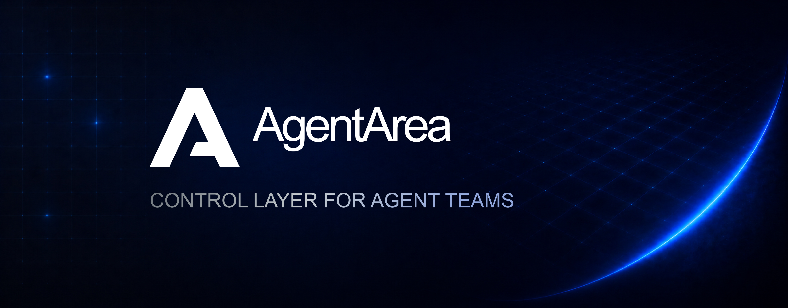

<div align="center">




## The platform for building governed agentic networks

[](LICENSE.md)
[](https://github.com/agentarea/agentarea/actions/workflows/ci.yml)
[](https://docs.agentarea.ai)
[](https://discord.gg/5tduPwheYQ)
[](https://github.com/agentarea/agentarea/stargazers)

[📖 Documentation](https://docs.agentarea.ai) •
[🚀 Quick Start](#-quick-start) •
[💬 Discord](https://discord.gg/93jVZ4Kx) •
[🐛 Report Bug](https://github.com/agentarea/agentarea/issues/new?template=bug_report.md) •
[✨ Request Feature](https://github.com/agentarea/agentarea/issues/new?template=feature_request.md)

</div>

---

## 🚀 What is AgentArea?

AgentArea is an open-core platform purpose-built for **agentic networks** and **agent governance**. Unlike single-agent frameworks, AgentArea provides the infrastructure to build, govern, and scale multi-agent systems with VPC-inspired network architecture and built-in compliance controls.

## 🎯 Why AgentArea?

Traditional agent frameworks focus on individual agents. AgentArea is different:

- **🌐 Agentic Networks First**: VPC-inspired architecture where agents communicate via A2A protocol with granular network permissions
- **🛡️ Governance Built-In**: Tool approvals, permission boundaries, ReBAC authorization, and audit trails from day one
- **🔗 A2A Protocol**: Native agent-to-agent communication standard for multi-agent orchestration
- **⚡ Production-Ready**: Temporal-based execution, Kubernetes-native, edge deployment, enterprise authentication
- **🏗️ Open-Core Model**: Core platform is open source (EPLv2), enterprise features available for compliance-critical deployments

### ✨ Core Capabilities

<table>
<tr>
<td width="50%">

#### 🌐 Agentic Networks
VPC-inspired network architecture with isolated agent groups. Configure granular permissions between agents, control inter-agent communication, and build secure multi-agent topologies.

#### 🛡️ Agent Governance
Granular tool permissions with approval workflows. Select which tools agents can use, require human approval for sensitive operations, and maintain full audit trails for compliance.

#### 🔗 A2A Protocol
Native agent-to-agent communication protocol. Agents can discover, connect, and collaborate with each other. Supports agent teams, task delegation, and hierarchical agent structures.

#### ⚡ Event-Driven Triggers
Fire agents on timers, webhooks, or third-party events. Build reactive agent systems that respond to external stimuli in real-time.

</td>
<td width="50%">

#### 🔌 MCP Server Management
Create and host MCP servers from templates or custom Dockerfiles. Add remote MCPs, verify updates with hash checking, and extend agent capabilities with external tools.

#### 🤖 Flexible Agent Creation
Build agents with custom instructions and tool configurations. Long-running task support with flexible termination criteria (goal achievement, budget limits, timeouts).

#### 🏗️ Production Infrastructure
Temporal for distributed execution and edge deployment. Kubernetes-native architecture. Multi-LLM support via LiteLLM proxy. Multiple secret backends (database, Infisical, AWS).

#### 🔐 Enterprise Authorization
Built-in Keto integration for fine-grained access control. Relationship-based access control (ReBAC) coming soon for advanced permission modeling.

</td>
</tr>
</table>

### 🎬 See It In Action

> 📸 *Screenshots and demo GIFs coming soon! [Contribute yours](https://github.com/agentarea/agentarea/discussions)*

## 🏃‍♂️ Quick Start

### Prerequisites

- Docker & Docker Compose

### Installation

```bash
# Clone the repository
git clone https://github.com/agentarea/agentarea.git
cd agentarea

# Start the platform
make up

# Access the platform at http://localhost:3000
```

That's it! The platform will start all necessary services and be ready to use.

## 📚 Documentation

- **[Getting Started](docs/getting-started.md)** - Complete setup guide
- **[Building Agents](docs/building-agents.md)** - Create and customize AI agents
- **[Agent Communication](docs/agent-communication.md)** - Multi-agent workflows
- **[MCP Integration](docs/mcp-integration.md)** - External tool integration
- **[Deployment](docs/deployment.md)** - Production deployment guide
- **[API Reference](docs/api-reference.md)** - Complete API documentation

## 🛠️ Project Structure

```
agentarea/
├── agentarea-platform/     # Backend API and services (Python)
│   ├── apps/               # Applications (API, Worker, CLI)
│   └── libs/               # Shared libraries
├── agentarea-webapp/       # Web interface (React/Next.js)
├── agentarea-mcp-manager/  # MCP server management (Go)
├── agent-placement/        # Agent orchestration (Node.js)
├── docs/                   # Documentation (Mintlify)
└── scripts/               # Development and deployment scripts
```


## 🏗️ Architecture

AgentArea is built for production agentic workloads with:

- **Agent Networks**: VPC-inspired isolation with granular permissions
- **A2A Protocol**: Native agent-to-agent communication
- **Temporal**: Distributed workflow orchestration for long-running agent tasks
- **Multi-LLM Support**: Provider-agnostic through LiteLLM proxy
- **MCP Infrastructure**: Extensible tool system with custom server support

For detailed architecture documentation, see [docs/architecture.md](docs/architecture.md).

See our [full roadmap](docs/roadmap.md) for more details.

## 🌟 Community

Join our community of AI developers:

- **💬 Discord**: [Get help and share ideas](https://discord.gg/93jVZ4Kx)
- **💭 GitHub Discussions**: [Q&A and feature requests](https://github.com/agentarea/agentarea/discussions)
- **🐛 Issues**: [Bug reports and feature requests](https://github.com/agentarea/agentarea/issues)
- **🐦 Twitter/X**: [Follow for updates](https://twitter.com/agentarea_hq)

## 📄 License

This project is licensed under the Eclipse Public License v2.0 (EPLv2) - see the [LICENSE](LICENSE) file for details.

## 🙏 Acknowledgments

AgentArea is built on top of many excellent open-source projects. See our [NOTICE](NOTICE) file for complete attribution.

---

<div align="center">

### ⭐ Star History

[](https://star-history.com/#agentarea/agentarea&Date)

### 🙌 Built With AgentArea

*Showcase your project here! [Submit via PR](https://github.com/agentarea/agentarea/pulls) or [Discussion](https://github.com/agentarea/agentarea/discussions)*

---

**[⭐ Star us on GitHub](https://github.com/agentarea/agentarea) • [📖 Read the Docs](https://docs.agentarea.ai) • [💬 Join Discord](https://discord.gg/93jVZ4Kx) • [🐦 Follow on Twitter](https://twitter.com/agentarea_hq)**

Made with ❤️ by the AgentArea community

</div>
