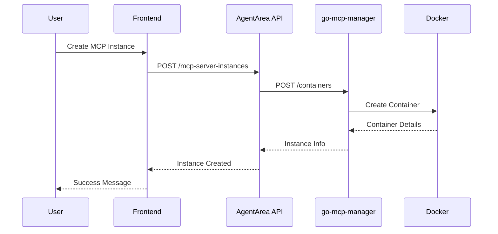

# AgentArea Platform - Consolidated Implementation Plan

*Last Updated: January 2025*

This document consolidates all implementation plans, roadmaps, and development priorities across the AgentArea platform into a single comprehensive guide.

## 📋 Implementation Status Overview

### ✅ Completed Components
- **Core Infrastructure**: Docker Compose, PostgreSQL, Redis, Traefik
- **Authentication System**: JWT-based auth with Clerk integration
- **Basic API Framework**: FastAPI with async support
- **MCP Infrastructure**: go-mcp-manager service
- **Database Models**: Core entities and relationships
- **Development Environment**: Hot reloading, debugging setup
- **Documentation Framework**: Comprehensive docs structure

### 🔄 In Progress Components
- **MCP Server Management**: Frontend integration pending
- **Agent Protocol Implementation**: A2A compliance work
- **Task Assignment System**: Core functionality implemented
- **Frontend Development**: React/Next.js components
- **API Documentation**: Swagger integration

### 📋 Pending Components
- **Production Deployment**: Kubernetes, monitoring
- **Advanced Agent Features**: Multi-agent collaboration
- **Enterprise Features**: RBAC, audit logging
- **Testing Coverage**: Integration and E2E tests
- **Performance Optimization**: Caching, scaling

## 🎯 Critical Path to Release

### Phase 1: Core Completion (Weeks 1-4)
**Priority: CRITICAL - Must complete for MVP**

#### 1.1 MCP Server Management Frontend
**Status**: 🔄 In Progress | **Owner**: Frontend Team | **Deadline**: Week 2

**Remaining Tasks**:
- [ ] Complete MCP instance creation UI (`/mcp-servers/add/page.tsx`)
- [ ] Implement instance management dashboard (`/mcp-servers/manage/page.tsx`)
- [ ] Add real-time status updates for MCP instances
- [ ] Integrate with backend MCP API endpoints
- [ ] Add error handling and validation

**Dependencies**:
- Backend MCP API endpoints (✅ Complete)
- go-mcp-manager service (✅ Complete)

#### 1.2 Agent Protocol Consolidation
**Status**: 🔄 In Progress | **Owner**: Backend Team | **Deadline**: Week 3

**Remaining Tasks**:
- [ ] Remove duplicate implementations (`a2a_chat.py`, `chat.py`)
- [ ] Complete unified protocol service (`protocol/service.py`)
- [ ] Implement missing A2A protocol types
- [ ] Fix InMemoryTaskManager abstract methods
- [ ] Create unified API endpoints (`protocol.py`)
- [ ] Update main router registration

**Files to Modify**:
```
core/agentarea/
├── api/v1/
│   ├── protocol.py          # NEW: Unified A2A endpoints
│   ├── tasks.py            # UPDATE: Simplified task management
│   └── router.py           # UPDATE: Register protocol router
├── modules/
│   ├── protocol/           # NEW: Protocol module
│   │   ├── service.py      # NEW: Core protocol service
│   │   ├── auth.py         # NEW: A2A authentication
│   │   └── streaming.py    # NEW: SSE streaming
│   └── tasks/
│       └── in_memory_task_manager.py # FIX: Abstract methods
└── common/utils/
    └── types.py            # UPDATE: Complete A2A types
```

#### 1.3 Authentication Integration
**Status**: 🔄 In Progress | **Owner**: Full-Stack Team | **Deadline**: Week 2

**Remaining Tasks**:
- [ ] Complete Clerk integration in frontend
- [ ] Implement JWT validation middleware
- [ ] Add protected route handling
- [ ] Test authentication flow end-to-end
- [ ] Add user session management

### Phase 2: Production Readiness (Weeks 5-8)
**Priority: HIGH - Required for production deployment**

#### 2.1 Kubernetes Deployment
**Status**: 📋 Not Started | **Owner**: DevOps Team | **Deadline**: Week 6

**Tasks**:
- [ ] Create Kubernetes manifests for all services
- [ ] Set up Helm charts for deployment
- [ ] Configure ingress and load balancing
- [ ] Implement health checks and readiness probes
- [ ] Set up persistent volumes for data
- [ ] Configure secrets management

#### 2.2 Monitoring and Observability
**Status**: 📋 Not Started | **Owner**: DevOps Team | **Deadline**: Week 7

**Tasks**:
- [ ] Deploy Prometheus for metrics collection
- [ ] Set up Grafana dashboards
- [ ] Implement structured logging
- [ ] Add distributed tracing
- [ ] Create alerting rules
- [ ] Set up log aggregation

#### 2.3 Testing Infrastructure
**Status**: 📋 Not Started | **Owner**: QA Team | **Deadline**: Week 8

**Tasks**:
- [ ] Expand unit test coverage to >80%
- [ ] Implement integration tests
- [ ] Add end-to-end test suite
- [ ] Set up CI/CD pipeline
- [ ] Add performance testing
- [ ] Implement security testing

### Phase 3: Polish and Launch (Weeks 9-12)
**Priority: MEDIUM - Enhancement and optimization**

#### 3.1 User Experience Improvements
**Tasks**:
- [ ] Improve UI/UX based on user feedback
- [ ] Add onboarding flow
- [ ] Implement help documentation
- [ ] Add keyboard shortcuts
- [ ] Optimize loading times

#### 3.2 Performance Optimization
**Tasks**:
- [ ] Implement caching strategies
- [ ] Optimize database queries
- [ ] Add connection pooling
- [ ] Implement rate limiting
- [ ] Add CDN for static assets

## 🏗️ Detailed Implementation Plans

### MCP Server Management Implementation

#### Backend API (✅ Complete)
**Location**: `core/agentarea/api/v1/mcp_server_instances.py`

**Endpoints**:
- `POST /mcp-server-instances` - Create new instance
- `GET /mcp-server-instances` - List instances
- `GET /mcp-server-instances/{id}` - Get instance details
- `DELETE /mcp-server-instances/{id}` - Delete instance
- `POST /mcp-server-instances/check` - Validate configuration

#### Frontend Implementation (🔄 In Progress)
**Location**: `frontend/src/app/mcp-servers/`

**Components**:
- `add/page.tsx` - Instance creation form
- `manage/page.tsx` - Instance management dashboard
- `[id]/setup/page.tsx` - Instance configuration
- `MyMCPsSection.tsx` - Active instances display
- `MCPSpecsSection.tsx` - Available templates

**Data Flow**:


### Agent Protocol Implementation

#### Current State Issues
- **Duplicate Code**: Multiple chat/task implementations
- **Incomplete A2A**: Missing protocol compliance
- **Abstract Methods**: InMemoryTaskManager not fully implemented
- **Inconsistent APIs**: Mixed JSON-RPC and REST patterns

#### Target Architecture
**Unified Protocol Service**:
```python
# modules/protocol/service.py
class ProtocolService:
    async def handle_jsonrpc(self, request: JSONRPCRequest) -> JSONRPCResponse
    async def send_message(self, message: Message) -> MessageResponse
    async def stream_task(self, task: Task) -> AsyncIterator[TaskUpdate]
    async def get_agent_card(self, agent_id: str) -> AgentCard
```

**API Consolidation**:
```python
# api/v1/protocol.py
@router.post("/rpc")
async def handle_jsonrpc(request: JSONRPCRequest):
    """Single endpoint for all A2A JSON-RPC methods"""

@router.post("/messages")
async def send_message(message: MessageRequest):
    """REST endpoint for message sending"""

@router.get("/agents/{agent_id}/card")
async def get_agent_card(agent_id: str):
    """Agent discovery endpoint"""
```

### Task Assignment System

#### Current Implementation (✅ Complete)
**Location**: `core/agentarea/modules/tasks/`

**Features**:
- A2A protocol compliance
- JSON-RPC and REST APIs
- Task filtering by user/agent
- In-memory storage (development)
- Event streaming support

**APIs**:
```http
POST /v1/tasks/send          # JSON-RPC task creation
POST /v1/tasks/              # REST task creation
GET  /v1/tasks/user/{id}     # Get tasks by user
GET  /v1/tasks/agent/{id}    # Get tasks by agent
GET  /v1/tasks/{id}          # Get specific task
```

#### Future Enhancements
- [ ] Persistent storage (PostgreSQL)
- [ ] Task prioritization
- [ ] Bulk operations
- [ ] Advanced filtering
- [ ] Task templates

### Authentication System

#### Current Implementation (✅ Backend Complete)
**Components**:
- JWT middleware for API protection
- Clerk integration for frontend
- OIDC support via NextAuth.js
- Protected route handling

**Files**:
```
core/agentarea/
├── api/deps/auth.py         # FastAPI auth dependencies
├── middleware/jwt_middleware.py # JWT validation
└── api/v1/auth.py          # Auth endpoints

frontend/
├── middleware.ts           # Clerk middleware
└── lib/auth.ts            # Auth utilities
```

#### Remaining Tasks
- [ ] Complete frontend Clerk integration
- [ ] Add user profile management
- [ ] Implement role-based access control
- [ ] Add API key management
- [ ] Test authentication flows

## 🚀 Deployment Strategy

### Development Environment (✅ Complete)
**Setup**: Docker Compose with hot reloading
**Services**: PostgreSQL, Redis, Traefik, MinIO
**Command**: `make dev-up`

### Production Environment (📋 Planned)
**Platform**: Kubernetes
**Infrastructure**: 
- **Compute**: Auto-scaling pods
- **Storage**: Persistent volumes
- **Networking**: Ingress controllers
- **Monitoring**: Prometheus + Grafana
- **Security**: Network policies, secrets

**Deployment Pipeline**:
1. **Build**: Docker images with multi-stage builds
2. **Test**: Automated testing in CI/CD
3. **Deploy**: Helm charts to Kubernetes
4. **Monitor**: Health checks and metrics
5. **Scale**: Auto-scaling based on load

## 📊 Success Metrics

### Technical Metrics
- [ ] **API Response Time**: <200ms for 95th percentile
- [ ] **Uptime**: 99.9% availability
- [ ] **Test Coverage**: >80% code coverage
- [ ] **Security**: Zero critical vulnerabilities
- [ ] **Performance**: Handle 1000+ concurrent users

### User Experience Metrics
- [ ] **Onboarding**: <5 minutes to first agent
- [ ] **MCP Setup**: <2 minutes to deploy server
- [ ] **Task Creation**: <30 seconds end-to-end
- [ ] **Error Rate**: <1% user-facing errors
- [ ] **Documentation**: Complete API coverage

## 🔧 Development Guidelines

### Code Quality Standards
- **Type Safety**: Full TypeScript/Python typing
- **Testing**: Unit + Integration + E2E tests
- **Documentation**: Inline docs + API specs
- **Security**: Input validation, auth checks
- **Performance**: Async/await, connection pooling

### Git Workflow
- **Branching**: Feature branches from main
- **Reviews**: Required PR reviews
- **Testing**: CI/CD pipeline validation
- **Deployment**: Automated staging deployment

### Architecture Principles
- **Separation of Concerns**: Clear module boundaries
- **Dependency Injection**: Testable, modular code
- **Event-Driven**: Loose coupling via events
- **Protocol Agnostic**: Support multiple standards
- **Cloud Native**: Containerized, scalable

## 📚 Documentation Requirements

### User Documentation
- [ ] **Getting Started Guide**: Complete setup walkthrough
- [ ] **API Reference**: Interactive Swagger docs
- [ ] **Tutorials**: Step-by-step examples
- [ ] **Troubleshooting**: Common issues and solutions
- [ ] **Best Practices**: Recommended patterns

### Developer Documentation
- [ ] **Architecture Guide**: System design overview
- [ ] **Contributing Guide**: Development workflow
- [ ] **API Specifications**: OpenAPI schemas
- [ ] **Deployment Guide**: Production setup
- [ ] **Security Guide**: Security best practices

## 🎯 Next Actions

### Immediate (This Week)
1. **Complete MCP frontend integration**
2. **Fix agent protocol duplications**
3. **Test authentication end-to-end**
4. **Update API documentation**

### Short Term (Next 2 Weeks)
1. **Implement Kubernetes deployment**
2. **Add monitoring and logging**
3. **Expand test coverage**
4. **Performance optimization**

### Medium Term (Next Month)
1. **Production deployment**
2. **User feedback integration**
3. **Advanced features**
4. **Marketplace preparation**

---

*This document serves as the single source of truth for AgentArea implementation status and priorities. It should be updated weekly to reflect current progress and changing priorities.*