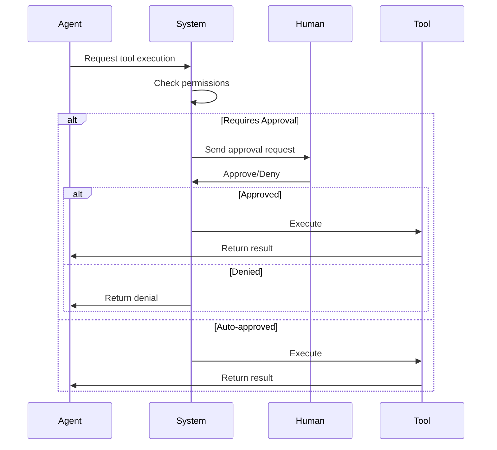

# Agent Governance

<Info>
Built-in governance controls for enterprise compliance: tool approvals, permission boundaries, budget controls, and audit trails.
</Info>

## Overview

AgentArea provides comprehensive governance controls to ensure agents operate within defined boundaries. This is critical for:

- **Compliance**: SOC 2, GDPR, HIPAA requirements
- **Security**: Prevent unauthorized actions
- **Cost Control**: Budget limits and monitoring
- **Audit**: Complete action history

---

## Tool Permissions

### Permission Model

Each agent has a configured set of allowed tools:

```yaml
agent:
  name: "Customer Support Agent"
  
  tools:
    # Allowed without approval
    - name: knowledge_base_search
      enabled: true
      requires_approval: false
    
    # Requires human approval
    - name: refund_payment
      enabled: true
      requires_approval: true
      approval_config:
        timeout_seconds: 300
        auto_deny_on_timeout: true
        notify_channels: ["slack:approvals"]
    
    # Completely disabled
    - name: database_write
      enabled: false
```

### Approval Workflow



### Implementation

```python
# Workflow checks tool permissions
async def execute_tool(self, tool_call: ToolCall):
    # Check if tool requires approval
    if self._tool_requires_approval(tool_call.name):
        # Emit approval request event
        await self._publish_event(
            EventType.HUMAN_APPROVAL_REQUESTED,
            {"tool": tool_call.name, "args": tool_call.args}
        )
        
        # Wait for approval signal
        approval = await self._wait_for_approval(timeout=300)
        
        if not approval.granted:
            raise ApprovalDeniedError(approval.reason)
    
    # Execute the tool
    return await self._execute_mcp_tool(tool_call)
```

---

## Budget Controls

### Cost Limits

Prevent runaway agent execution with budget controls:

```yaml
agent:
  budget:
    max_tokens: 100000        # Total token limit
    max_cost_usd: 10.00       # Maximum cost in USD
    max_iterations: 50        # Maximum execution loops
    
  # Termination conditions
  termination:
    on_goal_achieved: true    # Stop when goal complete
    on_budget_exceeded: true  # Stop when budget hit
    on_timeout: 3600          # Stop after 1 hour
```

### Budget Tracking

```python
class BudgetTracker:
    def __init__(self, limits: BudgetLimits):
        self.limits = limits
        self.tokens_used = 0
        self.cost_usd = 0.0
        self.iterations = 0
    
    def check_budget(self) -> BudgetStatus:
        warnings = []
        
        if self.tokens_used > self.limits.max_tokens * 0.8:
            warnings.append("Token usage at 80%")
        
        if self.cost_usd > self.limits.max_cost_usd * 0.9:
            warnings.append("Cost at 90% of budget")
        
        exceeded = (
            self.tokens_used >= self.limits.max_tokens or
            self.cost_usd >= self.limits.max_cost_usd or
            self.iterations >= self.limits.max_iterations
        )
        
        return BudgetStatus(
            exceeded=exceeded,
            warnings=warnings,
            remaining_tokens=self.limits.max_tokens - self.tokens_used,
            remaining_cost=self.limits.max_cost_usd - self.cost_usd
        )
```

---

## Execution Controls

### Termination Criteria

Agents can be configured with flexible termination conditions:

| Condition | Description |
|-----------|-------------|
| `goal_achieved` | Agent signals task completion |
| `budget_exceeded` | Token/cost limit reached |
| `timeout` | Time limit exceeded |
| `max_iterations` | Maximum loops completed |
| `error_threshold` | Too many errors |

### Pause/Resume

Control agent execution in real-time:

```python
# Pause execution
await workflow.pause_execution(reason="Awaiting review")

# Resume execution
await workflow.resume_execution(reason="Review complete")

# Query state
state = await workflow.get_current_state()
```

---

## Audit Trails

### Event Sourcing

All agent actions are captured as events:

```python
# Event types
class EventType(Enum):
    WORKFLOW_STARTED = "workflow.started"
    WORKFLOW_COMPLETED = "workflow.completed"
    
    LLM_CALL_STARTED = "llm_call.started"
    LLM_CALL_COMPLETED = "llm_call.completed"
    
    TOOL_CALL_STARTED = "tool_call.started"
    TOOL_CALL_COMPLETED = "tool_call.completed"
    
    HUMAN_APPROVAL_REQUESTED = "human_approval.requested"
    HUMAN_APPROVAL_RECEIVED = "human_approval.received"
    
    BUDGET_WARNING = "budget.warning"
    BUDGET_EXCEEDED = "budget.exceeded"
```

### Event Storage

Events are stored in two places:

1. **Redis** - Real-time SSE streaming to frontend
2. **PostgreSQL** - Persistent storage for history

```sql
-- Task events table
CREATE TABLE task_events (
    id UUID PRIMARY KEY,
    task_id UUID REFERENCES tasks(id),
    event_type VARCHAR NOT NULL,
    event_data JSONB NOT NULL,
    created_at TIMESTAMP DEFAULT NOW()
);

-- Create index for efficient queries
CREATE INDEX idx_task_events_task_id ON task_events(task_id);
CREATE INDEX idx_task_events_type ON task_events(event_type);
```

### Audit Queries

```sql
-- Get all tool executions for a task
SELECT * FROM task_events 
WHERE task_id = 'task-123' 
  AND event_type LIKE 'tool_call.%'
ORDER BY created_at;

-- Get approval history
SELECT * FROM task_events
WHERE event_type LIKE 'human_approval.%'
  AND event_data->>'approver_id' IS NOT NULL;
```

---

## Governance Configuration

### Agent Configuration

```yaml
# Complete governance configuration
agent:
  id: "agent-123"
  name: "Production Agent"
  
  # Tool permissions
  tools:
    - name: "*"
      enabled: false  # Deny all by default
    
    - name: web_search
      enabled: true
    
    - name: file_read
      enabled: true
    
    - name: file_write
      enabled: true
      requires_approval: true
  
  # Budget limits
  budget:
    max_tokens: 500000
    max_cost_usd: 50.00
    max_iterations: 100
  
  # Execution controls
  execution:
    timeout_seconds: 7200
    enable_pause: true
    enable_cancel: true
  
  # Audit settings
  audit:
    log_all_events: true
    retention_days: 90
    include_message_content: true
```

---

## Best Practices

<Accordion>
  <AccordionItem title="Least Privilege">
    - Start with all tools disabled
    - Enable only necessary tools
    - Require approval for sensitive operations
    - Review permissions regularly
  </AccordionItem>
  
  <AccordionItem title="Budget Planning">
    - Set realistic token limits based on task complexity
    - Monitor usage patterns
    - Set up alerts at 80% threshold
    - Review and adjust limits quarterly
  </AccordionItem>
  
  <AccordionItem title="Approval Workflows">
    - Define clear approval SLAs
    - Set up notification channels
    - Create approval escalation paths
    - Document approval criteria
  </AccordionItem>
</Accordion>

---

## Next Steps

<CardGroup cols={2}>
  <Card title="MCP Integration" icon="plug" href="/mcp-integration">
    Configure external tools
  </Card>
  <Card title="Security" icon="shield" href="/security">
    Security best practices
  </Card>
</CardGroup>
