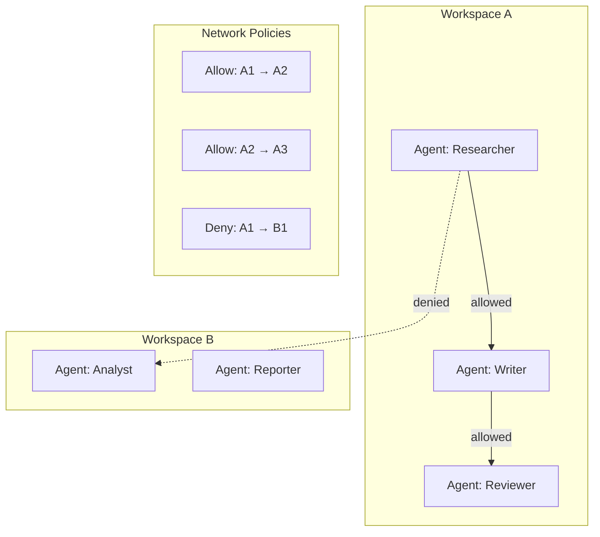

# Agentic Networks

<Info>
VPC-inspired network architecture for building secure, isolated multi-agent systems with granular communication controls.
</Info>

## Overview

Traditional agent frameworks treat agents as isolated entities. AgentArea takes a different approach: **agentic networks** where agents can communicate, collaborate, and coordinate within controlled network boundaries.



---

## Core Concepts

### Workspaces

Workspaces provide tenant-level isolation. Each workspace has:

- **Isolated data**: Agents, tasks, MCP servers scoped to workspace
- **User access**: Workspace-specific user permissions
- **Network boundaries**: Agents can only communicate within workspace

```python
# All entities are workspace-scoped
class Agent(BaseModel, WorkspaceScopedMixin):
    id: UUID
    name: str
    workspace_id: UUID  # Required for isolation
```

### Agent Networks

Within a workspace, organize agents into logical networks:

<CardGroup cols={2}>
  <Card title="Hierarchical" icon="sitemap">
    Manager → Workers pattern for task distribution
  </Card>
  <Card title="Peer-to-Peer" icon="users">
    Collaborative agents with shared context
  </Card>
  <Card title="Pipeline" icon="arrow-right-arrow-left">
    Sequential processing chain
  </Card>
  <Card title="Mesh" icon="circle-nodes">
    Full interconnection for complex workflows
  </Card>
</CardGroup>

---

## Network Policies

### Communication Rules

Control which agents can communicate:

```yaml
network_policy:
  workspace_id: "ws-123"
  
  rules:
    # Allow researcher to send to writer
    - from: "researcher-agent"
      to: "writer-agent"
      action: allow
      channels: ["tasks", "messages"]
    
    # Deny direct access to database agent
    - from: "researcher-agent"
      to: "database-agent"
      action: deny
    
    # Allow manager to communicate with all
    - from: "manager-agent"
      to: "*"
      action: allow
```

### A2A Protocol

Agents communicate via the Agent-to-Agent (A2A) protocol:

<Tabs>
  <Tab title="Message Structure">
    ```json
    {
      "jsonrpc": "2.0",
      "method": "tasks/send",
      "params": {
        "id": "task-123",
        "message": {
          "role": "user",
          "parts": [{"text": "Analyze this data"}]
        }
      }
    }
    ```
  </Tab>
  
  <Tab title="Agent Card">
    ```json
    {
      "name": "Data Analyst",
      "description": "Analyzes datasets and generates reports",
      "capabilities": {
        "streaming": true,
        "push_notifications": true
      },
      "skills": [
        {"name": "analyze", "description": "Analyze data"}
      ]
    }
    ```
  </Tab>
</Tabs>

---

## Implementation

### Workspace Scoping

All data is automatically scoped to workspaces:

```python
# Repository pattern enforces workspace scoping
class WorkspaceScopedRepository(Generic[T]):
    def __init__(self, session: AsyncSession, user_context: UserContext):
        self.session = session
        self.workspace_id = user_context.workspace_id
    
    async def list(self) -> list[T]:
        # Automatically filters by workspace
        return await self.session.execute(
            select(self.model).where(
                self.model.workspace_id == self.workspace_id
            )
        )
```

### User Context

Every request carries user context for scoping:

```python
@dataclass
class UserContext:
    user_id: str
    workspace_id: str
    roles: list[str] | None = None
```

### A2A Bridge

The A2A bridge handles inter-agent communication:

```python
# Internal routing
class A2ABridge:
    async def route_message(
        self, 
        from_agent: str, 
        to_agent: str, 
        message: dict
    ):
        # Check network policy
        if not self.policy.is_allowed(from_agent, to_agent):
            raise CommunicationDeniedError()
        
        # Route to target agent
        await self.agent_manager.deliver(to_agent, message)
```

---

## Best Practices

### Network Design

<Accordion>
  <AccordionItem title="Start Simple">
    - Begin with a single manager-worker pattern
    - Add more agents as complexity grows
    - Keep communication paths minimal
  </AccordionItem>
  
  <AccordionItem title="Define Clear Boundaries">
    - Each agent should have a single responsibility
    - Document which agents can communicate
    - Use deny-by-default policies
  </AccordionItem>
  
  <AccordionItem title="Monitor Communication">
    - Log all inter-agent messages
    - Track message volumes
    - Set up alerts for unusual patterns
  </AccordionItem>
</Accordion>

### Security Considerations

| Practice | Why |
|----------|-----|
| Deny by default | Only allow necessary communication |
| Audit all messages | Compliance and debugging |
| Rate limiting | Prevent agent spam |
| Workspace isolation | Multi-tenant security |

---

## Next Steps

<CardGroup cols={2}>
  <Card title="Agent Communication" icon="arrows-turn-to-dots" href="/agent-communication">
    A2A protocol details
  </Card>
  <Card title="Agent Governance" icon="shield-halved" href="/agent-governance">
    Tool permissions and approvals
  </Card>
</CardGroup>
