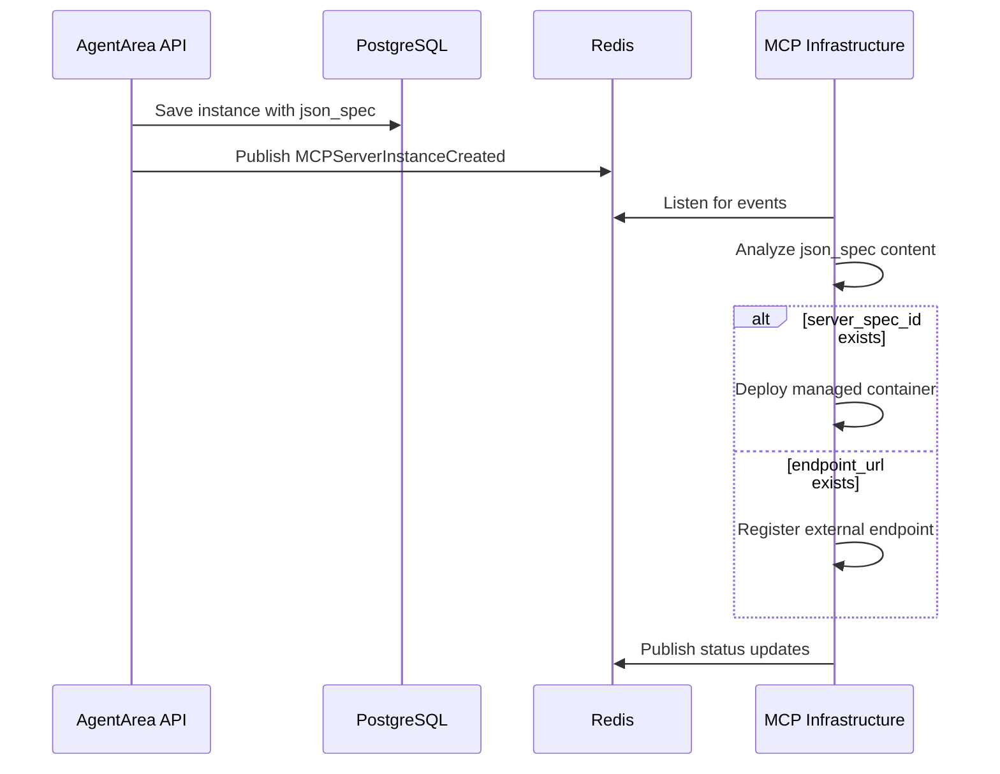

# AgentArea Architecture Insights & Learnings

*Document created: June 2025*  
*Last updated: During unified MCP architecture implementation*

---

## 🏗️ **Architecture Overview**

AgentArea is a microservices-based agent management and orchestration platform with event-driven MCP (Model Context Protocol) integration.

### **Core Components**
- **AgentArea Backend** (FastAPI) - Main API and business logic
- **MCP Infrastructure** (Go) - Container orchestration and MCP server management  
- **PostgreSQL** - Primary data store
- **Redis** - Event bus and caching
- **MinIO** - Object storage
- **Infisical** - Secret management

---

## 🎯 **Key Architectural Insights**

### **1. Event-Driven MCP Integration**

**Problem Solved:** Originally had complex integration services and event bridges between AgentArea and MCP Infrastructure.

**Solution:** Simplified to pure event-driven architecture:
```python
# AgentArea publishes domain events
await self.event_broker.publish(
    MCPServerInstanceCreated(
        instance_id=str(instance.id),
        server_spec_id=server_spec_id,
        name=instance.name,
        json_spec=spec  # ← Key: unified configuration
    )
)
```

**Benefits:**
- ✅ Clean separation of concerns
- ✅ No tight coupling between services
- ✅ MCP Infrastructure auto-detects provider type from json_spec
- ✅ Scalable and resilient

### **2. Unified Configuration Pattern (json_spec)**

**Inspired by Airbyte Connectors** - all configuration stored in single JSON field:

```python
# External MCP Provider
{
    "endpoint_url": "https://api.example.com/mcp",
    "headers": {
        "Authorization": "Bearer token"
    }
}

# Managed MCP Provider  
{
    "env_vars": {
        "API_KEY": "secret_ref_123",
        "ROOT_DIR": "/data"
    }
}
```

**Benefits:**
- ✅ No need for explicit provider_type field
- ✅ Flexible schema - can add new provider types without DB changes
- ✅ MCP Infrastructure determines behavior from content
- ✅ Similar to modern integration platforms

### **3. Domain-Driven Event Design**

Events follow domain semantics, not infrastructure concerns:
```python
# Domain Events (what happened)
MCPServerInstanceCreated
MCPServerInstanceUpdated
MCPServerInstanceDeleted
MCPServerInstanceStarted
MCPServerInstanceStopped

# NOT Infrastructure Events (how it happened)
ContainerStarted, DockerDeployed, etc.
```

**Benefits:**
- ✅ Events remain stable as infrastructure changes
- ✅ Multiple infrastructure implementations possible
- ✅ Clear business meaning

---

## 🏛️ **Database Architecture**

### **Key Design Decisions**

1. **UUID Primary Keys** - All entities use UUID for distributed system compatibility
2. **JSON Columns** - Heavy use of PostgreSQL JSON for flexible schemas
3. **Timezone Strategy** - All timestamps stored as naive UTC (learned through debugging!)
4. **Foreign Key Strategy** - Nullable `server_spec_id` allows external providers

### **Schema Evolution**
```sql
-- Old Schema (provider-specific)
CREATE TABLE mcp_server_instances (
    id UUID PRIMARY KEY,
    provider_type VARCHAR NOT NULL,  -- ❌ Removed
    endpoint_url VARCHAR,            -- ❌ Removed  
    config JSON,                     -- ❌ Removed
    server_id UUID REFERENCES...    -- ❌ Renamed
);

-- New Schema (unified)
CREATE TABLE mcp_server_instances (
    id UUID PRIMARY KEY,
    server_spec_id VARCHAR,          -- ✅ Nullable for external
    json_spec JSON NOT NULL,         -- ✅ Unified config
    description TEXT,                -- ✅ Added
    name VARCHAR NOT NULL,
    status VARCHAR,
    created_at TIMESTAMP,
    updated_at TIMESTAMP
);
```

---

## 🔄 **Event Flow Architecture**

### **MCP Instance Creation Flow**


**Key Learning:** The json_spec content determines the deployment strategy automatically!

---

## 💡 **Implementation Patterns**

### **1. Dependency Injection Pattern**
```python
# Clean DI pattern used throughout
async def get_mcp_server_instance_service(
    repository: MCPServerInstanceRepository = Depends(get_repository),
    event_broker: EventBroker = Depends(get_event_broker),
    secret_manager: BaseSecretManager = Depends(get_secret_manager),
) -> MCPServerInstanceService:
    return MCPServerInstanceService(repository, event_broker, secret_manager)
```

### **2. Repository Pattern**
```python
class MCPServerInstanceRepository(BaseCrudRepository):
    async def list(self, server_spec_id: Optional[str] = None, status: Optional[str] = None):
        # Clean separation of data access logic
```

### **3. Domain Events Pattern**
```python
class MCPServerInstanceCreated(DomainEvent):
    def __init__(self, instance_id: str, server_spec_id: Optional[str], 
                 name: str, json_spec: Dict[str, Any]):
        super().__init__()
        # Events carry complete business context
```

---

## 🔧 **Development Environment Insights**

### **Docker Compose Architecture**
- **Networks**: Separate `mcp-network` for MCP services isolation
- **Health Checks**: Proper dependency ordering with health checks
- **Volumes**: Persistent storage for containers and databases
- **Environment Variables**: Centralized configuration management

### **Key Environment Variables**
```yaml
# AgentArea Backend
- REDIS_URL=redis://redis:6379          # Event bus
- MCP_MANAGER_URL=http://mcp-manager:8000
- DATABASE_URL=postgresql://...

# MCP Infrastructure  
- REDIS_URL=redis://redis:6379          # Same Redis!
- TEMPLATES_DIR=/app/templates
```

**Critical:** Both services share the same Redis instance for event communication.

---

## 🚨 **Common Pitfalls & Solutions**

### **1. Timezone Issues**
**Problem:** Mixing timezone-aware and naive datetimes
```python
# ❌ This breaks
created_at = Column(DateTime, default=lambda: datetime.now(timezone.utc))

# ✅ This works
created_at = Column(DateTime, default=datetime.utcnow)
```

### **2. Database Type Mismatches**
**Problem:** Model-database schema mismatches
- Model had `Integer` but database had `UUID`
- Response schema had `int` but model returned `UUID`

### **3. Import Circular Dependencies**
**Solution:** Clear module boundaries and dependency injection

### **4. Event Schema Evolution**
**Learning:** Keep events focused on business concepts, not implementation details

---

## 🎯 **Performance Considerations**

### **Database**
- Connection pooling configured
- Async database operations throughout
- JSON queries optimized with proper indexing

### **Event System**
- Redis pub/sub for low-latency events
- Event deduplication and idempotency patterns
- Graceful degradation when event system unavailable

### **API Design**
- Async FastAPI for high concurrency
- Proper error handling and validation
- OpenAPI documentation auto-generated

---

## 🔐 **Security Architecture**

### **Secret Management**
```python
class MCPEnvironmentService:
    # Environment variables stored in secret manager
    # Instance configs only store references, never values
    async def set_instance_environment(self, instance_id: UUID, env_vars: Dict[str, str]):
        # Store actual values in secret manager
        # Return only reference keys
```

### **Patterns**
- **Principle of Least Privilege**: Services only access what they need
- **Secret Rotation**: Environment variables can be updated without redeployment
- **Audit Trail**: All changes tracked through domain events

---

## 🚀 **Deployment Architecture**

### **Container Strategy**
- **AgentArea**: Python/FastAPI in container
- **MCP Infrastructure**: Go microservice with Podman for container management
- **MCP Servers**: Dynamic containers managed by MCP Infrastructure
- **Reverse Proxy**: Caddy for routing and SSL termination

### **Scaling Patterns**
- **Horizontal Scaling**: Multiple AgentArea backend instances
- **Event-Driven**: Natural load distribution through Redis
- **Database**: Connection pooling and read replicas potential
- **Container Orchestration**: MCP Infrastructure handles MCP server scaling

---

## 📚 **Technology Stack Insights**

### **Why FastAPI**
- ✅ Native async/await support
- ✅ Excellent OpenAPI integration
- ✅ Type hints and validation
- ✅ High performance

### **Why PostgreSQL**
- ✅ ACID compliance for critical data
- ✅ Excellent JSON support for flexible schemas
- ✅ Strong ecosystem and tooling

### **Why Redis**
- ✅ Low-latency pub/sub for events
- ✅ Simple and reliable
- ✅ Good persistence options

### **Why Go for MCP Infrastructure**
- ✅ Excellent container management libraries
- ✅ High performance for orchestration tasks
- ✅ Simple deployment and cross-compilation

---

## 🎯 **Future Architecture Considerations**

### **Potential Improvements**
1. **Event Sourcing**: Full event sourcing for audit and replay capabilities
2. **CQRS**: Separate read/write models for complex queries
3. **Multi-tenancy**: Tenant isolation at database and container level
4. **Service Mesh**: Istio/Linkerd for complex microservice communication
5. **Observability**: Distributed tracing and metrics collection

### **Scaling Challenges**
1. **Database Sharding**: When single PostgreSQL instance insufficient
2. **Cross-Region**: Handling distributed events across regions
3. **Container Orchestration**: Moving from single-host to Kubernetes
4. **State Management**: Managing stateful MCP servers across nodes

---

## 💡 **Key Learnings Summary**

1. **Event-Driven Architecture** is powerful but requires careful event design
2. **Unified Configuration** (json_spec pattern) provides flexibility without complexity
3. **Domain Events** should focus on business meaning, not implementation
4. **Proper Dependency Injection** makes testing and maintenance much easier
5. **Database Schema Evolution** needs careful planning, especially with foreign keys
6. **Container Orchestration** is complex - dedicated service (MCP Infrastructure) was right choice
7. **Redis as Event Bus** is simple and effective for moderate scale
8. **Type Safety** (Python type hints + Pydantic) catches many errors early

---

## 📖 **Recommended Reading**

- **Domain-Driven Design** by Eric Evans
- **Building Event-Driven Microservices** by Adam Bellemare
- **Microservices Patterns** by Chris Richardson
- **FastAPI Documentation** - particularly async patterns
- **PostgreSQL JSON Documentation** - for flexible schema design

---

*This document represents learnings from implementing a production-ready agent orchestration platform. The insights here can guide future development and architectural decisions.* 