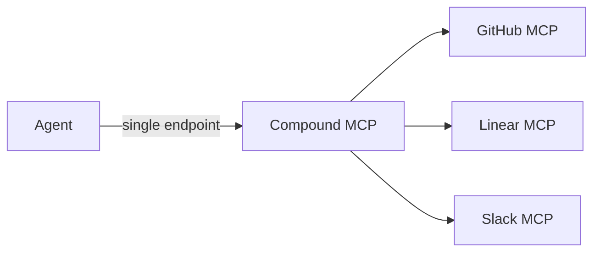

# Compound MCPs

<Info>
Combine multiple MCP server instances into a single virtual endpoint with configurable routing — expose all tools simultaneously, fail over automatically, or route conditionally based on runtime expressions.
</Info>

## Overview

A **Compound MCP** is a virtual MCP server that proxies requests to one or more underlying MCP server instances. Instead of wiring each MCP separately into your agent, you create one Compound MCP that aggregates them and present a unified tool surface.



This gives you a clean separation between how agents consume tools and how those tools are deployed. You can swap, reorder, or add member servers without changing any agent configuration.

---

## Key Concepts

<CardGroup cols={3}>
  <Card title="Routing Modes" icon="arrows-split-up-and-left">
    Control how requests are distributed across member servers — simultaneously, in priority order, or by condition.
  </Card>
  <Card title="Tool Namespacing" icon="tag">
    Each member's tools are prefixed with a namespace to avoid collisions when multiple servers expose identically named tools.
  </Card>
  <Card title="Status Aggregation" icon="chart-bar">
    Compound MCP health rolls up from its members: all running → `running`, some running → `degraded`, none → `stopped`.
  </Card>
</CardGroup>

---

## Routing Modes

<Tabs>
  <Tab title="parallel">
    All member tools are exposed simultaneously. When an agent calls a tool, it is routed to whichever member owns that tool based on the namespace prefix.

    **Use this when:** you want to give an agent access to the combined tool surface of multiple MCP servers at once.

    ```
    Agent calls: github__create_issue
           ↓
    Routed to: GitHub MCP instance

    Agent calls: linear__create_ticket
           ↓
    Routed to: Linear MCP instance
    ```

    This is the default routing mode.
  </Tab>

  <Tab title="fallback">
    Members are tried in `order` (ascending). The first healthy member handles the request. If it is unavailable, the next member is tried.

    **Use this when:** you have primary and backup MCP servers providing the same capability, and you want automatic failover.

    ```
    order=0  Primary Slack MCP    ← tried first
    order=1  Backup Slack MCP     ← tried if primary unhealthy
    order=2  Emergency Slack MCP  ← tried if both above fail
    ```

    <Note>
    Member health is checked before routing. An unhealthy member is skipped and the next in order is tried.
    </Note>
  </Tab>

  <Tab title="conditional">
    Each member carries a `condition_expression` in its config. At request time, the expression is evaluated against the request context. The first member whose condition evaluates to true handles the request.

    **Use this when:** you need to route to different MCP backends based on runtime factors — environment, user role, payload content, etc.

    ```json
    {
      "condition_expression": "env == 'production'"
    }
    ```

    ```json
    {
      "condition_expression": "user.role == 'admin'"
    }
    ```
  </Tab>
</Tabs>

---

## Tool Namespacing

When multiple MCP servers expose tools with the same name (e.g. `search`), Compound MCP avoids collisions by prefixing each member's tools with a namespace.

The namespace is resolved in this order:

1. The `namespace_prefix` field in the member's `config` — use this for human-readable names.
2. The first 8 characters of the MCP instance UUID — used as a stable fallback when no prefix is set.

```
namespace_prefix: "github"  →  github__search_repos
namespace_prefix: "linear"  →  linear__search_issues

(no prefix set, instance id = a3f8c1d2-...)
                             →  a3f8c1d2__search
```

### Tool Aliases

Within the member `config`, you can also define an `aliases` map to rename tools before they are exposed:

```json
{
  "namespace_prefix": "gh",
  "aliases": {
    "create_issue": "open_ticket",
    "list_repos":   "get_repos"
  }
}
```

The original tool name `create_issue` becomes `gh__open_ticket` in the compound's tool list.

---

## Status Aggregation

The Compound MCP computes a rolled-up status from its members:

| Member statuses | Compound status |
|-----------------|-----------------|
| All `running` | `running` |
| At least one `running`, others not | `degraded` |
| None `running` | `stopped` |
| No members | `unknown` |

A `degraded` compound can still serve requests — only the unavailable members are affected.

---

## API Reference

Base path: `/v1/compound-mcps`

### Compound MCP endpoints

| Method | Path | Description |
|--------|------|-------------|
| `POST` | `/` | Create a compound MCP |
| `GET` | `/` | List all compound MCPs |
| `GET` | `/{id}` | Get a compound MCP |
| `PUT` | `/{id}` | Update a compound MCP |
| `DELETE` | `/{id}` | Delete a compound MCP |

### Member endpoints

| Method | Path | Description |
|--------|------|-------------|
| `GET` | `/{id}/members` | List members (includes computed namespace) |
| `POST` | `/{id}/members` | Add a member |
| `DELETE` | `/{id}/members/{instance_id}` | Remove a member |

<Warning>
Compound MCPs are workspace-scoped. All member MCP instances must belong to the same workspace.
</Warning>

---

## Practical Examples

### Example 1 — Unified Dev Tools (parallel)

Expose GitHub, Linear, and Slack to an agent through a single endpoint.

<Steps>
  <Step title="Create the compound">
    ```bash
    curl -X POST https://api.agentarea.io/v1/compound-mcps \
      -H "Authorization: Bearer $TOKEN" \
      -H "Content-Type: application/json" \
      -d '{
        "name": "Dev Tools",
        "description": "GitHub, Linear, and Slack for engineering agents",
        "routing_mode": "parallel"
      }'
    ```

    ```json
    {
      "id": "c1d2e3f4-...",
      "name": "Dev Tools",
      "routing_mode": "parallel",
      "created_at": "2026-03-09T10:00:00Z",
      "updated_at": "2026-03-09T10:00:00Z"
    }
    ```
  </Step>

  <Step title="Add GitHub MCP with a namespace">
    ```bash
    curl -X POST https://api.agentarea.io/v1/compound-mcps/c1d2e3f4-.../members \
      -H "Authorization: Bearer $TOKEN" \
      -H "Content-Type: application/json" \
      -d '{
        "mcp_instance_id": "11111111-...",
        "order": 0,
        "config": {
          "namespace_prefix": "github"
        }
      }'
    ```
  </Step>

  <Step title="Add Linear MCP">
    ```bash
    curl -X POST https://api.agentarea.io/v1/compound-mcps/c1d2e3f4-.../members \
      -H "Authorization: Bearer $TOKEN" \
      -H "Content-Type: application/json" \
      -d '{
        "mcp_instance_id": "22222222-...",
        "order": 1,
        "config": {
          "namespace_prefix": "linear"
        }
      }'
    ```
  </Step>

  <Step title="Add Slack MCP">
    ```bash
    curl -X POST https://api.agentarea.io/v1/compound-mcps/c1d2e3f4-.../members \
      -H "Authorization: Bearer $TOKEN" \
      -H "Content-Type: application/json" \
      -d '{
        "mcp_instance_id": "33333333-...",
        "order": 2,
        "config": {
          "namespace_prefix": "slack"
        }
      }'
    ```
  </Step>

  <Step title="Verify the member list">
    ```bash
    curl https://api.agentarea.io/v1/compound-mcps/c1d2e3f4-.../members \
      -H "Authorization: Bearer $TOKEN"
    ```

    ```json
    [
      {
        "mcp_instance_id": "11111111-...",
        "order": 0,
        "config": { "namespace_prefix": "github" },
        "namespace": "github"
      },
      {
        "mcp_instance_id": "22222222-...",
        "order": 1,
        "config": { "namespace_prefix": "linear" },
        "namespace": "linear"
      },
      {
        "mcp_instance_id": "33333333-...",
        "order": 2,
        "config": { "namespace_prefix": "slack" },
        "namespace": "slack"
      }
    ]
    ```

    Your agent now sees tools like `github__create_issue`, `linear__create_ticket`, and `slack__post_message` through a single MCP endpoint.
  </Step>
</Steps>

---

### Example 2 — Redundant Search (fallback)

Point two search MCP instances at the same backend with primary/backup priority.

```bash
# Create the compound
curl -X POST https://api.agentarea.io/v1/compound-mcps \
  -H "Authorization: Bearer $TOKEN" \
  -H "Content-Type: application/json" \
  -d '{
    "name": "Search (HA)",
    "routing_mode": "fallback"
  }'

# Add primary (order=0)
curl -X POST https://api.agentarea.io/v1/compound-mcps/{id}/members \
  -H "Authorization: Bearer $TOKEN" \
  -H "Content-Type: application/json" \
  -d '{
    "mcp_instance_id": "primary-search-instance-id",
    "order": 0,
    "config": { "namespace_prefix": "search" }
  }'

# Add backup (order=1)
curl -X POST https://api.agentarea.io/v1/compound-mcps/{id}/members \
  -H "Authorization: Bearer $TOKEN" \
  -H "Content-Type: application/json" \
  -d '{
    "mcp_instance_id": "backup-search-instance-id",
    "order": 1,
    "config": { "namespace_prefix": "search" }
  }'
```

<Note>
Both members share the same `namespace_prefix` here because they expose identical tools — the agent's tool names stay consistent regardless of which backend is active.
</Note>

---

### Example 3 — Environment-based Routing (conditional)

Route to a staging MCP in development and the production MCP in production.

```bash
# Create the compound
curl -X POST https://api.agentarea.io/v1/compound-mcps \
  -H "Authorization: Bearer $TOKEN" \
  -H "Content-Type: application/json" \
  -d '{
    "name": "Database MCP (env-aware)",
    "routing_mode": "conditional"
  }'

# Add staging member (checked first, order=0)
curl -X POST https://api.agentarea.io/v1/compound-mcps/{id}/members \
  -H "Authorization: Bearer $TOKEN" \
  -H "Content-Type: application/json" \
  -d '{
    "mcp_instance_id": "staging-db-instance-id",
    "order": 0,
    "config": {
      "namespace_prefix": "db",
      "condition_expression": "env == '\''staging'\''"
    }
  }'

# Add production member (checked second, order=1)
curl -X POST https://api.agentarea.io/v1/compound-mcps/{id}/members \
  -H "Authorization: Bearer $TOKEN" \
  -H "Content-Type: application/json" \
  -d '{
    "mcp_instance_id": "prod-db-instance-id",
    "order": 1,
    "config": {
      "namespace_prefix": "db",
      "condition_expression": "env == '\''production'\''"
    }
  }'
```

---

## Nesting Limits

<Warning>
Compound MCPs support a maximum nesting depth of **3 levels**. Deeply nested compound structures beyond this limit are rejected at creation time.
</Warning>

The nesting depth limit (`MAX_NESTING_DEPTH = 3`) exists to prevent runaway composition chains that could create unbounded resolution graphs. Design your compound hierarchy to stay shallow — most use cases need only one level.

---

## Member Config Reference

The `config` object on each member accepts the following fields:

| Field | Type | Description |
|-------|------|-------------|
| `namespace_prefix` | `string` | Human-readable prefix for this member's tools. Falls back to first 8 chars of instance ID. |
| `aliases` | `object` | Map of `{ original_tool_name: alias_name }`. Applied after namespacing. |
| `condition_expression` | `string` | Expression evaluated at request time for `conditional` routing mode. |

All fields are optional. An empty `config` (`{}`) is valid and uses defaults.

---

## Best Practices

<CardGroup cols={2}>
  <Card title="Always set namespace_prefix" icon="tag">
    The auto-generated prefix (first 8 chars of UUID) is stable but opaque. Set an explicit `namespace_prefix` so tool names are readable and predictable for your agents.
  </Card>
  <Card title="Use order deliberately in fallback mode" icon="list-ol">
    Lower `order` values are tried first. Assign `order=0` to your most reliable instance, increasing values for progressively less preferred backups.
  </Card>
  <Card title="Prefer parallel for tool aggregation" icon="layer-group">
    When combining different MCP servers (e.g. code + search + communication), `parallel` is almost always the right mode — each tool routes deterministically by namespace.
  </Card>
  <Card title="Monitor degraded status" icon="triangle-exclamation">
    A `degraded` compound still functions but with reduced capability. Set up alerts when compound status transitions to `degraded` so you can remediate unhealthy members.
  </Card>
</CardGroup>

---

## Next Steps

<CardGroup cols={2}>
  <Card title="MCP Integration" icon="plug" href="/mcp-integration">
    Learn how to deploy and connect individual MCP server instances.
  </Card>
  <Card title="Agent Governance" icon="shield-halved" href="/agent-governance">
    Control which tools agents can call and require approvals for sensitive operations.
  </Card>
</CardGroup>
