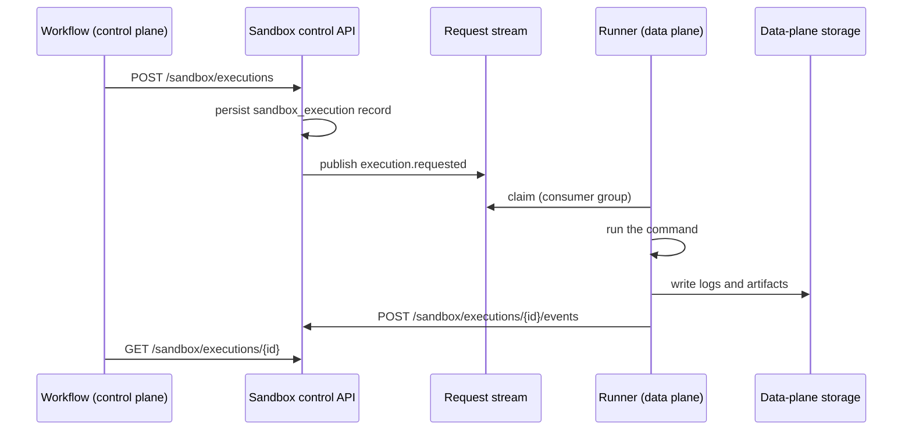

# Control plane and data plane

AgentArea splits into two halves with different jobs and different threat
exposure. The **control plane** decides: it owns workspaces, projects, task
metadata, policy, quotas, routing, and audit records. The **data plane**
executes: it runs commands, holds files, produces artifacts, and touches
plaintext task data.

The split is the reason execution can move into a customer's own network while
the platform stays where it is. It is also the reason certain things are
deliberately awkward — the control plane is not allowed to know a pod name.

## The problem

Agent platforms handle two categories of information that want opposite
treatment.

**Orchestration metadata** — which task belongs to which workspace, what policy
applies, who approved what — is small, needs to be durable and queryable, and
benefits from central management.

**Task payload** — the contents of a file the agent is analysing, the output of a
command, the text a model produced — is large, frequently sensitive, and often
subject to residency requirements that say it may not leave a jurisdiction or a
customer network.

Build these as one system and you get a platform that cannot be adopted by anyone
with a data-residency obligation, because running the orchestrator means handing
over the payload. The alternative most vendors choose is a fully on-premises
installation, which shifts the entire operational burden to the customer.

Separating the planes lets the two halves be hosted differently.

## How AgentArea approaches it

### What each plane owns

| Control plane | Data plane |
|---|---|
| Workspaces, projects, task metadata | Sandbox sessions and process lifecycle |
| Policies, quotas, budgets | Command execution |
| Routing and scheduling decisions | Logs, files, artifacts, snapshots |
| Audit metadata | Object storage |
| Starting agent workflows, recording execution state | Egress policy, LLM provider credentials where residency requires it |

Two constraints keep the boundary honest:

- The control plane **must not depend on pod names, runner URLs, or
  provider-specific sandbox paths**. Depending on any of these would couple it to
  one data-plane implementation and make a customer-hosted runner impossible.
- Raw stdout, large logs, files, and artifacts **must not enter workflow history
  or control-plane event payloads**. They are written to data-plane storage and
  referenced by handle.

### The request path across the boundary

Execution is a durable job hand-off, not a synchronous call:



The control-plane API is served by the Go MCP manager, which registers:

```go
router.POST("/sandbox/executions", h.createSandboxExecution)
router.GET("/sandbox/executions/:id", h.getSandboxExecution)
router.POST("/sandbox/executions/:id/events", h.applySandboxExecutionEvent)
```

`POST /sandbox/executions` only creates a pending record and publishes a request
event. It does not run anything. A data-plane runner claims the work from a Redis
Streams consumer group, executes it, and acknowledges the request message only
after terminal state is stored — so a runner that dies mid-command leaves the
message unacknowledged and the work reclaimable.

Events are CloudEvents-compatible JSON envelopes on two streams, named in
`internal/sandboxcontrol/models.go`:

- `agentarea.sandbox.execution.requests`
- `agentarea.sandbox.execution.events`

Lifecycle events include `claimed`, `started`, `completed`, `failed`, and output
artifact references. Agent shell and skill execution clients go through
`/sandbox/executions` and read completion from the execution record; they never
call a runner URL.

### The contract is a protocol, not a URL

What makes a data plane replaceable is that the control plane depends on a set of
operations rather than an address:

create or resume a session · start an execution · read execution status · read
logs by reference · collect artifacts by reference · cancel an execution ·
snapshot and restore a workspace · pause or terminate a session

Any runtime implementing those can be substituted: the AgentArea Kubernetes
runner, a customer-hosted runner claiming jobs outbound, or a provider adapter.
The portable unit is a workspace snapshot, an artifact manifest, and session
metadata. Live process memory is not portable, so a session cannot be migrated
mid-command between runtimes.

### Deployment shapes

| Mode | Control plane | Data plane | Plaintext task data |
|---|---|---|---|
| Hosted | AgentArea | AgentArea | Visible to AgentArea systems |
| Hybrid | AgentArea SaaS: account, billing, project metadata, policy | Customer VPC: workers, sandbox runners, MCP connectors, object storage, secrets, LLM access | Stays in the customer network |
| Fully self-hosted | Customer | Customer | Customer only |

In hybrid mode the customer runner connects **outbound** to claim work. There is
no inbound path from AgentArea into the customer network, which is what makes the
mode deployable behind a firewall without an ingress exception.

## Why not run everything in the customer's network?

Fully self-hosted is supported and is the right answer for some organizations.
It is not the default because it transfers the entire operational burden —
upgrades, Temporal, Postgres, object storage, the authorization service, and the
consequences of misconfiguring any of them — to the customer's team.

The hybrid split exists because the residency requirement is almost always about
the payload, not the metadata. A customer who cannot let file contents leave
their network is usually content for the record "task 91f3 ran and failed policy
check X" to live in a managed control plane. Separating the planes lets that
customer buy an operated platform and still keep the bytes.

## Why not one synchronous execute call?

A synchronous `/sandbox/execute` is simpler and does exist as a compatibility
path for the AgentArea-managed Kubernetes warm pool. It is not the production
contract, for three reasons.

**Long work outlives HTTP.** An agent command can run for many minutes. A
synchronous call ties completion to a socket surviving that long, through every
proxy and load balancer between the two planes.

**It puts payload in the wrong place.** Returning stdout in the response body
pulls output through the control plane, which is the thing the boundary exists to
prevent, and lands large blobs in workflow history.

**It requires an inbound route.** Calling a runner means addressing it, which
means the control plane knows a URL and the customer network accepts inbound
connections. The claim model inverts this: the runner reaches out, and the
control plane never learns where it is.

The cost is that the asynchronous path is harder to debug — a failure is
distributed across a record, a stream, and a runner log, rather than visible in
one response. `SANDBOX_EXECUTOR_URL` and other direct runner URLs are explicitly
not production extension points, precisely because they are the tempting shortcut
back to the synchronous model.

## Limits

- **Hosted mode is not data residency.** If hosted workers, hosted sandbox
  runners, or a hosted LLM proxy receive plaintext task data, residency claims do
  not hold. The boundary only helps when the data-plane components are genuinely
  in your environment.
- **Metadata is not nothing.** Task names, file names, artifact paths, policy
  decisions, and audit records live in the control plane by design. If your
  sensitivity extends to identifiers and filenames, the hybrid split is
  insufficient.
- **The synchronous path still exists.** Deployments using the compatibility
  `/sandbox/execute` route do not get the durability or the payload separation
  described here.
- **Snapshots bound portability.** Moving between runtimes means restoring a
  workspace snapshot. Anything not captured in the snapshot — running processes,
  in-memory state, unflushed buffers — does not survive.
- **The control plane still schedules.** It decides what runs, so a compromised
  control plane can direct a customer-hosted data plane to execute attacker-chosen
  work. The split protects confidentiality of payload at rest and in transit, not
  integrity of instruction.

## Related

- [Agentic networks](/concepts/agentic-networks) — why some labels cannot be enforced across this boundary
- [Why a sandbox](/concepts/sandbox/why-a-sandbox) — the threat model on the data-plane side
- [Durable execution](/concepts/execution/durable-execution) — how the workflow waits without holding a connection
- [Open core](/concepts/open-core) — which deployment shapes are commercial
