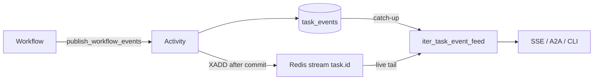

# Events

Everything an agent does while running is an event: a model call started, a
token arrived, a tool was called, an approval is pending, the task ended. There
is one vocabulary for those events, one contract that turns them into renderable
parts, and three independent consumers reading them.

## The problem

An agent run produces a stream of facts that three different clients need to
render live and reconstruct after the fact. Get the shape wrong and three
specific failures follow.

A client that attaches after the task started loses everything that happened
before it attached — the classic pub/sub race, and the reason the first
implementation polled the database instead. A client that renders each event as
a new line produces a transcript where one model call appears four times
(started, chunk, chunk, completed) instead of once. And a consumer that
switch-cases on event names breaks every time the workflow learns a new one,
which is how the CLI silently stopped rendering task output.

## How AgentArea approaches it

### One vocabulary, emitted directly

`agentarea_common/events/contract.py` owns the names. The workflow emits those
exact dotted strings — there is no second vocabulary and no alias-on-read
bridge. `agentarea-webapp/src/lib/events/contract.ts` mirrors the same file in
TypeScript.

```
llm.call.started      llm.call.chunk      llm.call.completed   llm.call.failed
tool.call             tool.result
input.request         input.response
approval.request      approval.response
artifact.created      artifact.updated
a2ui.create           a2ui.update.components
a2ui.update.data      a2ui.delete
task.started          task.completed      task.failed          task.cancelled
task.awaiting_continuation                task.continued
```

Timeline and diagnostic events keep bare names and are deliberately outside the
taxonomy: `IterationStarted`, `IterationCompleted`, `BudgetWarning`,
`ContextCompacted`, `AgentDelegationStarted`, `ModelChanged`,
`WorkflowContinuedAsNew`, and others. They carry no part and derive nothing.

### Supersede by id

Every event in the taxonomy maps to a **part** with a stable `part_id`. A later
event with the same `part_id` replaces the earlier part in place, at its
original position. That is what collapses `llm.call.started` → chunks →
`llm.call.completed` into one message bubble, and a `tool.call` plus its
`tool.result` into one tool card.

| Part kind | `part_id` derived from |
|---|---|
| `llm` | `execution_id` + `:` + `iteration` |
| `tool` | `tool_call_id` |
| `form` | `escalation_id` or `input_request_id` (falling back to `request_id`) |
| `artifact` | `artifact_id` |
| `a2ui` | `surface_id` |

An event missing the fields its kind needs derives no part and is skipped. This
is why a chunk published without `execution_id` and `iteration` never renders as
text — it cannot be matched to the call it is streaming.

Lifecycle `task.*` events derive no part. They are append-only.

### Three terminal types

`task.completed`, `task.failed`, `task.cancelled`. These end the feed. Nothing
else does, and a consumer's exclusion filter can never contain one, so a filter
cannot suppress termination.

Terminal events are normalized to carry a human-readable `message` (and a
`reason` for failed and cancelled) before they go on the wire, so a client that
attaches after a task finished can render the final state from the catch-up
snapshot alone.

### Path one: the task execution feed

This is what SSE, A2A, and the CLI read.



The workflow buffers events and hands them to `publish_workflow_events_activity`.
That activity persists each event to `task_events`, then XADDs it to a per-task
Redis stream using **the persisted row id** as the event id.

Readers use `iter_task_event_feed`: replay the full history from `task_events`
in timestamp order, then tail the Redis stream from offset `0`, dropping
anything already seen. The two sources overlap on purpose — an event committed
during the snapshot read appears in both and is emitted once. That dedup is what
makes the hand-off race-free, and it replaced a 0.25-second-per-connection
database poll.

Incremental `llm.call.chunk` events are the exception: they go to the stream
only, never to `task_events`. Live token streaming is at-most-once by contract.

### Path two: the transactional outbox

Service-layer domain events take a different route, and it exists in the code
today despite an earlier decision record rejecting it.

`OutboxPublisher` is a drop-in for the event broker that writes to the
`event_outbox` table **on the service's own session**. The event row commits
with the aggregate change or rolls back with it — there is no window where a
task is created and its event is lost. An enqueue failure propagates and fails
the enclosing operation, which is the point: the swallowed publish error is the
bug this replaced.

`OutboxRelay` runs inside the existing worker and drains the table on a
1-second interval, 100 rows per batch, under `SELECT ... FOR UPDATE SKIP
LOCKED` so any number of workers can co-reside without coordination. Rows past
10 attempts are excluded by the fetch query itself, so a poisoned event cannot
wedge the loop; it is logged loudly and left in the table.

Delivery is at-least-once. Publishing is an external side effect that cannot
join the transaction, so a crash after publishing re-delivers the batch.
Consumers dedup by event id.

**Nothing subscribes to what the relay publishes.** What the outbox provides
today is a loss-proof enqueue and a SQL-queryable domain-event log. Do not build
against the assumption that a published domain event triggers anything.

### The three consumers

| Consumer | Entry point |
|---|---|
| Webapp | `GET /v1/agents/{agent_id}/tasks/{task_id}/events/stream` — SSE, chunks included by default, `?include_chunks=false` drops them |
| A2A | `message/stream` and `tasks/resubscribe`, mapping each envelope to A2A SSE frames |
| CLI | `agentarea-cli/source/services/sse.ts`, with its own copy of the terminal set |

All three read the same feed through the same helper. A fourth would too.

### Why consumers stay vocabulary-agnostic

A consumer needs to know exactly two things: how to derive a part id, and which
three types are terminal. Everything else it should pass through.

The alternative — a switch statement over event names — makes every consumer a
place the vocabulary is re-declared, and there are three of them in two
languages plus a mapper. When the workflow adds an event type, a switch-based
consumer does not fail loudly; it silently renders nothing. That is the failure
the CLI hit, and it is why the SSE event name and the payload's `event_type` are
the same dotted string: a consumer that reads either one is reading the
contract, not a translation of it.

## Why not a single Redis pub/sub channel

Pub/sub is at-most-once with no retention. An event published while no
subscriber is attached is gone, so every client that connects after the task
started begins mid-story. The durable log plus catch-up subscription costs a
table and a dedup set and removes the race entirely.

## Why not keep polling the database

That was the original SSE implementation: a full `SELECT` against `task_events`
every 0.25 seconds, per open connection. Load is O(history × rate × viewers) and
grows with the length of the transcript, so the longest and most interesting
tasks are the most expensive to watch.

## Why not a consumer group for the live tail

Redis consumer groups give at-least-once delivery with acknowledgement, which is
right for durable work. For a UI tail it is a category error: the pending-entries
list grows unbounded when a browser tab closes without acknowledging, and a
restart replays stale state. Loss is acceptable on this channel precisely
because the database holds the durable copy. The reverse mistake matters more —
putting durable work on a broadcast tail drops it silently, which is why the
first durable consumer of the outbox must attach via a consumer group or the
table, not bare pub/sub.

## Limits

- **The live stream is a buffer, not history.** The per-task Redis stream is
  capped at 4096 entries. Full history is `task_events`.
- **Chunks are never persisted.** A client attaching after a model call finished
  sees the completed `llm.call.completed` part, not the token stream that
  produced it.
- **The feed stops on a wall clock.** `iter_task_event_feed` gives up after 30
  minutes if no terminal event arrives, so a stuck task does not tail forever.
- **Live publishing is best-effort.** `publish_task_event` logs and swallows its
  own failures. A failed XADD means the event is in the database and not in the
  live tail; a client already attached will not see it until it reconnects.
- **Persisting an event is not atomic with publishing it.** In
  `publish_workflow_events_activity`, a database write failure is caught,
  recorded in the result's `errors` list, and does not fail the activity — so
  the batch is not retried and that event is missing from history.
- **The immediate publish path can lose the buffer.** See the drop described in
  [Durable execution](/concepts/execution/durable-execution#limits).
- **Terminal is not the same on both surfaces.** A `blocked` task emits
  `task.failed`. See [Tasks](/concepts/execution/tasks).
- **Ordering is per stream, and only that.** Events are ordered within a task's
  feed. Nothing guarantees ordering across tasks or across the outbox, and
  at-least-once delivery means handlers must be idempotent and order-tolerant.

## Related

- [Tasks](/concepts/execution/tasks) — what the terminal types mean on the row.
- [Durable execution](/concepts/execution/durable-execution) — where events are
  produced.
- [Artifacts](/concepts/execution/artifacts) — what `artifact.created` points at.
