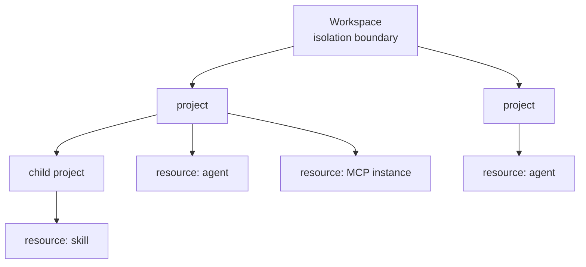

# Workspaces, projects, and resources

AgentArea scopes everything three ways. A **workspace** is the isolation
boundary — the wall data does not cross. A **project** is a grouping inside that
wall, used for organization and for inheriting permissions. A **resource** is an
individual thing an agent or a person is granted access to.

Every other concept in these docs assumes this model, so it is worth twenty
minutes now.

## The problem

Multi-tenancy fails quietly. The failure is never "the isolation feature was not
implemented"; it is one query out of four hundred that forgot the tenant filter,
written by someone who did not know they had to add it, discovered by a customer
who saw someone else's data.

Any design that relies on every developer remembering to scope every query is a
design that will leak. The scoping has to be structurally difficult to omit.

## How AgentArea approaches it

### Workspace: enforced at construction time

Two mechanisms, working together.

Entities inherit `WorkspaceScopedMixin`, which supplies `workspace_id` and
`created_by`. Repositories extend `WorkspaceScopedRepository`, whose
`_get_workspace_filter()` is applied to reads:

```python
def _get_workspace_filter(self):
    workspaces = self.user_context.accessible_workspaces
    workspace_col = self.model_class.workspace_id
    if workspaces and len(workspaces) > 1:
        return workspace_col.in_(workspaces)
    return workspace_col == self.user_context.workspace_id
```

The part that makes it hold is the constructor. A repository cannot be built
without a `UserContext`:

```python
class RepositoryFactory:
    def __init__(self, session: AsyncSession, user_context: UserContext):
        self.session = session
        self.user_context = user_context

    def create_repository(self, repository_class: type[T]) -> T:
        return repository_class(session=self.session, user_context=self.user_context)
```

There is no ambient "current workspace" global and no zero-argument repository
constructor. Forgetting to scope a query requires deliberately bypassing the
repository layer, which is a visible act in review rather than an omission.

`UserContext` carries:

| Field | Purpose |
|---|---|
| `user_id` | Who is acting. Written to `created_by` for audit. |
| `workspace_id` | The active workspace. The default read scope. |
| `accessible_workspaces` | Every workspace this principal may read. Defaults to `[workspace_id]`. |
| `email` | Optional, for display and audit. |
| `client_id` | Set when the principal is a registered client rather than a user, such as an OAuth2 client-credentials token. |

### Project: grouping and permission inheritance

A `Project` is workspace-scoped like everything else, and holds agents, skills,
and MCP server instances through junction tables — `project_agents`,
`project_skills`, `project_mcp_instances`. Projects nest through
`parent_project_id`, and carry a `name`, `description`, and `instructions`.

Membership is many-to-many. An agent can belong to several projects or to none;
a project is a view over resources, not their owner. Deleting a project cascades
the junction rows, not the agents.

Projects matter for authorization because they are where grants are anchored. In
the deployed model, a `resource` has a `project` relation and a `project` has
`parent` and `workspace` relations, so permission granted at a project is
inherited by the resources under it rather than restated on each one.

### Resource: the unit of authorization

Every governed object is a `resource` in the authorization graph, related to its
project. The relations are `manager`, `writer`, `reader`, plus the derived
`can_manage`, `can_write`, `can_read` that checks actually evaluate.

This is relationship-based access control (ReBAC), not role-based. The
distinction is not pedantry: permission comes from a path through a graph —
this user manages this project, this project contains this resource — rather
than from a role string on the user.

### How the three compose



A read is answered only if both hold: the row is in an accessible workspace (SQL
filter, always applied), and the caller has a relation granting the operation
(graph check). The first is a wall, the second is a door.

## Why not one tier instead of three?

**Why not workspaces alone?** Workspace-only scoping means every member of a
workspace sees everything in it. That is fine for five people and wrong for
fifty, and the usual workaround — a workspace per team — fragments shared
resources and makes cross-team agent reuse an export problem.

**Why not projects as the isolation boundary?** Because isolation and
organization change at different rates and for different reasons. People
reorganize projects constantly; nobody wants a drag-and-drop that silently
relocates a tenant boundary. Keeping isolation at the workspace means
reorganization is never a security event.

**Why not roles instead of relations?** A role is a string on a user, so
answering "who can read this agent?" requires scanning every user. ReBAC stores
the edge, so the question is a graph traversal in the direction you actually ask
it. It also expresses inheritance natively — a resource inherits from its
project, a project from its parent — which a flat role model can only simulate
by expanding grants and then keeping the expansion current.

The cost is real: authorization now depends on an external service (OpenFGA or
Keto) being reachable, and a graph is harder to eyeball than a role column.
Checks fail closed, which turns an authorization-service outage into denied
requests rather than granted ones.

## Limits

- **Workspace isolation is only as good as the token.** `accessible_workspaces`
  is resolved during authentication. A token issued with too broad a list widens
  the read scope everywhere, and no layer below authentication re-checks it.
- **The SQL filter protects the repository path, not raw SQL.** Code that
  bypasses `WorkspaceScopedRepository` and issues its own query gets no scoping.
  Migrations and admin scripts are outside it by construction.
- **Projects do not isolate.** Two projects in one workspace are not a security
  boundary between two teams. Someone with workspace-wide relations reads across
  every project in it. If you need a wall, you need a second workspace.
- **Project membership is not automatically consistent with grants.** Adding an
  agent to a project creates a junction row; whether that changes anyone's access
  depends on the relation tuples that exist. The two are related by convention in
  the composition layer, not by a database constraint.
- **Deleting a workspace does not garbage-collect its authorization tuples.**
  Stale tuples referencing removed resources persist in the graph.
- **`created_by` is for audit, not access.** Being the creator of a row grants
  nothing on its own. Creator-scoped reads exist as an explicit opt-in
  (`creator_scoped=True`) and are not the default.

## Related

- [Agentic networks](/concepts/agentic-networks) — what the workspace boundary means for agents
- [Authorization basics](/concepts/governance/authorization-basics) — ACL, RBAC, ABAC, and ReBAC compared
- [The AgentArea authorization model](/concepts/governance/the-agentarea-model) — the deployed types and relations in full
- [Open core](/concepts/open-core) — which parts of this model differ between editions
