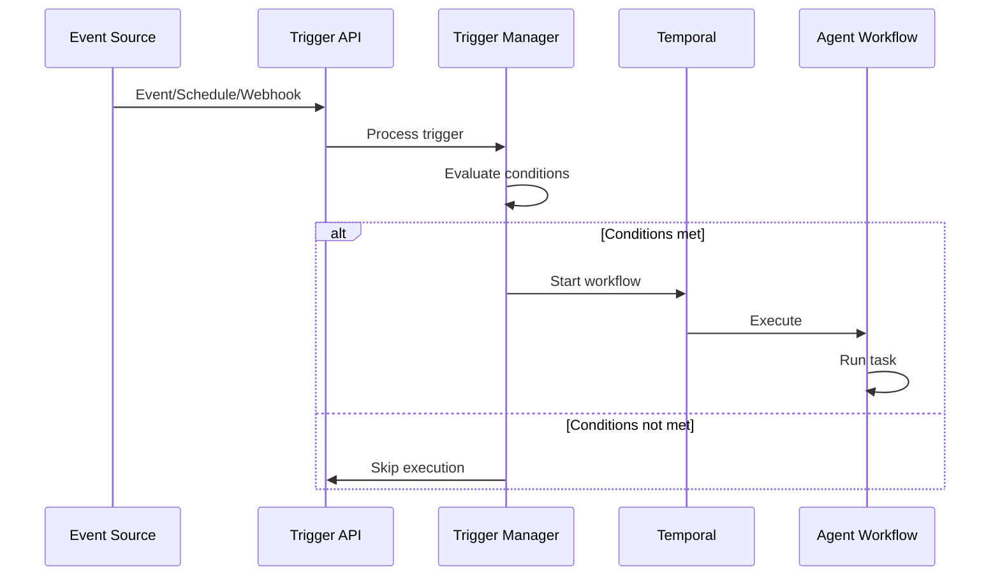

# Event-Driven Triggers

<Info>
Fire agents automatically based on schedules, webhooks, or domain events. Build reactive agent systems that respond to external stimuli in real-time.
</Info>

## Overview

Event triggers enable agents to execute automatically without manual intervention:

| Trigger Type | Use Case |
|--------------|----------|
| **Schedule** | Recurring reports, cleanup tasks |
| **Webhook** | Third-party integrations, notifications |
| **Event** | System events, domain events |

---

## Trigger Types

### Schedule Triggers

Cron-based scheduling for recurring agent execution:

```yaml
trigger:
  name: "Daily Sales Report"
  type: schedule
  enabled: true
  
  schedule:
    cron: "0 9 * * *"  # Daily at 9 AM
    timezone: "America/New_York"
  
  agent:
    id: "report-generator"
    input:
      report_type: "daily_sales"
      recipients: ["team@company.com"]
```

### Webhook Triggers

HTTP endpoints that trigger agent execution:

```yaml
trigger:
  name: "Slack Command Handler"
  type: webhook
  enabled: true
  
  webhook:
    endpoint: "/webhooks/slack/commands"
    method: POST
    
  authentication:
    type: hmac
    secret: "${SLACK_WEBHOOK_SECRET}"
    header: "X-Slack-Signature"
  
  agent:
    id: "slack-bot"
    input_mapping:
      # Map webhook payload to agent input
      text: "$.body.text"
      user_id: "$.body.user_id"
      channel: "$.body.channel_id"
```

### Event Triggers

React to system or domain events:

```yaml
trigger:
  name: "Error Handler"
  type: event
  enabled: true
  
  event:
    pattern: "error.*"  # Match all error events
    source: ["system", "agents"]
  
  condition:
    # Only trigger for high-severity errors
    severity: ">= high"
    count_threshold: 5  # After 5 errors
    window: "5m"        # Within 5 minutes
  
  agent:
    id: "error-analyzer"
    input:
      include_context: true
```

---

## Architecture

### Trigger Flow



### Components

```
agentarea-platform/libs/triggers/
├── agentarea_triggers/
│   ├── domain/
│   │   └── models.py          # Trigger, TriggerExecution
│   ├── application/
│   │   └── trigger_service.py # Trigger management
│   ├── infrastructure/
│   │   ├── repository.py      # Data access
│   │   └── di_container.py    # DI setup
│   ├── webhook_manager.py     # Webhook handling
│   └── temporal_schedule_manager.py
```

---

## Configuration

### Trigger Definition

```python
class Trigger(BaseModel):
    id: UUID
    name: str
    type: TriggerType  # SCHEDULE, WEBHOOK, EVENT
    enabled: bool
    
    # Schedule configuration
    schedule_config: ScheduleConfig | None
    
    # Webhook configuration
    webhook_config: WebhookConfig | None
    
    # Event configuration
    event_config: EventConfig | None
    
    # Agent configuration
    agent_id: UUID
    input_template: dict[str, Any]
    
    # Execution settings
    max_concurrent: int = 1
    timeout_seconds: int = 3600
    
    # Workspace scoping
    workspace_id: UUID
```

### Schedule Configuration

```python
class ScheduleConfig(BaseModel):
    cron: str
    timezone: str = "UTC"
    start_date: datetime | None
    end_date: datetime | None
    jitter_seconds: int = 0  # Random delay to spread load
```

### Webhook Configuration

```python
class WebhookConfig(BaseModel):
    endpoint: str
    method: str = "POST"
    authentication: WebhookAuth | None
    rate_limit: RateLimit | None
    ip_whitelist: list[str] | None

class WebhookAuth(BaseModel):
    type: str  # hmac, bearer, basic
    secret: str
    header: str
```

### Event Configuration

```python
class EventConfig(BaseModel):
    pattern: str  # Regex pattern
    source: list[str]  # Event sources to listen to
    condition: EventCondition | None

class EventCondition(BaseModel):
    field: str
    operator: str  # eq, ne, gt, gte, lt, lte, contains
    value: Any
```

---

## Webhook Implementation

### Endpoint Handler

```python
# apps/api/agentarea_api/api/v1/triggers.py
@router.post("/webhooks/{trigger_id}")
async def handle_webhook(
    trigger_id: UUID,
    request: Request,
    trigger_service: TriggerServiceDep,
):
    # 1. Get trigger
    trigger = await trigger_service.get(trigger_id)
    if not trigger or not trigger.enabled:
        raise HTTPException(404, "Trigger not found")
    
    # 2. Verify authentication
    if trigger.webhook_config.authentication:
        await verify_webhook_auth(request, trigger.webhook_config.authentication)
    
    # 3. Parse payload
    payload = await request.json()
    
    # 4. Execute trigger
    execution = await trigger_service.execute_trigger(
        trigger=trigger,
        input_data=map_payload(trigger.input_template, payload)
    )
    
    return {"execution_id": str(execution.id)}
```

### HMAC Verification

```python
async def verify_webhook_auth(request: Request, auth: WebhookAuth):
    if auth.type == "hmac":
        signature = request.headers.get(auth.header)
        payload = await request.body()
        
        expected = hmac.new(
            auth.secret.encode(),
            payload,
            hashlib.sha256
        ).hexdigest()
        
        if not hmac.compare_digest(signature, expected):
            raise HTTPException(401, "Invalid signature")
```

---

## Schedule Implementation

### Temporal Schedules

```python
class TemporalScheduleManager:
    def __init__(self, client: Client):
        self.client = client
        self.schedule_client = client.schedule_client
    
    async def create_schedule(
        self,
        trigger: Trigger,
        schedule_id: str,
    ):
        schedule = Schedule(
            action=ScheduleActionStartWorkflow(
                "TriggerExecutionWorkflow",
                args=[TriggerExecutionRequest(
                    trigger_id=trigger.id,
                    agent_id=trigger.agent_id,
                    input_data=trigger.input_template,
                )],
                task_queue=settings.TEMPORAL_TASK_QUEUE,
            ),
            spec=ScheduleSpec(
                cron_expressions=[trigger.schedule_config.cron],
                timezone=trigger.schedule_config.timezone,
            ),
            state=ScheduleState(
                paused=not trigger.enabled,
            ),
        )
        
        await self.schedule_client.create_schedule(
            schedule_id,
            schedule,
        )
    
    async def update_schedule(self, trigger: Trigger):
        await self.delete_schedule(trigger.id)
        await self.create_schedule(trigger, str(trigger.id))
    
    async def delete_schedule(self, trigger_id: UUID):
        try:
            handle = self.schedule_client.get_schedule_handle(str(trigger_id))
            await handle.delete()
        except:
            pass
```

---

## Event Implementation

### Event Subscription

```python
class EventTriggerListener:
    def __init__(self, trigger_service: TriggerService):
        self.trigger_service = trigger_service
        self.subscriptions: dict[str, list[Trigger]] = {}
    
    async def subscribe(self, trigger: Trigger):
        pattern = trigger.event_config.pattern
        if pattern not in self.subscriptions:
            self.subscriptions[pattern] = []
        self.subscriptions[pattern].append(trigger)
    
    async def handle_event(self, event: DomainEvent):
        for pattern, triggers in self.subscriptions.items():
            if self._matches_pattern(event.type, pattern):
                for trigger in triggers:
                    if self._check_conditions(event, trigger):
                        await self.trigger_service.execute_trigger(
                            trigger=trigger,
                            input_data={"event": event.dict()}
                        )
```

### Condition Evaluation

```python
def _check_conditions(self, event: DomainEvent, trigger: Trigger) -> bool:
    if not trigger.event_config.condition:
        return True
    
    condition = trigger.event_config.condition
    field_value = getattr(event, condition.field, None)
    
    if condition.operator == "eq":
        return field_value == condition.value
    elif condition.operator == "gte":
        return field_value >= condition.value
    elif condition.operator == "contains":
        return condition.value in field_value
    # ... more operators
    
    return False
```

---

## Execution Tracking

### Trigger Execution Model

```python
class TriggerExecution(BaseModel):
    id: UUID
    trigger_id: UUID
    agent_id: UUID
    
    # Execution state
    status: ExecutionStatus  # PENDING, RUNNING, COMPLETED, FAILED
    workflow_id: str | None
    
    # Input/Output
    input_data: dict
    output_data: dict | None
    
    # Timing
    triggered_at: datetime
    started_at: datetime | None
    completed_at: datetime | None
    
    # Error info
    error_message: str | None
    
    # Workspace scoping
    workspace_id: UUID
```

### Execution History

```bash
# List trigger executions
GET /v1/triggers/{trigger_id}/executions

# Get execution details
GET /v1/triggers/{trigger_id}/executions/{execution_id}

# Cancel running execution
POST /v1/triggers/{trigger_id}/executions/{execution_id}/cancel
```

---

## Best Practices

<Accordion>
  <AccordionItem title="Schedule Design">
    - Use timezone-aware cron expressions
    - Add jitter to spread load
    - Set appropriate timeouts
    - Monitor for schedule drift
  </AccordionItem>
  
  <AccordionItem title="Webhook Security">
    - Always use HMAC verification
    - Implement rate limiting
    - Use IP whitelisting
    - Log all webhook requests
  </AccordionItem>
  
  <AccordionItem title="Event Handling">
    - Use specific event patterns
    - Implement idempotency
    - Handle event ordering
    - Set up dead letter queues
  </AccordionItem>
</Accordion>

---

## Next Steps

<CardGroup cols={2}>
  <Card title="Temporal Workflows" icon="gear" href="/temporal-workflows">
    How workflows execute triggers
  </Card>
  <Card title="Building Agents" icon="bot" href="/building-agents">
    Create agents for triggers
  </Card>
</CardGroup>
