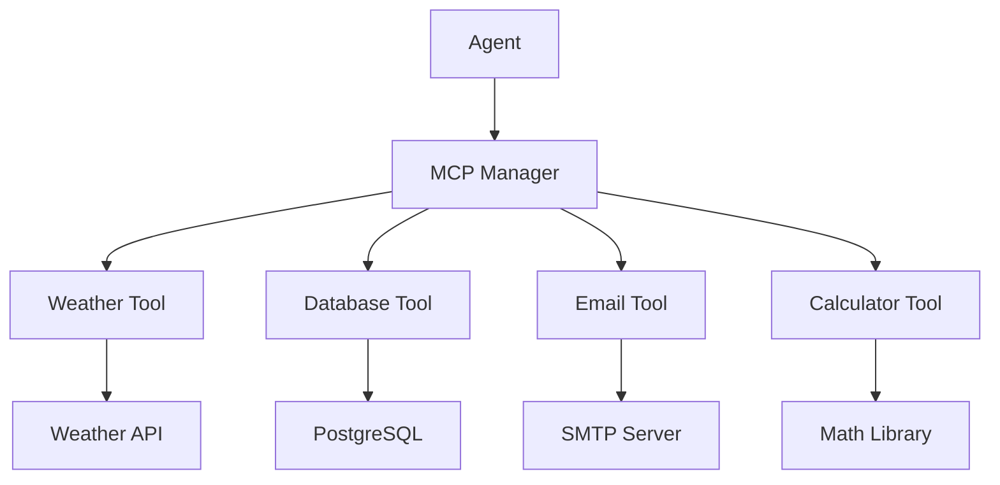

# Custom Tools Example

This example shows how to create and integrate custom tools with AgentArea using the Model Context Protocol (MCP).

## Overview

This example includes:
- **Weather Tool** - Get current weather for any location
- **Database Tool** - Query customer database
- **Email Tool** - Send notifications and updates
- **Calculator Tool** - Perform complex calculations

## Architecture



## Quick Start

### 1. Install Dependencies

```bash
pip install -r requirements.txt
```

### 2. Configure Environment

```bash
cp .env.example .env
# Edit .env with your API keys and settings
```

### 3. Deploy Tools

```bash
# Deploy all custom tools
python deploy_tools.py

# Or deploy individually
python deploy_weather_tool.py
python deploy_database_tool.py
python deploy_email_tool.py
python deploy_calculator_tool.py
```

### 4. Create Agent with Tools

```bash
curl -X POST http://localhost:8000/v1/agents \
  -H "Content-Type: application/json" \
  -d @agent-with-tools.json
```

### 5. Test Tool Integration

```bash
python test_tools.py
```

## Files

### Tool Implementations
- `weather_tool.py` - Weather information service
- `database_tool.py` - Database query interface
- `email_tool.py` - Email notification service
- `calculator_tool.py` - Advanced calculations

### Configuration
- `tool_configs/` - Individual tool configurations
- `agent-with-tools.json` - Agent configuration with tool access
- `.env.example` - Environment variables template

### Utilities
- `deploy_tools.py` - Tool deployment script
- `test_tools.py` - Tool testing and validation
- `monitor_tools.py` - Tool performance monitoring

## Creating Custom Tools

### 1. Tool Structure

```python
from mcp import MCPTool
from typing import Dict, Any

class MyCustomTool(MCPTool):
    name = "my_custom_tool"
    description = "Description of what this tool does"
    
    def __init__(self):
        super().__init__()
        # Initialize your tool
    
    def execute(self, parameters: Dict[str, Any]) -> Dict[str, Any]:
        """Execute the tool with given parameters"""
        # Your tool logic here
        return {"result": "success", "data": "..."}
    
    def validate_parameters(self, parameters: Dict[str, Any]) -> bool:
        """Validate input parameters"""
        # Validation logic
        return True
```

### 2. Tool Configuration

```json
{
  "name": "my_custom_tool",
  "version": "1.0.0",
  "description": "My custom tool for AgentArea",
  "parameters": {
    "type": "object",
    "properties": {
      "input_param": {
        "type": "string",
        "description": "Description of parameter"
      }
    },
    "required": ["input_param"]
  },
  "permissions": ["read", "write"],
  "rate_limit": "100/hour",
  "timeout": 30
}
```

### 3. Tool Deployment

```python
from agentarea import ToolManager

# Deploy your tool
tool_manager = ToolManager()
tool_manager.deploy_tool(
    tool_class=MyCustomTool,
    config_file="tool_config.json"
)
```

## Example Tools

### Weather Tool

```python
import requests
from mcp import MCPTool

class WeatherTool(MCPTool):
    name = "weather"
    description = "Get current weather for any location"
    
    def execute(self, parameters):
        location = parameters.get("location")
        api_key = os.getenv("WEATHER_API_KEY")
        
        url = f"http://api.openweathermap.org/data/2.5/weather"
        params = {
            "q": location,
            "appid": api_key,
            "units": "metric"
        }
        
        response = requests.get(url, params=params)
        data = response.json()
        
        return {
            "location": location,
            "temperature": data["main"]["temp"],
            "description": data["weather"][0]["description"],
            "humidity": data["main"]["humidity"]
        }
```

### Database Tool

```python
import psycopg2
from mcp import MCPTool

class DatabaseTool(MCPTool):
    name = "database_query"
    description = "Query customer database safely"
    
    def execute(self, parameters):
        query_type = parameters.get("query_type")
        customer_id = parameters.get("customer_id")
        
        # Predefined safe queries only
        queries = {
            "customer_info": "SELECT name, email, status FROM customers WHERE id = %s",
            "order_history": "SELECT * FROM orders WHERE customer_id = %s ORDER BY created_at DESC LIMIT 10"
        }
        
        if query_type not in queries:
            raise ValueError("Invalid query type")
        
        conn = psycopg2.connect(os.getenv("DATABASE_URL"))
        cur = conn.cursor()
        
        cur.execute(queries[query_type], (customer_id,))
        results = cur.fetchall()
        
        conn.close()
        return {"results": results}
```

## Security Considerations

### Tool Permissions

```json
{
  "tool_security": {
    "permissions": {
      "weather": ["external_api"],
      "database": ["read_only"],
      "email": ["send_email"],
      "calculator": ["compute"]
    },
    "rate_limits": {
      "weather": "1000/day",
      "database": "100/hour", 
      "email": "50/hour",
      "calculator": "unlimited"
    },
    "input_validation": {
      "sanitize_inputs": true,
      "validate_schemas": true,
      "block_sql_injection": true
    }
  }
}
```

### Best Practices

1. **Input Validation** - Always validate and sanitize inputs
2. **Rate Limiting** - Implement appropriate rate limits
3. **Error Handling** - Graceful error handling and logging
4. **Permissions** - Minimal required permissions only
5. **Monitoring** - Track tool usage and performance
6. **Security** - Regular security audits and updates

## Testing

### Unit Tests

```bash
pytest tests/test_weather_tool.py
pytest tests/test_database_tool.py
pytest tests/test_email_tool.py
pytest tests/test_calculator_tool.py
```

### Integration Tests

```bash
python test_tool_integration.py
```

### Performance Tests

```bash
python test_tool_performance.py
```

## Monitoring

### Tool Metrics

Monitor these key metrics:
- Execution time and success rate
- Error rates and types
- Usage patterns and frequency
- Resource consumption

### Alerts

Set up alerts for:
- High error rates (>5%)
- Slow response times (>30s)
- Rate limit violations
- Security violations

## Troubleshooting

### Common Issues

1. **Tool Not Found** - Check tool registration and deployment
2. **Permission Denied** - Verify tool permissions and agent access
3. **Timeout Errors** - Adjust timeout settings or optimize tool code
4. **Rate Limit Exceeded** - Check usage patterns and limits

### Debug Mode

```python
# Enable debug logging
import logging
logging.basicConfig(level=logging.DEBUG)

# Test tool execution
tool = WeatherTool()
result = tool.execute({"location": "London"})
print(result)
```

---

This example provides a comprehensive foundation for building and integrating custom tools with AgentArea. Customize and extend these examples for your specific use cases!