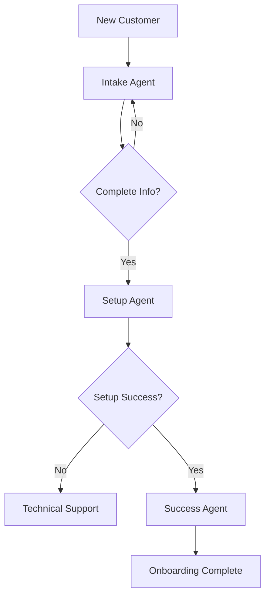

# Multi-Agent Workflow Example

This example demonstrates how to create a workflow with multiple AI agents collaborating to complete a complex task.

## Scenario: Customer Onboarding Process

This workflow involves three agents working together:

1. **Intake Agent** - Collects customer information and requirements
2. **Setup Agent** - Configures the customer's account and environment  
3. **Success Agent** - Provides training and ensures successful onboarding

## Architecture



## Quick Start

### 1. Create All Agents

```bash
# Create intake agent
curl -X POST http://localhost:8000/v1/agents \
  -H "Content-Type: application/json" \
  -d @intake-agent.json

# Create setup agent  
curl -X POST http://localhost:8000/v1/agents \
  -H "Content-Type: application/json" \
  -d @setup-agent.json

# Create success agent
curl -X POST http://localhost:8000/v1/agents \
  -H "Content-Type: application/json" \
  -d @success-agent.json
```

### 2. Start the Workflow

```bash
python onboarding_workflow.py --customer-email "customer@example.com"
```

### 3. Monitor Progress

```bash
python monitor_workflow.py --workflow-id "your-workflow-id"
```

## Files

- `intake-agent.json` - Customer information collection agent
- `setup-agent.json` - Account setup and configuration agent
- `success-agent.json` - Training and success management agent
- `onboarding_workflow.py` - Main workflow orchestration
- `workflow_monitor.py` - Monitor workflow progress
- `test_workflow.py` - End-to-end testing

## Agent Communication

Agents communicate through:
- **Direct messaging** for handoffs
- **Shared context** for customer data
- **Event notifications** for status updates
- **Escalation protocols** for error handling

## Workflow States

1. **Initiated** - Customer starts onboarding
2. **Information Collection** - Intake agent gathers requirements
3. **Validation** - Data validation and completeness check
4. **Account Setup** - Technical configuration and provisioning
5. **Training** - Success agent provides guidance and training
6. **Completed** - Onboarding successfully finished
7. **Escalated** - Manual intervention required

## Customization

You can customize this workflow by:
- Adding additional agents for specific tasks
- Modifying agent personalities and capabilities
- Changing handoff conditions and rules
- Adding custom validation steps
- Integrating with external systems

## Testing

Run the comprehensive test suite:

```bash
python test_workflow.py
```

This tests:
- Individual agent responses
- Agent-to-agent communication
- Workflow state transitions
- Error handling and escalation
- End-to-end customer journey