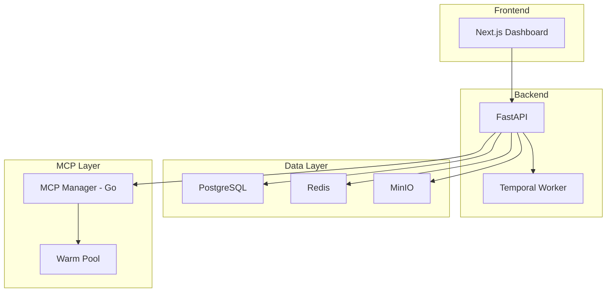

# Features

<Info>
AgentArea is purpose-built for **governed agentic networks**. Every feature is designed to help you build, deploy, and manage multi-agent systems at scale.
</Info>

## Feature Overview

<CardGroup cols={3}>
  <Card title="🌐 Agentic Networks" icon="network-wired" href="/agentic-networks">
    VPC-inspired architecture for multi-agent systems
  </Card>
  <Card title="🛡️ Agent Governance" icon="shield-halved" href="/agent-governance">
    Tool approvals, permissions, audit trails
  </Card>
  <Card title="🔗 A2A Protocol" icon="arrows-turn-to-dots" href="/agent-communication">
    Native agent-to-agent communication
  </Card>
  <Card title="⚡ Event Triggers" icon="bolt" href="/event-triggers">
    Fire agents on timers, webhooks, events
  </Card>
  <Card title="🔌 MCP Integration" icon="plug" href="/mcp-integration">
    Model Context Protocol for external tools
  </Card>
  <Card title="🏗️ Production Ready" icon="server" href="/deployment">
    Kubernetes-native, Temporal workflows
  </Card>
</CardGroup>

---

## 🌐 Agentic Networks

VPC-inspired network architecture where agents communicate via A2A protocol with granular network permissions.

<Accordion>
  <AccordionItem title="Network Isolation">
    - Create isolated agent groups (like VPC subnets)
    - Control which agents can communicate with each other
    - Build secure multi-agent topologies
    - Workspace-scoped data isolation
  </AccordionItem>
  
  <AccordionItem title="Communication Controls">
    - Granular permissions between agents
    - Whitelist/blacklist agent communication
    - Audit all inter-agent messages
    - Rate limiting and quotas
  </AccordionItem>
  
  <AccordionItem title="Multi-Agent Topologies">
    - Hierarchical agent structures (manager → workers)
    - Peer-to-peer collaboration
    - Agent teams with shared context
    - Task delegation patterns
  </AccordionItem>
</Accordion>

**Learn more:** [Agentic Networks →](/agentic-networks)

---

## 🛡️ Agent Governance

Built-in governance controls for enterprise compliance and security.

### Tool Permissions

```yaml
# Agent tool configuration
tools:
  - name: web_search
    enabled: true
    requires_approval: false
  
  - name: file_write
    enabled: true
    requires_approval: true  # Human approval needed
    approval_timeout: 300
  
  - name: database_query
    enabled: false  # Disabled for this agent
```

### Governance Features

| Feature | Description |
|---------|-------------|
| **Tool Approvals** | Require human approval for sensitive operations |
| **Permission Boundaries** | Limit what tools agents can access |
| **Audit Trails** | Full logging of all agent actions |
| **Budget Controls** | Set token/cost limits per agent |
| **Execution Timeouts** | Prevent runaway agents |
| **Goal Termination** | Stop agents when goals are achieved |

**Learn more:** [Agent Governance →](/agent-governance)

---

## 🔗 A2A Protocol

Native agent-to-agent communication following the Agent Communication Protocol standard.

### Communication Patterns

<Tabs>
  <Tab title="Direct Messaging">
    ```python
    # Agent A sends message to Agent B
    await agent_a.send_message(
        to="agent-b-id",
        content="Please analyze this data",
        context={"data": dataset}
    )
    ```
  </Tab>
  
  <Tab title="Task Delegation">
    ```python
    # Delegate task to specialist agent
    result = await manager_agent.delegate(
        agent="data-analyst",
        task="Analyze quarterly sales",
        deadline="2025-01-15"
    )
    ```
  </Tab>
  
  <Tab title="Broadcast">
    ```python
    # Broadcast to all agents in network
    await agent.broadcast(
        channel="alerts",
        message="High priority task incoming"
    )
    ```
  </Tab>
</Tabs>

### A2A Features

- **Agent Discovery**: Well-known endpoints for agent capabilities
- **JWT Authentication**: Secure inter-agent communication
- **Protocol Compliance**: Follows A2A standard
- **Bridge Pattern**: Message routing between agents

**Learn more:** [Agent Communication →](/agent-communication)

---

## ⚡ Event-Driven Triggers

Fire agents automatically based on events, schedules, or external webhooks.

### Trigger Types

<CardGroup cols={3}>
  <Card title="🕐 Schedule" icon="clock">
    Cron-based scheduling for recurring tasks
  </Card>
  <Card title="🔗 Webhooks" icon="webhook">
    HTTP endpoints to trigger agents
  </Card>
  <Card title="📡 Events" icon="tower-broadcast">
    React to system/domain events
  </Card>
</CardGroup>

### Configuration Example

```yaml
triggers:
  - name: daily_report
    type: schedule
    cron: "0 9 * * *"  # Daily at 9 AM
    agent: report-generator
    input:
      report_type: daily_summary
  
  - name: slack_handler
    type: webhook
    endpoint: /webhooks/slack
    agent: slack-bot
    authentication:
      type: hmac
      secret: ${SLACK_WEBHOOK_SECRET}
  
  - name: error_handler
    type: event
    event_pattern: "error.*"
    agent: error-analyzer
    condition:
      severity: ">= high"
```

**Learn more:** [Event Triggers →](/event-triggers)

---

## 🔌 MCP Integration

Model Context Protocol (MCP) for extending agent capabilities with external tools.

### MCP Server Types

| Type | Description | Use Case |
|------|-------------|----------|
| **Managed** | Hosted by AgentArea | Custom tools, databases |
| **Remote** | External MCP servers | Third-party APIs |
| **Compound** | Multiple MCPs combined | Complex workflows |

### Warm Pool Acceleration

<Warning>
**~10x faster cold starts** with warm pool technology
</Warning>

| Metric | Standard | Warm Pool |
|--------|----------|-----------|
| Cold Start | 8-15s | ~1.3s |
| Activation | Full container | Image layer |
| Scaling | Per-container | Pre-provisioned |

### MCP Features

- **Template Library**: Pre-built MCP server templates
- **Custom Dockerfiles**: Build your own MCP servers
- **Hash Verification**: Verify remote MCP updates
- **OAuth Integration**: Authenticate external services
- **Compound MCPs**: Combine multiple tools

**Learn more:** [MCP Integration →](/mcp-integration)

---

## 🏗️ Production Infrastructure

Enterprise-grade infrastructure for production workloads.

### Execution Engine

**Temporal.io** for durable, distributed workflow execution:

- **Fault Tolerance**: Automatic retries, checkpointing
- **Long-Running Tasks**: Hours to days of execution
- **Workflow History**: Full audit trail
- **Signal/Query**: Real-time workflow control

### Infrastructure Stack



### Deployment Options

<CardGroup cols={3}>
  <Card title="🐳 Docker Compose" icon="docker">
    Local development, testing
  </Card>
  <Card title="☸️ Kubernetes" icon="dharmachakra">
    Production, auto-scaling
  </Card>
  <Card title="☁️ Cloud" icon="cloud">
    AWS, GCP, Azure
  </Card>
</CardGroup>

**Learn more:** [Deployment →](/deployment)

---

## 🔐 Security & Auth

### Authentication

- **Ory Kratos**: Identity management
- **Ory Hydra**: OAuth2/OIDC provider
- **JWT Tokens**: API authentication
- **Workspace Scoping**: Multi-tenant data isolation

### Authorization

- **Role-Based Access Control** (RBAC)
- **Relationship-Based Access Control** (ReBAC) via Keto
- **Workspace-level permissions**
- **Agent-level permissions**

### Secrets Management

| Backend | Use Case |
|---------|----------|
| **Database** | Development, simple setups |
| **Infisical** | Team secret management |
| **AWS Secrets** | AWS deployments |
| **HashiCorp Vault** | Enterprise |

**Learn more:** [Security →](/security)

---

## 📊 Observability

### Real-Time Monitoring

- **SSE Streaming**: Live task event updates
- **Workflow Events**: Track execution progress
- **Performance Metrics**: Response times, success rates
- **Resource Usage**: CPU, memory, storage

### Logging & Audit

- **Structured Logging**: JSON logs with context
- **Audit Trails**: All agent actions logged
- **Event Sourcing**: Complete event history
- **Compliance Reporting**: SOC 2, GDPR ready

---

## 🚀 Getting Started

<Steps>
  <Step title="Install">
    ```bash
    git clone https://github.com/agentarea/agentarea
    cd agentarea
    make up-dev
    ```
  </Step>
  
  <Step title="Create Agent">
    Use the dashboard or API to create your first agent
  </Step>
  
  <Step title="Add Tools">
    Configure MCP servers for external tool access
  </Step>
  
  <Step title="Deploy">
    Deploy to Kubernetes for production
  </Step>
</Steps>

<CardGroup cols={2}>
  <Card title="Getting Started Guide" icon="rocket" href="/getting-started">
    Complete setup tutorial
  </Card>
  <Card title="Architecture Deep-Dive" icon="code" href="/architecture">
    Technical implementation details
  </Card>
</CardGroup>
