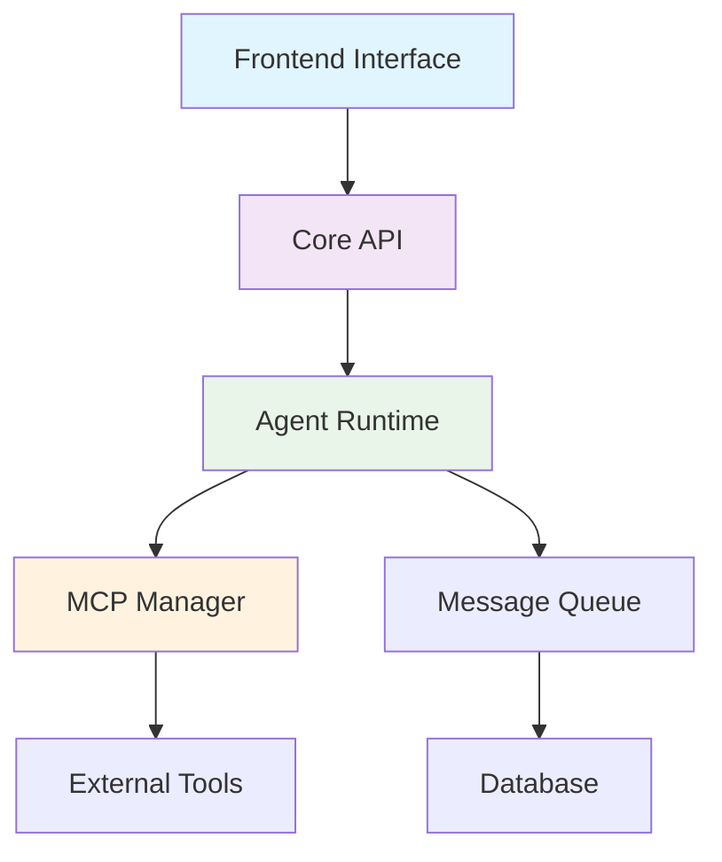

# Welcome to AgentArea

<Info>
AgentArea is a comprehensive platform for building, deploying, and managing AI agents at scale. Whether you're creating simple chatbots or complex multi-agent systems, AgentArea provides the tools and infrastructure you need.
</Info>

## 🚀 What is AgentArea?

AgentArea is a cloud-native platform that enables developers, businesses, and organizations to:

- **Build AI Agents** with pre-built templates and customizable components
- **Deploy at Scale** with automated infrastructure and load balancing
- **Manage Conversations** across multiple channels and contexts
- **Integrate Seamlessly** with existing systems and APIs
- **Monitor Performance** with real-time analytics and debugging tools

## ✨ Key Features

<CardGroup cols={2}>
  <Card title="Multi-Agent Communication" icon="bot">
    Enable your AI agents to collaborate, share information, and work together on complex tasks
  </Card>
  
  <Card title="Model Context Protocol" icon="link">
    Built-in support for MCP allows agents to access external tools and data sources securely
  </Card>
  
  <Card title="Scalable Infrastructure" icon="server">
    Auto-scaling container orchestration ensures your agents can handle any workload
  </Card>
  
  <Card title="Developer-Friendly APIs" icon="code">
    RESTful APIs and SDKs make integration simple and straightforward
  </Card>
</CardGroup>

## 🎯 Who is AgentArea For?

<Tabs>
  <Tab title="Developers">
    **Build powerful AI agents** with our comprehensive development tools:
    - Pre-built agent templates
    - Local development environment
    - Real-time testing and debugging
    - CI/CD integration
  </Tab>
  
  <Tab title="Businesses">
    **Deploy AI solutions** that scale with your needs:
    - Customer service automation
    - Internal process optimization
    - Data analysis and reporting
    - Multi-channel communication
  </Tab>
  
  <Tab title="Enterprises">
    **Enterprise-grade platform** with security and compliance:
    - Role-based access control
    - Audit logging and compliance
    - Private cloud deployment
    - Custom integrations
  </Tab>
</Tabs>

## 🏗️ Architecture Overview

AgentArea is built on modern cloud-native principles:



- **Frontend**: React-based dashboard for managing agents and conversations
- **Core API**: FastAPI backend handling all business logic
- **Agent Runtime**: Scalable container orchestration for running AI agents
- **MCP Manager**: Model Context Protocol integration for external tool access
- **Message Queue**: Redis-based communication between components

## 🚀 Quick Start

Get started with AgentArea in just a few minutes:

<Steps>
  <Step title="Installation">
    Clone the repository and start the development environment:
    ```bash
    git clone https://github.com/your-org/agentarea
    cd agentarea
    make dev-up
    ```
  </Step>
  
  <Step title="Create Your First Agent">
    Use our web interface or API to create a simple agent:
    ```bash
    curl -X POST http://localhost:8000/v1/agents \
      -H "Content-Type: application/json" \
      -d '{"name": "My First Agent", "template": "chatbot"}'
    ```
  </Step>
  
  <Step title="Start Chatting">
    Open the AgentArea dashboard and start a conversation with your agent!
  </Step>
</Steps>

## 📚 Next Steps

<CardGroup cols={3}>
  <Card title="Getting Started Guide" icon="rocket" href="/GETTING_STARTED">
    Complete step-by-step setup and tutorial
  </Card>
  
  <Card title="Build Your First Agent" icon="bot" href="/agent_to_agent_communication">
    Learn how to create and customize AI agents
  </Card>
  
  <Card title="API Documentation" icon="terminal" href="/API_REFERENCE">
    Explore our comprehensive API reference
  </Card>
</CardGroup>

## 🤝 Community & Support

- **GitHub**: [AgentArea Repository](https://github.com/your-org/agentarea)
- **Discord**: [Join our community](https://discord.gg/your-discord)
- **Documentation**: You're reading it! 📖
- **Issues**: Report bugs and request features on GitHub

---

<Note>
Ready to build the future of AI agents? [Get started now](/GETTING_STARTED) or [explore our API](/API_REFERENCE)!
</Note>