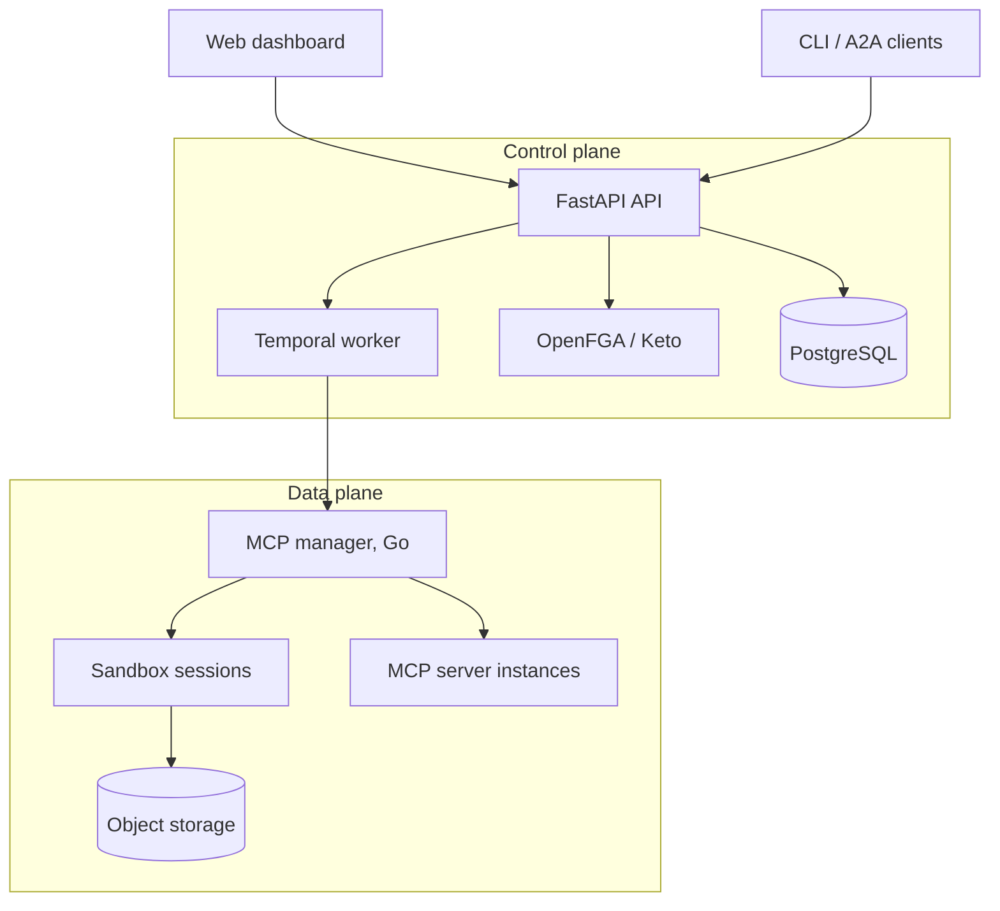

AgentArea runs AI agents under controls you configure: which tools an agent may
call, whose data it may read, what it may spend, and what a human has to approve
before it proceeds. Agents execute in isolated sandboxes on durable workflows,
and every decision is recorded.

It is open core and Apache-2.0 licensed. You can self-host the whole thing.

## The problem it addresses

Getting one agent to work is a weekend. Running agents where the cost of a
mistake is real is a different problem, and it is mostly not a modelling problem:

- An agent acts with someone's authority. Which someone, and how far does it
  extend?
- Model output is untrusted input. It arrives as a shell command or a tool call.
- Agents are long-running and stateful. A process crash mid-task should not lose
  the task.
- When something goes wrong, someone will ask what happened and why it was
  allowed.

Most agent frameworks treat these as deployment concerns left to the reader.
AgentArea treats them as the product, which is why it looks less like a library
and more like infrastructure.

## What it gives you

<Columns cols={2}>
  <Card title="Isolation by construction" icon="layer-group" href="/concepts/workspaces-projects-resources">
    Every entity belongs to a workspace, and repositories cannot be built
    without a user context. Scoping is structurally hard to omit rather than a
    rule developers must remember.
  </Card>
  <Card title="Relationship-based authorization" icon="scale-balanced" href="/concepts/governance/authorization-basics">
    Permissions come from relationships in a graph — this user manages this
    project, this project contains this agent — evaluated by OpenFGA or Ory
    Keto. Checks fail closed.
  </Card>
  <Card title="Sandboxed execution" icon="box" href="/concepts/sandbox/why-a-sandbox">
    Commands and skills run in isolated sandboxes managed by a dedicated Go
    service, not in the workflow process. Logs and artifacts go to object
    storage and are referenced by handle.
  </Card>
  <Card title="Durable workflows" icon="diagram-project" href="/concepts/execution/durable-execution">
    Agent execution is a Temporal workflow. A worker restart does not lose a
    task, and a run can wait on a human approval for as long as it takes
    without holding a connection open.
  </Card>
  <Card title="Governed tool access" icon="shield-halved" href="/concepts/governance/tool-authorization">
    Tool calls pass an interceptor pipeline — budget gates, security filters,
    observers — before they run, and the same policy that decides what an agent
    may call decides what it is even shown.
  </Card>
  <Card title="MCP as the tool interface" icon="plug" href="/concepts/integration/mcp">
    External tools connect over the Model Context Protocol, hosted by AgentArea
    or connected remotely, with secrets resolved server-side.
  </Card>
</Columns>

## How the pieces fit

```mermaid
graph TB
    subgraph Control["Control plane"]
        API[FastAPI API]
        WORKER[Temporal worker]
        AUTHZ[OpenFGA / Keto]
        PG[(PostgreSQL)]
    end

    subgraph Data["Data plane"]
        MGR[MCP manager, Go]
        SBX[Sandbox sessions]
        MCPI[MCP server instances]
        OBJ[(Object storage)]
    end

    UI[Web dashboard] --> API
    CLI[CLI / A2A clients] --> API
    API --> AUTHZ
    API --> PG
    API --> WORKER
    WORKER --> MGR
    MGR --> SBX
    MGR --> MCPI
    SBX --> OBJ
```

The split matters: the control plane decides and records, the data plane executes
and holds payload. That boundary is what lets execution move into your own
network while the platform stays where it is. [How it works](/how-it-works)
follows a single request across it.

## The stack

| Layer | Technology |
|---|---|
| Frontend | Next.js 16, React 19 |
| API | FastAPI, Python 3.12+ |
| Workflows | Temporal 1.29 |
| Sandbox and MCP orchestration | Go, Kubernetes or Docker |
| Database | PostgreSQL 18 |
| Cache and streams | Valkey 8 |
| Object storage | RustFS, S3-compatible |
| Authorization | OpenFGA or Ory Keto |
| Identity | Ory Kratos, Hydra |

## Why not an agent framework?

If you are building one agent, or embedding agent behaviour into an existing
service, a framework is the right tool and this is too much machinery.

The trade happens when agents start acting on behalf of other people. A framework
gives you the loop and leaves isolation, authorization, durability, and audit as
integration work — which is where the effort actually goes, and where getting it
subtly wrong is expensive. AgentArea makes those the platform's job, at the cost
of being something you operate: four processes, a database, a workflow engine,
and an authorization service.

That cost is only worth paying if the governance is worth something to you. If
it is not, use a framework.

## Limits

Worth knowing before you invest time.

<Warning>
**Not a model-agnostic agent framework you embed.** AgentArea is a platform you
deploy. If you want a library to import into an existing service, this is more
than you need.

**Not a hosted product you can sign up for today.** The documented path is
self-hosting.

**Not finished.** Parts of the network model are descriptive rather than
enforced, and the concept pages say which. Where documentation and code
disagree, the code is right and the page is a bug.
</Warning>

## Where to go next

Start here, in order:

<Steps>
  <Step title="Run AgentArea locally" icon="rocket">
    The development stack, from clone to a dashboard.
    [Quickstart →](/quickstart)
  </Step>
  <Step title="Read how it works" icon="sitemap">
    The request path, and what each service does. Read this before the rest of
    the documentation; it makes the rest legible.
    [How it works →](/how-it-works)
  </Step>
  <Step title="Create and configure an agent" icon="robot">
    Give an agent a model and run a task.
    [Create and configure →](/guides/agents/create-and-configure)
  </Step>
</Steps>

Then, depending on what you are evaluating:

<Columns cols={2}>
  <Card title="Agentic networks" icon="lightbulb" href="/concepts/agentic-networks">
    The network model, and which parts of it are enforced.
  </Card>
  <Card title="Workspaces, projects, and resources" icon="layer-group" href="/concepts/workspaces-projects-resources">
    The scoping model everything else assumes.
  </Card>
  <Card title="Control plane and data plane" icon="sitemap" href="/concepts/control-and-data-plane">
    Where your data goes, and how to keep it in your network.
  </Card>
  <Card title="Open core" icon="scale-balanced" href="/concepts/open-core">
    What is core, what is commercial, and how the boundary is implemented.
  </Card>
  <Card title="Self-host requirements" icon="server" href="/self-host/requirements">
    Running it somewhere other than your laptop.
  </Card>
  <Card title="API reference" icon="code" href="/api-reference/introduction">
    Every endpoint, generated from the OpenAPI spec.
  </Card>
</Columns>

## License and community

Apache License 2.0. Commercial features exist as a separately installed package;
see [Open core](/concepts/open-core) for exactly where the line falls.

<Columns cols={2}>
  <Card title="GitHub" icon="github" href="https://github.com/agentarea/agentarea">
    Source, issues, and discussions.
  </Card>
  <Card title="Discord" icon="discord" href="https://discord.gg/5tduPwheYQ">
    Ask questions and follow development.
  </Card>
</Columns>
