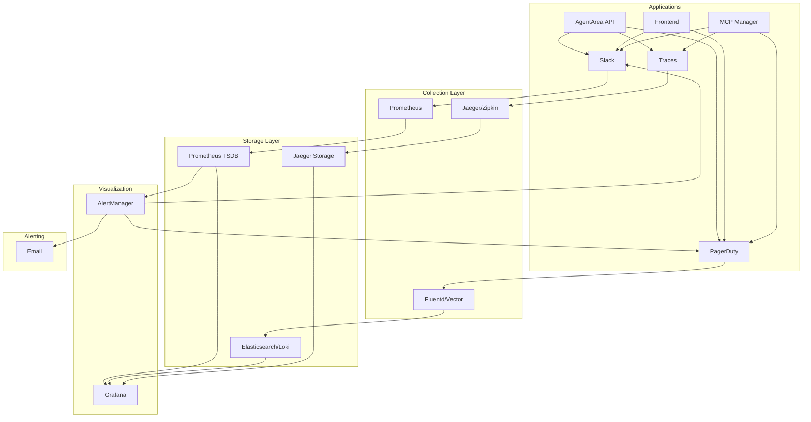

# Monitoring & Observability

<Info>
Comprehensive monitoring and observability are essential for running AgentArea in production. This guide covers metrics collection, logging, alerting, and distributed tracing for optimal system visibility.
</Info>

## 📊 Observability Stack

AgentArea implements a complete observability solution using industry-standard tools:



## 📈 Metrics Collection

### Prometheus Configuration

<Tabs>
  <Tab title="Server Configuration">
    ```yaml
    # prometheus.yml
    global:
      scrape_interval: 15s
      evaluation_interval: 15s
      external_labels:
        cluster: 'agentarea-prod'
        region: 'us-west-2'
    
    rule_files:
      - "agentarea_rules.yml"
      - "infrastructure_rules.yml"
    
    scrape_configs:
      # AgentArea API metrics
      - job_name: 'agentarea-api'
        kubernetes_sd_configs:
        - role: pod
        relabel_configs:
        - source_labels: [__meta_kubernetes_pod_label_app]
          action: keep
          regex: agentarea-api
        - source_labels: [__meta_kubernetes_pod_annotation_prometheus_io_scrape]
          action: keep
          regex: true
        - source_labels: [__meta_kubernetes_pod_annotation_prometheus_io_path]
          action: replace
          target_label: __metrics_path__
          regex: (.+)
    
      # MCP Manager metrics
      - job_name: 'mcp-manager'
        kubernetes_sd_configs:
        - role: pod
        relabel_configs:
        - source_labels: [__meta_kubernetes_pod_label_app]
          action: keep
          regex: mcp-manager
    
      # Infrastructure metrics
      - job_name: 'node-exporter'
        kubernetes_sd_configs:
        - role: node
        relabel_configs:
        - action: labelmap
          regex: __meta_kubernetes_node_label_(.+)
    
      - job_name: 'postgres-exporter'
        static_configs:
        - targets: ['postgres-exporter:9187']
    
      - job_name: 'redis-exporter'
        static_configs:
        - targets: ['redis-exporter:9121']
    ```
  </Tab>
  
  <Tab title="Application Metrics">
    ```python
    # Python metrics implementation
    from prometheus_client import Counter, Histogram, Gauge, start_http_server
    import time
    import functools
    
    # Business metrics
    agent_requests = Counter(
        'agentarea_agent_requests_total',
        'Total agent requests',
        ['agent_id', 'status', 'model']
    )
    
    conversation_duration = Histogram(
        'agentarea_conversation_duration_seconds',
        'Time spent in conversations',
        ['agent_type']
    )
    
    active_agents = Gauge(
        'agentarea_active_agents',
        'Number of currently active agents',
        ['status']
    )
    
    # HTTP metrics
    http_requests = Counter(
        'agentarea_http_requests_total',
        'Total HTTP requests',
        ['method', 'endpoint', 'status']
    )
    
    http_duration = Histogram(
        'agentarea_http_request_duration_seconds',
        'HTTP request duration',
        ['method', 'endpoint']
    )
    
    # Database metrics
    db_connections = Gauge(
        'agentarea_db_connections',
        'Database connections',
        ['state']
    )
    
    db_query_duration = Histogram(
        'agentarea_db_query_duration_seconds',
        'Database query duration',
        ['query_type']
    )
    
    # Decorator for automatic metrics
    def track_requests(func):
        @functools.wraps(func)
        async def wrapper(*args, **kwargs):
            start_time = time.time()
            status = 'success'
            
            try:
                result = await func(*args, **kwargs)
                return result
            except Exception as e:
                status = 'error'
                raise
            finally:
                duration = time.time() - start_time
                http_duration.labels(
                    method=request.method,
                    endpoint=request.url.path
                ).observe(duration)
                
                http_requests.labels(
                    method=request.method,
                    endpoint=request.url.path,
                    status=status
                ).inc()
        
        return wrapper
    ```
  </Tab>
  
  <Tab title="Custom Metrics">
    ```python
    # AgentArea-specific metrics
    class AgentAreaMetrics:
        def __init__(self):
            # Agent lifecycle metrics
            self.agent_created = Counter(
                'agentarea_agents_created_total',
                'Agents created',
                ['template', 'model']
            )
            
            self.agent_errors = Counter(
                'agentarea_agent_errors_total',
                'Agent execution errors',
                ['agent_id', 'error_type']
            )
            
            # MCP metrics
            self.mcp_tool_calls = Counter(
                'agentarea_mcp_tool_calls_total',
                'MCP tool invocations',
                ['tool_name', 'status']
            )
            
            self.mcp_response_time = Histogram(
                'agentarea_mcp_response_seconds',
                'MCP tool response time',
                ['tool_name']
            )
            
            # Agent communication metrics
            self.agent_messages = Counter(
                'agentarea_agent_messages_total',
                'Messages between agents',
                ['from_agent', 'to_agent', 'message_type']
            )
            
            # Resource usage metrics
            self.memory_usage = Gauge(
                'agentarea_memory_usage_bytes',
                'Memory usage by component',
                ['component']
            )
            
            self.cpu_usage = Gauge(
                'agentarea_cpu_usage_percent',
                'CPU usage by component',
                ['component']
            )
    
        def record_agent_creation(self, template: str, model: str):
            self.agent_created.labels(template=template, model=model).inc()
        
        def record_mcp_call(self, tool_name: str, duration: float, success: bool):
            status = 'success' if success else 'error'
            self.mcp_tool_calls.labels(tool_name=tool_name, status=status).inc()
            self.mcp_response_time.labels(tool_name=tool_name).observe(duration)
    ```
  </Tab>
</Tabs>

### Key Performance Indicators (KPIs)

<CardGroup cols={4}>
  <Card title="Availability" icon="shield">
    **99.9% uptime target**
    - Service availability
    - Error rates < 0.1%
    - Response time < 200ms (p95)
  </Card>
  
  <Card title="Performance" icon="zap">
    **Sub-second response**
    - API response time
    - Agent creation time
    - Database query performance
  </Card>
  
  <Card title="Scalability" icon="trending-up">
    **Linear scaling**
    - Requests per second
    - Concurrent users
    - Resource utilization
  </Card>
  
  <Card title="Business" icon="dollar-sign">
    **Usage metrics**
    - Active agents
    - Conversations per hour
    - User engagement
  </Card>
</CardGroup>

## 📝 Logging Strategy

### Structured Logging

<Tabs>
  <Tab title="Application Logs">
    ```python
    # Structured logging with Python
    import structlog
    import logging
    from pythonjsonlogger import jsonlogger
    
    # Configure structured logging
    structlog.configure(
        processors=[
            structlog.stdlib.filter_by_level,
            structlog.stdlib.add_logger_name,
            structlog.stdlib.add_log_level,
            structlog.stdlib.PositionalArgumentsFormatter(),
            structlog.processors.StackInfoRenderer(),
            structlog.processors.format_exc_info,
            structlog.processors.UnicodeDecoder(),
            structlog.processors.JSONRenderer()
        ],
        context_class=dict,
        logger_factory=structlog.stdlib.LoggerFactory(),
        wrapper_class=structlog.stdlib.BoundLogger,
        cache_logger_on_first_use=True,
    )
    
    # Get logger
    logger = structlog.get_logger("agentarea.api")
    
    # Usage examples
    async def create_agent(agent_config: AgentConfig):
        logger.info(
            "Creating agent",
            agent_name=agent_config.name,
            model=agent_config.model,
            template=agent_config.template,
            user_id=current_user.id
        )
        
        try:
            agent = await agent_service.create(agent_config)
            
            logger.info(
                "Agent created successfully",
                agent_id=agent.id,
                creation_time=agent.created_at,
                user_id=current_user.id
            )
            
            return agent
            
        except Exception as e:
            logger.error(
                "Failed to create agent",
                error=str(e),
                error_type=type(e).__name__,
                agent_config=agent_config.dict(),
                user_id=current_user.id,
                exc_info=True
            )
            raise
    ```
  </Tab>
  
  <Tab title="Log Aggregation">
    ```yaml
    # Fluentd configuration for log collection
    apiVersion: v1
    kind: ConfigMap
    metadata:
      name: fluentd-config
    data:
      fluent.conf: |
        # Input from Kubernetes pods
        <source>
          @type tail
          @id in_tail_agentarea
          path /var/log/containers/agentarea-*.log
          pos_file /var/log/fluentd-agentarea.log.pos
          tag kubernetes.agentarea.*
          read_from_head true
          <parse>
            @type kubernetes
            @id parse_agentarea
          </parse>
        </source>
        
        # Parse JSON logs
        <filter kubernetes.agentarea.**>
          @type parser
          key_name log
          reserve_data true
          remove_key_name_field true
          <parse>
            @type json
            json_parser yajl
          </parse>
        </filter>
        
        # Add Kubernetes metadata
        <filter kubernetes.agentarea.**>
          @type kubernetes_metadata
          @id filter_kube_metadata
        </filter>
        
        # Output to Elasticsearch
        <match kubernetes.agentarea.**>
          @type elasticsearch
          @id out_es
          host elasticsearch.logging.svc.cluster.local
          port 9200
          logstash_format true
          logstash_prefix agentarea
          include_tag_key true
          tag_key @log_name
          <buffer>
            @type file
            path /var/log/fluentd-buffers/agentarea.buffer
            flush_mode interval
            retry_type exponential_backoff
            flush_thread_count 2
            flush_interval 5s
            retry_forever
            retry_max_interval 30
            chunk_limit_size 2M
            queue_limit_length 8
            overflow_action block
          </buffer>
        </match>
    ```
  </Tab>
  
  <Tab title="Log Levels & Categories">
    ```python
    # Log level configuration
    LOG_LEVELS = {
        "development": "DEBUG",
        "staging": "INFO", 
        "production": "WARNING"
    }
    
    # Log categories
    LOGGERS = {
        # Application loggers
        "agentarea.api": {
            "level": "INFO",
            "categories": ["request", "response", "business_logic"]
        },
        "agentarea.agents": {
            "level": "INFO", 
            "categories": ["lifecycle", "communication", "errors"]
        },
        "agentarea.mcp": {
            "level": "INFO",
            "categories": ["tool_calls", "provisioning", "health"]
        },
        
        # Infrastructure loggers
        "agentarea.database": {
            "level": "WARNING",
            "categories": ["connections", "queries", "migrations"]
        },
        "agentarea.cache": {
            "level": "WARNING",
            "categories": ["hits", "misses", "evictions"]
        },
        
        # Security loggers
        "agentarea.auth": {
            "level": "INFO",
            "categories": ["login", "logout", "token_refresh", "failures"]
        },
        "agentarea.security": {
            "level": "WARNING",
            "categories": ["unauthorized_access", "suspicious_activity"]
        }
    }
    
    # Sensitive data filtering
    SENSITIVE_FIELDS = [
        "password", "token", "secret", "key", 
        "authorization", "cookie", "session"
    ]
    
    def sanitize_log_data(data: dict) -> dict:
        """Remove sensitive information from log data"""
        sanitized = data.copy()
        
        for field in SENSITIVE_FIELDS:
            if field in sanitized:
                sanitized[field] = "[REDACTED]"
        
        return sanitized
    ```
  </Tab>
</Tabs>

## 🔍 Distributed Tracing

### Jaeger Integration

<Tabs>
  <Tab title="Trace Configuration">
    ```python
    # OpenTelemetry tracing setup
    from opentelemetry import trace
    from opentelemetry.exporter.jaeger.thrift import JaegerExporter
    from opentelemetry.sdk.trace import TracerProvider
    from opentelemetry.sdk.trace.export import BatchSpanProcessor
    from opentelemetry.instrumentation.fastapi import FastAPIInstrumentor
    from opentelemetry.instrumentation.sqlalchemy import SQLAlchemyInstrumentor
    from opentelemetry.instrumentation.redis import RedisInstrumentor
    
    # Configure tracer
    trace.set_tracer_provider(TracerProvider())
    tracer = trace.get_tracer(__name__)
    
    # Configure Jaeger exporter
    jaeger_exporter = JaegerExporter(
        agent_host_name="jaeger-agent",
        agent_port=6831,
    )
    
    # Add span processor
    span_processor = BatchSpanProcessor(jaeger_exporter)
    trace.get_tracer_provider().add_span_processor(span_processor)
    
    # Auto-instrument frameworks
    FastAPIInstrumentor.instrument_app(app)
    SQLAlchemyInstrumentor().instrument(engine=engine)
    RedisInstrumentor().instrument()
    
    # Manual tracing for business logic
    async def create_agent_with_tracing(agent_config: AgentConfig):
        with tracer.start_as_current_span(
            "create_agent",
            attributes={
                "agent.name": agent_config.name,
                "agent.model": agent_config.model,
                "user.id": current_user.id
            }
        ) as span:
            
            # Validate configuration
            with tracer.start_as_current_span("validate_config") as child_span:
                validation_result = await validate_agent_config(agent_config)
                child_span.set_attribute("validation.result", validation_result)
            
            # Create agent in database
            with tracer.start_as_current_span("database_create") as child_span:
                agent = await create_agent_in_db(agent_config)
                child_span.set_attribute("agent.id", agent.id)
            
            # Initialize agent runtime
            with tracer.start_as_current_span("initialize_runtime") as child_span:
                await initialize_agent_runtime(agent)
                child_span.set_attribute("runtime.status", "initialized")
            
            span.set_attribute("operation.status", "success")
            return agent
    ```
  </Tab>
  
  <Tab title="Cross-Service Tracing">
    ```python
    # Propagate trace context across services
    import httpx
    from opentelemetry.propagate import inject
    
    async def call_mcp_manager(agent_id: str, action: str):
        # Create new span for external call
        with tracer.start_as_current_span(
            "mcp_manager_call",
            attributes={
                "service.name": "mcp-manager",
                "agent.id": agent_id,
                "action": action
            }
        ) as span:
            
            # Prepare headers with trace context
            headers = {}
            inject(headers)
            
            # Make HTTP request with tracing
            async with httpx.AsyncClient() as client:
                response = await client.post(
                    f"http://mcp-manager:8001/agents/{agent_id}/{action}",
                    headers=headers,
                    timeout=30.0
                )
                
                # Add response details to span
                span.set_attributes({
                    "http.status_code": response.status_code,
                    "http.response_size": len(response.content),
                    "operation.duration": response.elapsed.total_seconds()
                })
                
                if response.status_code >= 400:
                    span.set_status(Status(StatusCode.ERROR))
                
                return response.json()
    ```
  </Tab>
  
  <Tab title="Trace Analysis">
    ```python
    # Custom trace analysis
    class TraceAnalyzer:
        def __init__(self, jaeger_client):
            self.client = jaeger_client
        
        async def analyze_slow_requests(self, threshold_ms: int = 1000):
            """Find requests slower than threshold"""
            traces = await self.client.search_traces(
                service="agentarea-api",
                operation="create_agent",
                duration_min=f"{threshold_ms}ms"
            )
            
            slow_traces = []
            for trace in traces:
                analysis = {
                    "trace_id": trace.trace_id,
                    "duration": trace.duration,
                    "bottlenecks": self._find_bottlenecks(trace),
                    "error_rate": self._calculate_error_rate(trace)
                }
                slow_traces.append(analysis)
            
            return slow_traces
        
        def _find_bottlenecks(self, trace):
            """Identify the slowest spans in a trace"""
            spans_by_duration = sorted(
                trace.spans, 
                key=lambda s: s.duration, 
                reverse=True
            )
            
            return [
                {
                    "operation": span.operation_name,
                    "duration": span.duration,
                    "percentage": (span.duration / trace.duration) * 100
                }
                for span in spans_by_duration[:5]
            ]
    ```
  </Tab>
</Tabs>

## 🚨 Alerting & Notifications

### Alert Rules

<Tabs>
  <Tab title="Critical Alerts">
    ```yaml
    # prometheus_rules.yml
    groups:
    - name: agentarea_critical
      rules:
      
      # Service availability
      - alert: ServiceDown
        expr: up{job=~"agentarea.*"} == 0
        for: 1m
        labels:
          severity: critical
          team: platform
        annotations:
          summary: "AgentArea service is down"
          description: "{{ $labels.job }} has been down for more than 1 minute"
          runbook_url: "https://docs.agentarea.com/runbooks/service-down"
      
      # High error rate
      - alert: HighErrorRate
        expr: |
          (
            sum(rate(agentarea_http_requests_total{status=~"5.."}[5m])) by (service)
            /
            sum(rate(agentarea_http_requests_total[5m])) by (service)
          ) > 0.05
        for: 2m
        labels:
          severity: critical
          team: development
        annotations:
          summary: "High error rate detected"
          description: "Error rate is {{ $value | humanizePercentage }} for {{ $labels.service }}"
      
      # Database connection issues
      - alert: DatabaseConnectionFailure
        expr: agentarea_db_connections{state="failed"} > 0
        for: 30s
        labels:
          severity: critical
          team: infrastructure
        annotations:
          summary: "Database connection failures"
          description: "{{ $value }} database connections have failed"
      
      # High response time
      - alert: HighResponseTime
        expr: |
          histogram_quantile(0.95, 
            sum(rate(agentarea_http_request_duration_seconds_bucket[5m])) by (le, service)
          ) > 2
        for: 5m
        labels:
          severity: warning
          team: performance
        annotations:
          summary: "High response time"
          description: "95th percentile response time is {{ $value }}s for {{ $labels.service }}"
    ```
  </Tab>
  
  <Tab title="Resource Alerts">
    ```yaml
    - name: agentarea_resources
      rules:
      
      # High CPU usage
      - alert: HighCPUUsage
        expr: |
          (
            sum(rate(container_cpu_usage_seconds_total{container=~"agentarea.*"}[5m])) by (container)
            /
            sum(container_spec_cpu_quota{container=~"agentarea.*"} / container_spec_cpu_period{container=~"agentarea.*"}) by (container)
          ) > 0.8
        for: 10m
        labels:
          severity: warning
          team: infrastructure
        annotations:
          summary: "High CPU usage"
          description: "CPU usage is {{ $value | humanizePercentage }} for {{ $labels.container }}"
      
      # High memory usage
      - alert: HighMemoryUsage
        expr: |
          (
            container_memory_usage_bytes{container=~"agentarea.*"}
            /
            container_spec_memory_limit_bytes{container=~"agentarea.*"}
          ) > 0.9
        for: 5m
        labels:
          severity: warning
          team: infrastructure
        annotations:
          summary: "High memory usage"
          description: "Memory usage is {{ $value | humanizePercentage }} for {{ $labels.container }}"
      
      # Disk space low
      - alert: DiskSpaceLow
        expr: |
          (
            node_filesystem_avail_bytes{mountpoint="/"}
            /
            node_filesystem_size_bytes{mountpoint="/"}
          ) < 0.1
        for: 1m
        labels:
          severity: critical
          team: infrastructure
        annotations:
          summary: "Low disk space"
          description: "Disk space is {{ $value | humanizePercentage }} available on {{ $labels.instance }}"
    ```
  </Tab>
  
  <Tab title="Business Alerts">
    ```yaml
    - name: agentarea_business
      rules:
      
      # Agent creation failures
      - alert: AgentCreationFailures
        expr: |
          sum(increase(agentarea_agents_created_total{status="error"}[10m])) > 5
        for: 2m
        labels:
          severity: warning
          team: product
        annotations:
          summary: "High agent creation failure rate"
          description: "{{ $value }} agents failed to create in the last 10 minutes"
      
      # Low agent activity
      - alert: LowAgentActivity
        expr: agentarea_active_agents < 10
        for: 15m
        labels:
          severity: info
          team: product
        annotations:
          summary: "Low agent activity"
          description: "Only {{ $value }} agents are currently active"
      
      # MCP tool failures
      - alert: MCPToolFailures
        expr: |
          sum(increase(agentarea_mcp_tool_calls_total{status="error"}[5m])) by (tool_name) > 3
        for: 2m
        labels:
          severity: warning
          team: integration
        annotations:
          summary: "MCP tool failures"
          description: "Tool {{ $labels.tool_name }} has failed {{ $value }} times in 5 minutes"
    ```
  </Tab>
</Tabs>

### Notification Channels

<CardGroup cols={3}>
  <Card title="PagerDuty" icon="phone">
    **Critical alerts only**
    - Service outages
    - Security incidents
    - Data loss events
    - 24/7 on-call escalation
  </Card>
  
  <Card title="Slack" icon="message-square">
    **Team notifications**
    - Warning alerts
    - Performance issues
    - Deployment updates
    - Team-specific channels
  </Card>
  
  <Card title="Email" icon="mail">
    **Summary reports**
    - Daily health reports
    - Weekly performance summaries
    - Monthly SLA reports
    - Executive dashboards
  </Card>
</CardGroup>

## 📊 Grafana Dashboards

### Executive Dashboard

<Tabs>
  <Tab title="Business KPIs">
    ```json
    {
      "dashboard": {
        "title": "AgentArea - Executive Dashboard",
        "tags": ["agentarea", "executive"],
        "time": {
          "from": "now-24h",
          "to": "now"
        },
        "panels": [
          {
            "title": "Service Availability",
            "type": "stat",
            "targets": [
              {
                "expr": "avg(up{job=~\"agentarea.*\"})",
                "legendFormat": "Uptime"
              }
            ],
            "fieldConfig": {
              "defaults": {
                "unit": "percentunit",
                "min": 0.99,
                "max": 1,
                "thresholds": {
                  "steps": [
                    {"color": "red", "value": 0.99},
                    {"color": "yellow", "value": 0.995},
                    {"color": "green", "value": 0.999}
                  ]
                }
              }
            }
          },
          {
            "title": "Active Users",
            "type": "graph",
            "targets": [
              {
                "expr": "sum(agentarea_active_users)",
                "legendFormat": "Active Users"
              }
            ]
          },
          {
            "title": "Agent Activity",
            "type": "graph",
            "targets": [
              {
                "expr": "sum(agentarea_active_agents) by (status)",
                "legendFormat": "{{status}}"
              }
            ]
          },
          {
            "title": "Error Rate",
            "type": "graph",
            "targets": [
              {
                "expr": "sum(rate(agentarea_http_requests_total{status=~\"5..\"}[5m])) / sum(rate(agentarea_http_requests_total[5m]))",
                "legendFormat": "Error Rate"
              }
            ]
          }
        ]
      }
    }
    ```
  </Tab>
  
  <Tab title="Technical Operations">
    ```json
    {
      "dashboard": {
        "title": "AgentArea - Technical Operations",
        "tags": ["agentarea", "operations"],
        "panels": [
          {
            "title": "Request Rate",
            "type": "graph",
            "targets": [
              {
                "expr": "sum(rate(agentarea_http_requests_total[5m])) by (service)",
                "legendFormat": "{{service}}"
              }
            ]
          },
          {
            "title": "Response Time Distribution",
            "type": "heatmap",
            "targets": [
              {
                "expr": "sum(increase(agentarea_http_request_duration_seconds_bucket[5m])) by (le)",
                "format": "heatmap",
                "legendFormat": "{{le}}"
              }
            ]
          },
          {
            "title": "Database Performance",
            "type": "graph",
            "targets": [
              {
                "expr": "histogram_quantile(0.95, sum(rate(agentarea_db_query_duration_seconds_bucket[5m])) by (le))",
                "legendFormat": "95th percentile"
              },
              {
                "expr": "histogram_quantile(0.50, sum(rate(agentarea_db_query_duration_seconds_bucket[5m])) by (le))",
                "legendFormat": "50th percentile"
              }
            ]
          },
          {
            "title": "Resource Utilization",
            "type": "graph",
            "targets": [
              {
                "expr": "sum(container_memory_usage_bytes{container=~\"agentarea.*\"}) by (container)",
                "legendFormat": "Memory - {{container}}"
              },
              {
                "expr": "sum(rate(container_cpu_usage_seconds_total{container=~\"agentarea.*\"}[5m])) by (container)",
                "legendFormat": "CPU - {{container}}"
              }
            ]
          }
        ]
      }
    }
    ```
  </Tab>
</Tabs>

## 🔧 Troubleshooting

### Common Issues

<Accordion>
  <AccordionItem title="High Response Times">
    **Symptoms**: API responses > 1 second
    
    **Investigation steps**:
    1. Check Grafana response time dashboard
    2. Look at slow query logs in database
    3. Examine trace data in Jaeger
    4. Check resource utilization metrics
    
    **Common causes**:
    - Database query optimization needed
    - High CPU/memory usage
    - External service latency
    - Network connectivity issues
    
    **Resolution**:
    ```bash
    # Check slow queries
    kubectl logs -l app=postgresql | grep "slow query"
    
    # Analyze traces
    curl "http://jaeger:16686/api/traces?service=agentarea-api&lookback=1h&limit=100"
    
    # Check resource usage
    kubectl top pods -l app=agentarea-api
    ```
  </AccordionItem>
  
  <AccordionItem title="High Error Rates">
    **Symptoms**: Error rate > 1%
    
    **Investigation steps**:
    1. Check error logs in Elasticsearch/Loki
    2. Review alert notifications
    3. Examine error traces
    4. Check external service dependencies
    
    **Common causes**:
    - Database connection issues
    - External API rate limits
    - Configuration errors
    - Resource exhaustion
    
    **Resolution**:
    ```bash
    # Check recent errors
    kubectl logs -l app=agentarea-api --since=1h | grep ERROR
    
    # Check database connectivity
    kubectl exec -it deployment/agentarea-api -- python -c "
    import psycopg2
    conn = psycopg2.connect('$DATABASE_URL')
    print('DB connection OK')
    "
    
    # Check external services
    kubectl exec -it deployment/agentarea-api -- curl -I https://api.openai.com/v1/models
    ```
  </AccordionItem>
</Accordion>

### Performance Optimization

<Steps>
  <Step title="Identify Bottlenecks">
    Use metrics and tracing to identify the slowest components
    ```bash
    # Query slow endpoints
    curl -G 'http://prometheus:9090/api/v1/query' \
      --data-urlencode 'query=topk(10, histogram_quantile(0.95, sum(rate(agentarea_http_request_duration_seconds_bucket[5m])) by (le, endpoint)))'
    ```
  </Step>
  
  <Step title="Optimize Database">
    Review and optimize database queries and indexes
    ```sql
    -- Find slow queries
    SELECT query, mean_time, calls 
    FROM pg_stat_statements 
    ORDER BY mean_time DESC 
    LIMIT 10;
    
    -- Check index usage
    SELECT schemaname, tablename, attname, n_distinct, correlation 
    FROM pg_stats 
    WHERE tablename = 'agents';
    ```
  </Step>
  
  <Step title="Scale Resources">
    Adjust resource allocations and replica counts
    ```bash
    # Scale API replicas
    kubectl scale deployment agentarea-api --replicas=5
    
    # Update resource limits
    kubectl patch deployment agentarea-api -p '{"spec":{"template":{"spec":{"containers":[{"name":"api","resources":{"limits":{"cpu":"2","memory":"4Gi"}}}]}}}}'
    ```
  </Step>
</Steps>

---

<Note>
Effective monitoring and observability are crucial for maintaining a reliable AgentArea deployment. Regular review of metrics, logs, and traces helps identify issues before they impact users and ensures optimal system performance.
</Note>