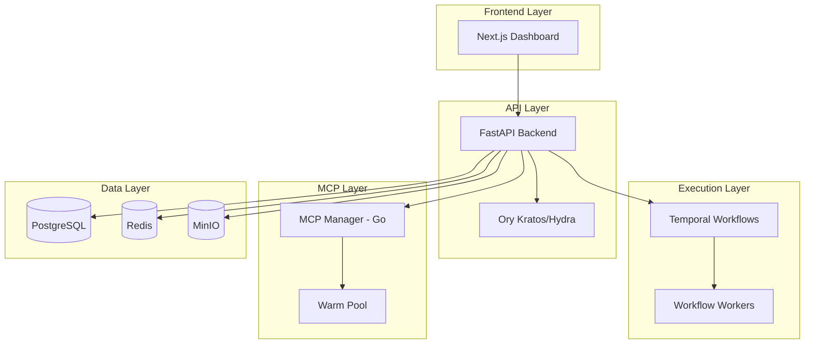

# Platform Overview

<Info>
AgentArea is an open-core platform for **governed agentic networks**. Build, deploy, and scale multi-agent systems with VPC-inspired architecture and built-in compliance controls.
</Info>

## Why AgentArea?

Traditional agent frameworks focus on individual agents. AgentArea is different:

<CardGroup cols={2}>
  <Card title="🌐 Agentic Networks" icon="network-wired">
    VPC-inspired architecture with granular network permissions between agents
  </Card>
  <Card title="🛡️ Governance Built-In" icon="shield-halved">
    Tool approvals, permission boundaries, ReBAC authorization, and audit trails from day one
  </Card>
  <Card title="🔗 A2A Protocol" icon="arrows-turn-to-dots">
    Native agent-to-agent communication standard for multi-agent orchestration
  </Card>
  <Card title="⚡ Production-Ready" icon="server">
    Temporal-based execution, Kubernetes-native, edge deployment, enterprise authentication
  </Card>
</CardGroup>

---

## Platform Architecture

### High-Level Overview



### Technology Stack

| Layer | Technology | Purpose |
|-------|------------|---------|
| **Frontend** | Next.js 16, React 19, Tailwind | Web dashboard |
| **Backend API** | FastAPI, Python 3.12+ | REST API |
| **Workflow Engine** | Temporal.io | Durable execution |
| **MCP Orchestration** | Go, Kubernetes | Container management |
| **Database** | PostgreSQL 15 | Primary data store |
| **Cache/Events** | Redis 7 | Real-time messaging |
| **Object Storage** | MinIO | Artifacts, logs |
| **Auth** | Ory Kratos, Hydra | Identity, OAuth2 |

---

## Core Components

### Backend (Python)

```
agentarea-platform/
├── apps/
│   ├── api/           # FastAPI server
│   └── worker/        # Temporal worker
└── libs/              # Domain libraries (uv workspace)
    ├── common/        # Base classes, auth, events, DI
    ├── agents/        # Agent domain
    ├── tasks/         # Task orchestration
    ├── llm/           # LLM providers (LiteLLM)
    ├── mcp/           # MCP protocol
    ├── execution/     # Temporal workflows
    ├── triggers/      # Event triggers
    ├── context/       # Context management
    └── secrets/       # Secret management
```

### Frontend (TypeScript)

```
agentarea-webapp/
├── src/
│   ├── app/           # Next.js app router
│   ├── components/    # React components
│   ├── hooks/         # Custom hooks
│   └── lib/           # API clients
└── packages/          # npm workspaces
    ├── elements-react/
    └── nextjs/
```

### MCP Manager (Go)

```
agentarea-mcp-manager/
├── cmd/
│   ├── mcp-manager/       # Main API
│   └── activation-service/ # Warm pool
└── internal/
    ├── api/               # HTTP handlers
    ├── backends/          # K8s, Docker
    ├── warmpool/          # Pool management
    └── container/         # Lifecycle
```

---

## Key Capabilities

### 🌐 Agentic Networks

Build multi-agent systems with network-level controls:

- **Workspace Isolation**: Multi-tenant data scoping
- **Network Policies**: Control agent communication
- **A2A Protocol**: Standard inter-agent messaging

[Learn more →](/agentic-networks)

### 🛡️ Agent Governance

Enterprise-grade controls for compliance:

- **Tool Permissions**: Enable/disable tools per agent
- **Approval Workflows**: Human-in-the-loop for sensitive operations
- **Budget Controls**: Token limits, cost tracking
- **Audit Trails**: Complete action history

[Learn more →](/agent-governance)

### 🔌 MCP Integration

Extend agents with external tools:

- **Managed MCPs**: Hosted by AgentArea
- **Remote MCPs**: Connect external servers
- **Warm Pool**: ~1.3s activation (vs 8-15s cold start)
- **Compound MCPs**: Combine multiple tools

[Learn more →](/mcp-integration)

### ⚡ Event Triggers

Automate agent execution:

- **Schedules**: Cron-based recurring tasks
- **Webhooks**: HTTP-triggered execution
- **Events**: React to system/domain events

[Learn more →](/event-triggers)

### 🏗️ Temporal Workflows

Durable, long-running execution:

- **Fault Tolerance**: Automatic retries, recovery
- **Signals/Queries**: Real-time workflow control
- **Event Streaming**: Live updates via SSE

[Learn more →](/temporal-workflows)

---

## Deployment Options

<CardGroup cols={3}>
  <Card title="🐳 Docker Compose" icon="docker">
    Local development, testing
    ```bash
    make up-dev
    ```
  </Card>
  <Card title="☸️ Kubernetes" icon="dharmachakra">
    Production, auto-scaling
    ```bash
    helm upgrade agentarea charts/agentarea
    ```
  </Card>
  <Card title="☁️ Cloud" icon="cloud">
    AWS, GCP, Azure
  </Card>
</CardGroup>

---

## Quick Start

<Steps>
  <Step title="Clone & Start">
    ```bash
    git clone https://github.com/agentarea/agentarea
    cd agentarea
    make up-dev
    ```
  </Step>
  
  <Step title="Access Dashboard">
    Open http://localhost:3000
  </Step>
  
  <Step title="Create Agent">
    Use the dashboard or API to create your first agent
  </Step>
</Steps>

---

## Next Steps

<CardGroup cols={2}>
  <Card title="Getting Started" icon="rocket" href="/getting-started">
    Complete setup guide
  </Card>
  <Card title="Features" icon="sparkles" href="/features">
    All platform capabilities
  </Card>
  <Card title="Architecture" icon="code" href="/architecture">
    Technical deep-dive
  </Card>
  <Card title="Building Agents" icon="bot" href="/building-agents">
    Create your first agent
  </Card>
</CardGroup>
