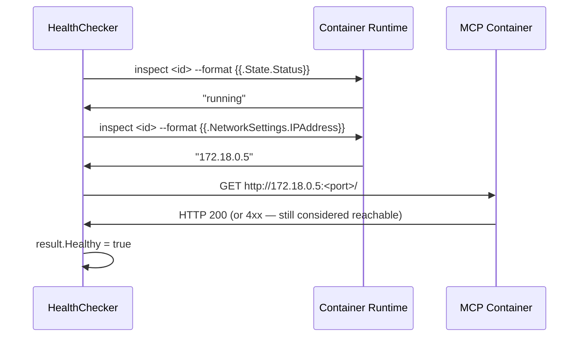

# Skill & MCP Container Sandboxing

<Info>
Every MCP server in AgentArea runs in its own isolated container, scoped to a workspace. No two workspaces share network access, filesystem state, or container processes.
</Info>

## Overview

AgentArea's skill system exposes MCP (Model Context Protocol) server capabilities to agents. Each MCP server instance runs inside a dedicated container managed by the **MCP Manager** — a Go service responsible for the full container lifecycle: creation, health monitoring, automatic restart, and cleanup.

The security model mirrors a VPC architecture: workspace boundaries are enforced at the network, filesystem, and process layers, so a compromised or misbehaving skill container cannot affect other workspaces or the platform control plane.

---

## Isolation Architecture

```
┌──────────────────────────────────────────────────────────┐
│                     AgentArea Platform                   │
│                                                          │
│  ┌─────────────┐        ┌──────────────────────────────┐ │
│  │  Python API  │──────>│       MCP Manager (Go)       │ │
│  │  (FastAPI)   │ Redis │  ┌────────────────────────┐  │ │
│  └─────────────┘ events │  │   Container Manager    │  │ │
│                          │  │  ┌──────────────────┐  │  │ │
│  ┌─────────────┐         │  │  │  ContainerValidator│ │  │ │
│  │  Traefik    │<────────│  │  └──────────────────┘  │  │ │
│  │  (Proxy)    │  labels │  │  ┌──────────────────┐  │  │ │
│  └─────────────┘         │  │  │   HealthChecker  │  │  │ │
│         │                │  │  └──────────────────┘  │  │ │
│         │                │  └────────────────────────┘  │ │
│         ▼                └──────────────────────────────┘ │
│  ┌──────────────────────────────────────────────────────┐ │
│  │              Docker / Podman Runtime                 │ │
│  │                                                      │ │
│  │  ┌─────────────────────┐  ┌─────────────────────┐   │ │
│  │  │   Workspace A net   │  │   Workspace B net   │   │ │
│  │  │  ┌───┐  ┌───┐      │  │  ┌───┐  ┌───┐      │   │ │
│  │  │  │MCP│  │MCP│      │  │  │MCP│  │MCP│      │   │ │
│  │  │  └───┘  └───┘      │  │  └───┘  └───┘      │   │ │
│  │  └─────────────────────┘  └─────────────────────┘   │ │
│  └──────────────────────────────────────────────────────┘ │
└──────────────────────────────────────────────────────────┘
```

---

## Security Model

<CardGroup cols={2}>
  <Card title="Network Isolation" icon="network-wired">
    Each workspace gets its own Docker network. Containers in workspace A cannot reach containers in workspace B.
  </Card>
  <Card title="No Privileged Mode" icon="shield-halved">
    Containers never run with `--privileged`. Resource limits and security defaults follow the principle of least privilege.
  </Card>
  <Card title="Resource Limits" icon="gauge">
    Every container has a configurable memory cap (default `512m`) and CPU quota (default `1.0`). Runaway processes cannot starve the host.
  </Card>
  <Card title="Workspace Scoping" icon="tag">
    Containers are labeled with `workspace_id`. The manager enforces scoping at both creation time and cleanup — orphaned containers from crashed workspaces are reclaimed on restart.
  </Card>
</CardGroup>

---

## Container Lifecycle

<Steps>
  <Step title="Skill Activation">
    When an agent activates a skill that references an MCP server instance, the Python API publishes an `MCPServerInstanceCreated` domain event to Redis.
  </Step>
  <Step title="Pre-launch Validation">
    The MCP Manager receives the event and the `ContainerValidator` performs a dry-run check before any container is started: image existence, port availability, container limits, and resource requirement validation.
  </Step>
  <Step title="Container Creation">
    The `Manager` calls the container runtime with security-hardened arguments — network assignment, resource limits, Traefik routing labels, and workspace labels.
  </Step>
  <Step title="Health Monitoring">
    The `HealthChecker` begins continuous polling. It checks both the runtime process status and the container's HTTP endpoint. On failure the container is automatically restarted.
  </Step>
  <Step title="Skill Deactivation">
    When the skill is detached from an agent or the workspace is deleted, the `MCPServerInstanceDeleted` event triggers container teardown and network cleanup.
  </Step>
</Steps>

---

## Container Runtime Arguments

The MCP Manager builds the container run command programmatically. The following flags are applied to every MCP container:

```go
// internal/container/manager.go — buildContainerRunArgs()
args := []string{"run", "-d"}

// Identity
args = append(args, "--name", container.Name)

// Network isolation — each workspace gets its own network
args = append(args, "--network", m.config.Container.Network)

// Environment variables (secrets resolved from secret manager)
for key, value := range container.Environment {
    args = append(args, "-e", fmt.Sprintf("%s=%s", key, value))
}

// Resource limits
args = append(args, "--memory", m.config.Container.DefaultMemoryLimit) // default: 512m
args = append(args, "--cpus",   m.config.Container.DefaultCPULimit)    // default: 1.0

// Traefik routing labels (auto-discovery, no static config)
args = append(args,
    "--label", "traefik.enable=true",
    "--label", fmt.Sprintf("traefik.http.routers.%s.rule=PathPrefix(`/mcp/%s`)", slug, slug),
    "--label", fmt.Sprintf("traefik.http.routers.%s.entrypoints=mcp", slug),
    "--label", fmt.Sprintf("traefik.http.services.%s.loadbalancer.server.port=%d", slug, port),
)
```

<Warning>
No container is ever started with `--privileged`. Privilege escalation from inside an MCP container is blocked by default.
</Warning>

---

## MCP Server Types

AgentArea supports two MCP server deployment types, both subject to the same container sandboxing rules.

<Tabs>
  <Tab title="Docker type">
    A pre-built container image serves the MCP protocol directly over HTTP. You supply the image and port; the manager handles the rest.

    ```json
    {
      "type": "docker",
      "image": "mcp/filesystem:latest",
      "port": 8001,
      "environment": {
        "ALLOWED_DIRECTORIES": "/tmp,/var/tmp",
        "API_KEY": "secret_ref:instance_123:API_KEY"
      },
      "resources": {
        "memory_limit": "256m",
        "cpu_limit": "0.5"
      }
    }
    ```

    The `ContainerValidator` checks that the image exists locally or can be pulled before the container is created. Images that are neither local nor pullable are rejected at validation time, before any runtime resources are allocated.
  </Tab>
  <Tab title="Command type">
    A stdio-based MCP command (e.g. an `npx` or `uvx` package) is automatically wrapped in the **supergateway** sandbox image (`supercorp/supergateway:latest`). This converts the stdio transport to HTTP without requiring a custom image.

    ```json
    {
      "type": "command",
      "command": "npx",
      "args": ["-y", "@modelcontextprotocol/server-filesystem", "/tmp"]
    }
    ```

    The manager resolves this to:

    ```go
    // internal/container/manager.go — ResolveContainerSpec()
    const sandboxImage = "docker.io/supercorp/supergateway:latest"

    command = []string{
        "--stdio", "npx -y @modelcontextprotocol/server-filesystem /tmp",
        "--port",  "8811",
        "--host",  "0.0.0.0",
    }
    ```

    The supergateway image includes Node.js and `npx`, so npm-based MCP servers work out of the box. No image validation is performed for command-type specs since the sandbox image is fixed.
  </Tab>
</Tabs>

---

## Pre-launch Validation

Before any container starts, `ContainerValidator.DryRunValidation()` runs a series of checks:

| Check | What it does |
|-------|-------------|
| **JSON spec structure** | Validates required fields (`image`+`port` for docker, `command` for command type) |
| **Image existence** | Verifies the image is local or can be pulled; rejects unknown images |
| **Container limit** | Enforces `MAX_CONTAINERS` (default `50`) per manager instance |
| **Resource requirements** | Validates `memory_limit` and `cpu_limit` format if provided |
| **Name collision** | Rejects specs that would create a container with a duplicate name |

```go
// ContainerValidator — DryRunValidationWithLimits()
if currentRunningCount >= maxContainers {
    result.Errors = append(result.Errors,
        fmt.Sprintf("Container limit reached: %d/%d", currentRunningCount, maxContainers))
    result.Valid = false
}
```

A `ValidationResult` is returned with `valid`, `errors`, `warnings`, `image_exists`, `can_pull`, and `estimated_size`. The container is only created when `valid == true`.

---

## Health Monitoring

The `HealthChecker` runs continuously for every managed container. Each check combines a runtime-level status query and an HTTP liveness probe.

```go
// internal/container/health.go — PerformHealthCheck()
type HealthCheckResult struct {
    ContainerID   string
    Healthy       bool
    Status        ContainerStatus   // running | starting | stopping | stopped | error
    HTTPReachable bool
    ResponseTime  time.Duration
    Error         string
    Timestamp     time.Time
    Details       map[string]interface{}
}
```

### Health Check Flow



<Note>
HTTP status codes below 500 are treated as healthy. MCP servers commonly return `403` or `405` on a bare `GET /` — these are valid responses that confirm the server is up and listening.
</Note>

### Automatic Restart

The manager's `autoRestartContainers` routine scans for containers that should be running but have stopped. Any container with status `stopped` or `error` that is still registered in the manager is automatically restarted:

```go
// internal/container/manager.go — restartContainer()
func (m *Manager) restartContainer(ctx context.Context, container *models.Container) error {
    // Rebuild the run args and re-execute the container runtime
    args := m.buildContainerRunArgs(container)
    cmd := exec.CommandContext(ctx, m.config.Container.Runtime, args...)
    // ...
}
```

Status transitions are published back to Redis so the Python API and any connected SSE clients see up-to-date health state.

---

## Workspace Isolation Details

### Network Scoping

All MCP containers for a workspace are placed on the same Docker network (`MCP_NETWORK`, default `agentarea_default`). Network policies prevent cross-workspace container communication:

- Containers in workspace A cannot initiate connections to containers in workspace B.
- The Traefik reverse proxy is the only ingress point; direct container-to-container access from outside the workspace network is not possible.

### Label-based Ownership

Every container is labeled at creation time with management metadata:

```
traefik.enable=true
traefik.http.routers.<slug>.rule=PathPrefix(`/mcp/<slug>`)
traefik.http.routers.<slug>.entrypoints=mcp
traefik.http.services.<slug>.loadbalancer.server.port=<port>
```

The manager uses the `CONTAINER_MANAGED_BY_LABEL` label (default `mcp-manager`) to identify and reclaim its own containers. On startup, containers with this label that are not in the in-memory registry are reconciled — either reattached or cleaned up.

### Orphan Cleanup

When the MCP Manager restarts, it queries the container runtime for all containers bearing its management label. Containers with no corresponding database record are treated as orphans and removed. This prevents runaway containers from accumulating across service restarts.

---

## Warm Pool Integration

<Info>
The warm pool pre-allocates containers so that skill activation is near-instant. See the [Warm Pool](/warm-pool) page for timing details.
</Info>

Pre-warmed containers follow the same security profile as on-demand containers. The pool manager assigns a workspace label and network at activation time, not at pre-creation time, so a warm container carries no workspace identity until it is claimed.

---

## Configuration Reference

### Environment Variables

| Variable | Default | Description |
|----------|---------|-------------|
| `CONTAINER_RUNTIME` | `docker` | Container runtime binary (`docker` or `podman`) |
| `MCP_NETWORK` | `agentarea_default` | Docker network for MCP containers |
| `CONTAINER_NAME_PREFIX` | `mcp-` | Prefix applied to all managed container names |
| `CONTAINER_MANAGED_BY_LABEL` | `mcp-manager` | Label used to identify managed containers |
| `MAX_CONTAINERS` | `50` | Maximum concurrent containers per manager instance |
| `DEFAULT_MEMORY_LIMIT` | `512m` | Default container memory cap |
| `DEFAULT_CPU_LIMIT` | `1.0` | Default container CPU quota (cores) |
| `STARTUP_TIMEOUT` | `120s` | Time allowed for a container to reach running state |
| `SHUTDOWN_TIMEOUT` | `30s` | Graceful shutdown window before forced stop |

### Per-instance Resource Override

Resource limits set in `json_spec.resources` override the manager-level defaults for that specific instance:

```json
{
  "type": "docker",
  "image": "mcp/heavyweight-tool:latest",
  "port": 8080,
  "resources": {
    "memory_limit": "2g",
    "cpu_limit": "2.0"
  }
}
```

---

## Skills System Integration

Skills are the user-facing abstraction over MCP server instances. The connection between them follows a simple lifecycle:

1. A **Skill** is created and associated with an MCP server definition.
2. When a skill is **attached to an agent**, the underlying `MCPServerInstance` is activated — triggering container creation via the event pipeline.
3. The **skill membership model** (`agent_skills` table) controls which agents can invoke which skills, enforcing access at the API layer before any container interaction occurs.
4. When the skill is **detached** or the workspace is deleted, the container is stopped and removed.

```
Agent ──attaches──> Skill ──references──> MCPServerInstance
                                                │
                                           Redis event
                                                │
                                          MCP Manager
                                                │
                                        Docker container
                                   (workspace-isolated network)
```

---

## Security Summary

| Control | Mechanism |
|---------|-----------|
| **No privileged containers** | `--privileged` is never passed to the runtime |
| **Network isolation** | Per-workspace Docker networks; cross-workspace routing is blocked |
| **Resource limits** | Hard `--memory` and `--cpus` caps on every container |
| **Image validation** | Pre-launch check rejects unknown or unpullable images |
| **Container quotas** | `MAX_CONTAINERS` limit enforced before creation |
| **Secret isolation** | Secrets stored as references; resolved to actual values only at container runtime |
| **Orphan cleanup** | Manager-labeled containers without a DB record are removed on startup |
| **Reverse proxy only** | Traefik is the sole ingress; MCP container ports are not exposed to the host |

---

## Next Steps

<CardGroup cols={2}>
  <Card title="Warm Pool" icon="bolt" href="/warm-pool">
    Pre-warm containers to reduce skill activation latency from seconds to milliseconds.
  </Card>
  <Card title="MCP Integration" icon="plug" href="/mcp-integration">
    Configure MCP servers, environment schemas, and secret references.
  </Card>
  <Card title="Secrets Management" icon="key" href="/secrets-management">
    How credentials are stored as references and resolved at container runtime.
  </Card>
  <Card title="Monitoring" icon="chart-line" href="/monitoring">
    Container health metrics, Prometheus integration, and alerting.
  </Card>
</CardGroup>
