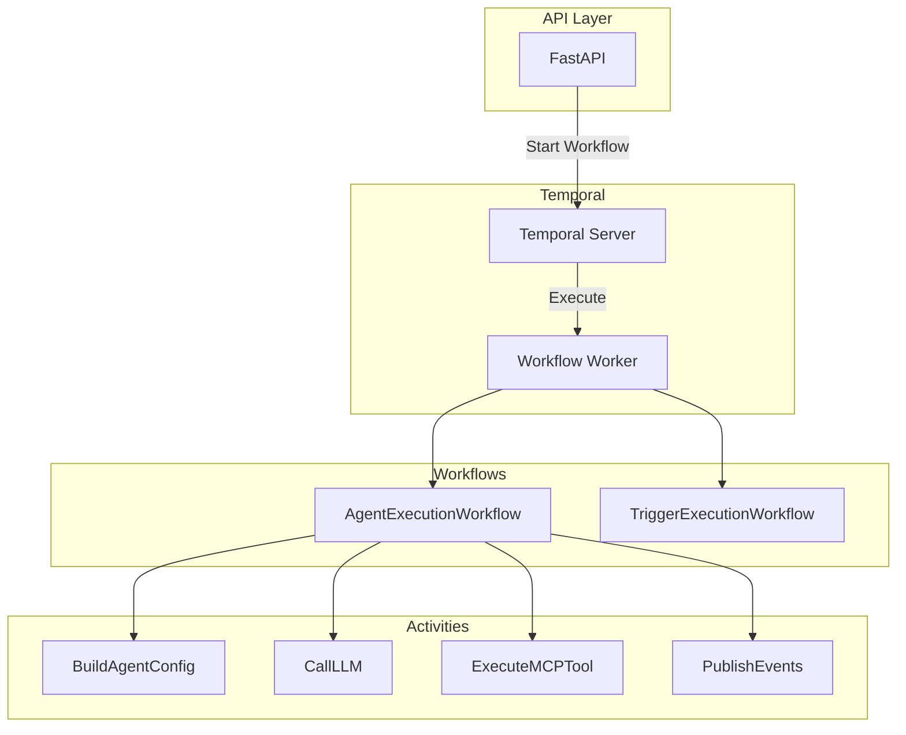
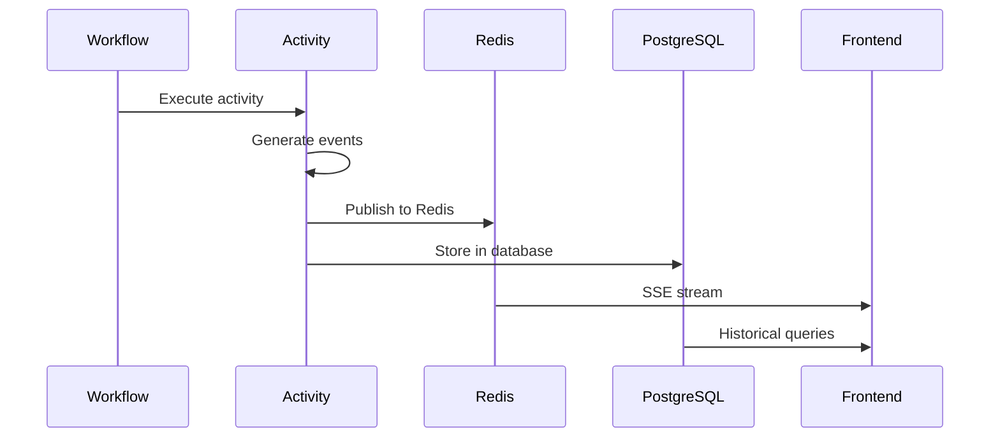

# Temporal Workflows

<Info>
AgentArea uses Temporal.io for durable, distributed workflow execution. This enables long-running agent tasks with fault tolerance, checkpointing, and real-time control.
</Info>

## Overview

Temporal provides the execution backbone for AgentArea agents:

- **Durable Execution**: Workflows survive process failures
- **Long-Running**: Tasks can run for hours or days
- **Fault Tolerance**: Automatic retries and recovery
- **Real-Time Control**: Signals and queries for workflow interaction

---

## Architecture

### Components



### Service Structure

```
agentarea-platform/
├── apps/worker/agentarea_worker/     # Temporal worker
├── libs/execution/agentarea_execution/
│   ├── workflows/
│   │   ├── agent_execution_workflow.py
│   │   └── trigger_execution_workflow.py
│   └── activities/
│       ├── agent_execution_activities.py
│       └── event_publisher.py
```

---

## Agent Execution Workflow

The main workflow for agent task execution:

### Workflow Definition

```python
@workflow.defn
class AgentExecutionWorkflow:
    def __init__(self):
        self.state = WorkflowState()
        self.event_manager = EventManager()
        self.budget_tracker = BudgetTracker()
        self._paused = False
        self._pause_reason = None

    @workflow.run
    async def run(self, request: AgentExecutionRequest) -> AgentExecutionResult:
        try:
            # 1. Initialize
            await self._initialize_workflow(request)
            await self._initialize_agent_config(request)
            
            # 2. Main execution loop
            result = await self._execute_main_loop(request)
            
            # 3. Finalize
            return await self._finalize_execution(result)
            
        except Exception as e:
            return await self._handle_workflow_error(e)
```

### Signals (Real-Time Control)

```python
@workflow.signal
async def pause_execution(self, reason: str) -> None:
    """Pause workflow execution."""
    self._paused = True
    self._pause_reason = reason
    await self._publish_event(EventTypes.WORKFLOW_PAUSED, {
        "reason": reason
    })

@workflow.signal
async def resume_execution(self, reason: str) -> None:
    """Resume workflow execution."""
    self._paused = False
    self._pause_reason = None
    await self._publish_event(EventTypes.WORKFLOW_RESUMED, {
        "reason": reason
    })
```

### Queries (State Inspection)

```python
@workflow.query
def get_current_state(self) -> dict:
    """Query current workflow state."""
    return {
        "status": self.state.status,
        "iteration": self.state.current_iteration,
        "budget": self.budget_tracker.get_status(),
        "paused": self._paused,
    }

@workflow.query
def get_workflow_events(self) -> list[dict]:
    """Query all workflow events."""
    return self.event_manager.events
```

---

## Main Execution Loop

### Loop Structure

```python
async def _execute_main_loop(self, request: AgentExecutionRequest) -> ExecutionResult:
    while True:
        # Check for pause
        if self._paused:
            await workflow.wait_condition(lambda: not self._paused)
        
        # Check termination conditions
        should_continue, reason = await self._should_continue_execution()
        if not should_continue:
            return ExecutionResult(
                status=ExecutionStatus.COMPLETED,
                termination_reason=reason
            )
        
        # Execute iteration
        await self._execute_iteration(request)
        
        # Increment iteration counter
        self.state.current_iteration += 1
```

### Termination Conditions

```python
async def _should_continue_execution(self) -> tuple[bool, str]:
    # Goal achieved
    if self.state.goal_achieved:
        return False, "goal_achieved"
    
    # Budget exceeded
    if self.budget_tracker.is_exceeded():
        return False, "budget_exceeded"
    
    # Max iterations reached
    if self.state.current_iteration >= self.state.max_iterations:
        return False, "max_iterations_reached"
    
    # Timeout exceeded
    if self._execution_time() > self.state.timeout_seconds:
        return False, "timeout_exceeded"
    
    return True, ""
```

---

## Activities

Activities are the units of work within workflows.

### Activity Factory Pattern

```python
def make_agent_activities(dependencies: ActivityDependencies) -> list:
    @activity.defn
    async def build_agent_config_activity(
        request: AgentConfigRequest
    ) -> AgentConfigResult:
        agent = await dependencies.agent_service.get(request.agent_id)
        skills = await dependencies.skill_service.list(request.skill_ids)
        
        return AgentConfigResult(
            agent=agent,
            skills=skills,
            system_prompt=build_system_prompt(agent, skills)
        )

    @activity.defn
    async def call_llm_activity(request: LLMRequest) -> LLMResult:
        # Execute LLM call
        response = await dependencies.llm_client.chat(
            model=request.model,
            messages=request.messages,
            tools=request.tools
        )
        
        return LLMResult(
            content=response.content,
            tool_calls=response.tool_calls,
            usage=response.usage
        )

    @activity.defn
    async def execute_mcp_tool_activity(
        request: MCPToolRequest
    ) -> MCPToolResult:
        # Check approval requirement
        if request.requires_approval:
            # Wait for approval signal
            # ...
            pass
        
        # Execute tool
        result = await dependencies.mcp_client.execute(
            server_id=request.server_id,
            tool_name=request.tool_name,
            arguments=request.arguments
        )
        
        return MCPToolResult(
            success=True,
            output=result
        )

    return [
        build_agent_config_activity,
        call_llm_activity,
        execute_mcp_tool_activity,
    ]
```

### Activity Execution

```python
async def _call_llm(self, messages: list[dict], tools: list[dict]) -> LLMResult:
    request = LLMRequest(
        model=self.state.model,
        messages=messages,
        tools=tools
    )
    
    result: LLMResult = await workflow.execute_activity(
        "call_llm_activity",
        args=[request],
        start_to_close_timeout=timedelta(seconds=120),
        retry_policy=RetryPolicy(
            maximum_attempts=3,
            backoff_coefficient=2.0,
        )
    )
    
    # Track usage
    self.budget_tracker.add_tokens(result.usage.total_tokens)
    
    return result
```

---

## Event Publishing

### Event Flow



### Event Types

```python
class EventType(Enum):
    # Workflow lifecycle
    WORKFLOW_STARTED = "workflow.started"
    WORKFLOW_COMPLETED = "workflow.completed"
    WORKFLOW_FAILED = "workflow.failed"
    
    # Iteration events
    ITERATION_STARTED = "iteration.started"
    ITERATION_COMPLETED = "iteration.completed"
    
    # LLM events
    LLM_CALL_STARTED = "llm_call.started"
    LLM_CALL_CHUNK = "llm_call.chunk"
    LLM_CALL_COMPLETED = "llm_call.completed"
    LLM_CALL_FAILED = "llm_call.failed"
    
    # Tool events
    TOOL_CALL_STARTED = "tool_call.started"
    TOOL_CALL_COMPLETED = "tool_call.completed"
    TOOL_CALL_FAILED = "tool_call.failed"
    
    # Approval events
    HUMAN_APPROVAL_REQUESTED = "human_approval.requested"
    HUMAN_APPROVAL_RECEIVED = "human_approval.received"
    
    # Budget events
    BUDGET_WARNING = "budget.warning"
    BUDGET_EXCEEDED = "budget.exceeded"
```

### Event Publishing Activity

```python
@activity.defn
async def publish_workflow_events_activity(
    request: WorkflowEventsRequest
) -> None:
    # 1. Store in database
    for event in request.events:
        await db.execute(
            insert(task_events).values(
                task_id=request.task_id,
                event_type=event.type,
                event_data=event.data,
                created_at=datetime.utcnow()
            )
        )
    
    # 2. Publish to Redis for real-time streaming
    await redis.publish(
        f"task:{request.task_id}:events",
        json.dumps([e.dict() for e in request.events])
    )
```

---

## Worker Configuration

### Worker Setup

```python
# apps/worker/agentarea_worker/main.py
async def run_worker():
    client = await Client.connect(settings.TEMPORAL_SERVER_URL)
    
    # Create activities with dependencies
    activities = make_agent_activities(dependencies)
    
    # Run worker
    async with Worker(
        client,
        task_queue=settings.TEMPORAL_TASK_QUEUE,
        workflows=[AgentExecutionWorkflow, TriggerExecutionWorkflow],
        activities=activities,
    ):
        await asyncio.Future()  # Run forever
```

### Worker Configuration

```yaml
# Environment variables
TEMPORAL_SERVER_URL=localhost:7233
TEMPORAL_NAMESPACE=default
TEMPORAL_TASK_QUEUE=agent-tasks

# Worker options
TEMPORAL_MAX_CONCURRENT_WORKFLOWS=100
TEMPORAL_MAX_CONCURRENT_ACTIVITIES=200
```

---

## Best Practices

<Accordion>
  <AccordionItem title="Workflow Design">
    - Keep workflows deterministic
    - Use activities for side effects
    - Avoid long-running activities
    - Handle timeouts gracefully
  </AccordionItem>
  
  <AccordionItem title="Activity Design">
    - Make activities idempotent
    - Use appropriate timeouts
    - Return meaningful errors
    - Log activity progress
  </AccordionItem>
  
  <AccordionItem title="Error Handling">
    - Define retry policies
    - Use non-retryable error types
    - Implement compensation logic
    - Log all failures
  </AccordionItem>
</Accordion>

---

## Monitoring

### Workflow Metrics

```yaml
# Prometheus metrics
temporal_workflow_started_total{type="agent_execution"} 1523
temporal_workflow_completed_total{type="agent_execution"} 1498
temporal_workflow_failed_total{type="agent_execution"} 25
temporal_workflow_duration_seconds{type="agent_execution", quantile="0.99"} 342.5

temporal_activity_execution_total{name="call_llm"} 4521
temporal_activity_failed_total{name="call_llm"} 12
```

### Temporal Web UI

Access the Temporal Web UI at `http://localhost:8080` to:
- View running workflows
- Debug failed executions
- Query workflow state
- Signal/Cancel workflows

---

## Next Steps

<CardGroup cols={2}>
  <Card title="Building Agents" icon="bot" href="/building-agents">
    Create agents that use workflows
  </Card>
  <Card title="Event Triggers" icon="bolt" href="/event-triggers">
    Trigger workflows from events
  </Card>
</CardGroup>
