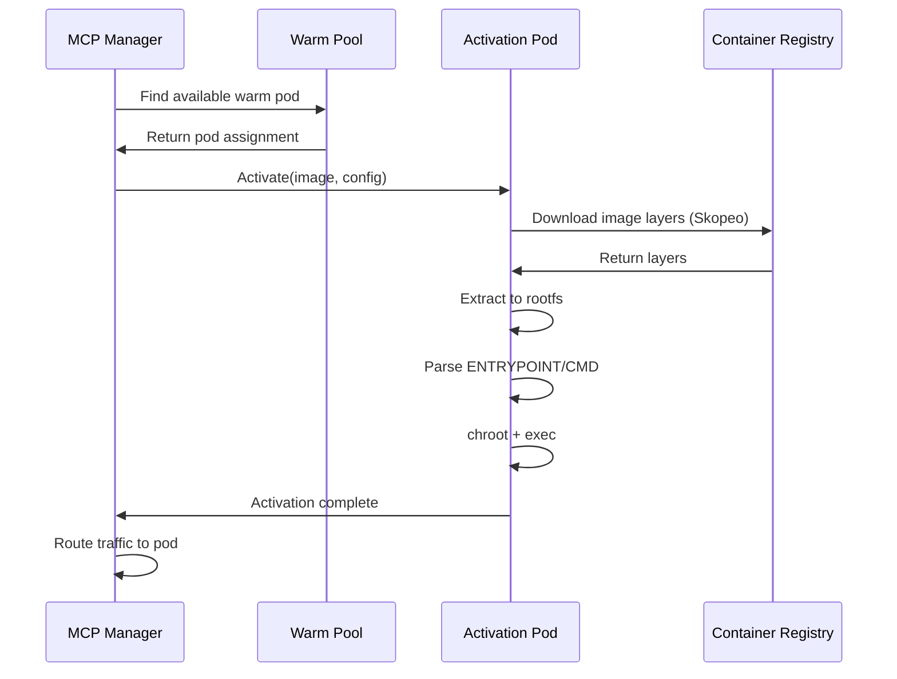

# Warm Pool Fast Activation

<Info>
~10x faster MCP server cold starts using warm pool technology. Activate containers in ~1.3s instead of 8-15s.
</Info>

## Overview

The warm pool system pre-provisions container pods that can be rapidly activated with MCP server images. This dramatically reduces cold start latency for on-demand MCP tool execution.

| Metric | Standard Cold Start | Warm Pool Activation |
|--------|---------------------|----------------------|
| Total Time | 8-15 seconds | ~1.3 seconds |
| Container Creation | 3-5s | 0s (pre-created) |
| Image Pull | 5-10s | ~1s (layer extraction) |
| Process Start | 1-2s | ~0.3s |

---

## How It Works

### Activation Flow



### Timing Breakdown

| Phase | Time | Description |
|-------|------|-------------|
| Find Warm Pod | ~100ms | Select available pod from pool |
| Assign Pod | ~50ms | Mark pod as in-use |
| Download Image | ~800ms | Skopeo pulls image layers |
| Extract Layers | ~300ms | Extract to container rootfs |
| Start Process | ~100ms | chroot + exec ENTRYPOINT |
| **Total** | **~1.3s** | Full activation time |

---

## Architecture

### Components

```
agentarea-mcp-manager/
├── cmd/
│   ├── mcp-manager/         # Main API service
│   └── activation-service/  # Runs inside warm pool pods
├── internal/
│   ├── warmpool/           # Pool management client
│   ├── container/          # Container lifecycle
│   └── backends/           # Kubernetes backend
```

### Warm Pool DaemonSet

Warm pool pods are deployed as a Kubernetes DaemonSet:

```yaml
apiVersion: apps/v1
kind: DaemonSet
metadata:
  name: mcp-warm-pool
  namespace: agentarea
spec:
  selector:
    matchLabels:
      app: mcp-activation
  template:
    spec:
      containers:
      - name: activation-service
        image: agentarea/mcp-runner:latest
        ports:
        - containerPort: 8080
        securityContext:
          privileged: true  # Required for chroot
        volumeMounts:
        - name: container-storage
          mountPath: /var/lib/containers
        - name: image-cache
          mountPath: /var/lib/images
      volumes:
      - name: container-storage
        emptyDir: {}
      - name: image-cache
        persistentVolumeClaim:
          claimName: image-cache-pvc
```

### Activation Service

The activation service runs inside each warm pod:

```go
// cmd/activation-service/main.go
func main() {
    http.HandleFunc("/activate", handleActivation)
    http.HandleFunc("/health", handleHealth)
    http.ListenAndServe(":8080", nil)
}

func handleActivation(w http.ResponseWriter, r *http.Request) {
    var req ActivationRequest
    json.NewDecoder(r.Body).Decode(&req)
    
    // 1. Download image using Skopeo
    err := downloadImage(req.Image, req.InstanceID)
    
    // 2. Extract layers to rootfs
    err = extractLayers(req.InstanceID)
    
    // 3. Parse ENTRYPOINT/CMD from config
    entrypoint, cmd := parseImageConfig(req.InstanceID)
    
    // 4. Apply user overrides
    if req.Entrypoint != nil {
        entrypoint = req.Entrypoint
    }
    if req.Command != nil {
        cmd = req.Command
    }
    
    // 5. Execute via chroot
    cmd := exec.Command(entrypoint[0], append(entrypoint[1:], cmd...)...)
    cmd.SysProcAttr = &syscall.SysProcAttr{
        Chroot: filepath.Join("/var/lib/containers", req.InstanceID),
    }
    cmd.Start()
    
    json.NewEncoder(w).Encode(ActivationResponse{
        Status:  "running",
        PID:     cmd.Process.Pid,
    })
}
```

---

## Configuration

### Feature Flags

Enable warm pool via feature flags:

```bash
# Environment variables
MCP_FEATURES_ENABLED=warm_pool,gateway_api,state_reconciler
WARM_POOL_ENABLED=true
WARM_POOL_SIZE=10
```

### Helm Values

```yaml
# charts/agentarea/values.yaml
mcpManager:
  warmPool:
    enabled: true
    size: 10
    image: agentarea/mcp-runner:latest
    
  features:
    enabled:
      - warm_pool
      - gateway_api
      - state_reconciler
```

### Configuration Options

| Variable | Default | Description |
|----------|---------|-------------|
| `WARM_POOL_ENABLED` | `false` | Enable warm pool |
| `WARM_POOL_SIZE` | `10` | Number of pre-provisioned pods |
| `WARM_POOL_NAMESPACE` | `agentarea` | Kubernetes namespace |
| `IMAGE_CACHE_SIZE` | `10Gi` | Persistent cache for images |

---

## Image Handling

### Skopeo Integration

Images are downloaded using Skopeo for efficient layer handling:

```go
func downloadImage(imageRef, instanceID string) error {
    destDir := filepath.Join("/var/lib/images", instanceID)
    
    cmd := exec.Command("skopeo", 
        "copy",
        "--dest-tls-verify=false",
        "docker://"+imageRef,
        "dir://"+destDir,
    )
    
    return cmd.Run()
}
```

### Layer Extraction

```go
func extractLayers(instanceID string) error {
    imageDir := filepath.Join("/var/lib/images", instanceID)
    rootfsDir := filepath.Join("/var/lib/containers", instanceID)
    
    // Read manifest
    manifest, _ := os.ReadFile(filepath.Join(imageDir, "manifest.json"))
    
    // Extract each layer
    for _, layer := range manifest.Layers {
        layerPath := filepath.Join(imageDir, layer)
        cmd := exec.Command("tar", "-xf", layerPath, "-C", rootfsDir)
        cmd.Run()
    }
    
    return nil
}
```

### ENTRYPOINT/CMD Parsing

```go
func parseImageConfig(instanceID string) ([]string, []string) {
    configPath := filepath.Join("/var/lib/images", instanceID, "config.json")
    
    var config ImageConfig
    data, _ := os.ReadFile(configPath)
    json.Unmarshal(data, &config)
    
    return config.Config.Entrypoint, config.Config.Cmd
}
```

---

## Pool Management

### Pod Selection

```go
// internal/warmpool/client.go
func (c *Client) FindAvailablePod() (*Pod, error) {
    pods, err := c.listPods()
    if err != nil {
        return nil, err
    }
    
    for _, pod := range pods {
        if pod.Status == "available" {
            return &pod, nil
        }
    }
    
    return nil, ErrNoAvailablePods
}

func (c *Client) AssignPod(podID, instanceID string) error {
    return c.k8sClient.PatchPod(podID, map[string]interface{}{
        "metadata.labels": map[string]string{
            "instance-id": instanceID,
            "status":      "in-use",
        },
    })
}
```

### State Reconciliation

The state reconciler ensures pool health:

```go
// Runs in background
func (r *StateReconciler) Reconcile() {
    ticker := time.NewTicker(30 * time.Second)
    for range ticker.C {
        // Check pool size
        currentSize := r.countAvailablePods()
        if currentSize < r.targetSize {
            r.scaleUp(r.targetSize - currentSize)
        }
        
        // Clean up stale pods
        r.cleanupStalePods()
    }
}
```

---

## Security Considerations

<Warning>
Warm pool pods run with `privileged: true` for chroot capability.
</Warning>

### Security Measures

| Measure | Description |
|---------|-------------|
| **No Docker Socket** | Uses Skopeo + direct execution, no Docker daemon |
| **Namespace Isolation** | Pods in dedicated Kubernetes namespace |
| **RBAC** | Limited permissions for activation service |
| **Image Verification** | Optional image signature verification |
| **Network Policies** | Restrict pod network access |

### Best Practices

1. **Limit pool access** - Only MCP Manager can activate pods
2. **Image allowlist** - Restrict which images can be activated
3. **Resource limits** - Set CPU/memory limits on activation pods
4. **Audit logging** - Log all activation requests
5. **Regular rotation** - Periodically recycle warm pods

---

## Monitoring

### Metrics

```yaml
# Prometheus metrics
mcp_warmpool_available_pods{namespace="agentarea"} 8
mcp_warmpool_activation_duration_seconds{quantile="0.99"} 1.3
mcp_warmpool_activation_errors_total 3
mcp_warmpool_image_pull_duration_seconds{quantile="0.99"} 0.8
```

### Health Checks

```bash
# Check warm pool status
kubectl get pods -n agentarea -l app=mcp-activation

# Check activation service health
kubectl exec -n agentarea mcp-warm-pool-xxx -- curl localhost:8080/health
```

---

## Troubleshooting

### Common Issues

<Accordion>
  <AccordionItem title="No Available Pods">
    **Symptoms**: Activation fails with "no available pods"
    
    **Causes**:
    - Pool size too small
    - Pods stuck in activation
    - DaemonSet not running
    
    **Solutions**:
    ```bash
    # Check pod status
    kubectl get pods -n agentarea -l app=mcp-activation
    
    # Increase pool size
    kubectl patch daemonset mcp-warm-pool -n agentarea \
      --type='json' -p='[{"op": "replace", "path": "/spec/template/spec/replicas", "value":20}]'
    ```
  </AccordionItem>
  
  <AccordionItem title="Activation Timeout">
    **Symptoms**: Activation takes longer than expected
    
    **Causes**:
    - Large image size
    - Slow registry connection
    - Insufficient resources
    
    **Solutions**:
    ```bash
    # Check image cache
    kubectl exec -n agentarea mcp-warm-pool-xxx -- ls -la /var/lib/images
    
    # Check resource usage
    kubectl top pods -n agentarea
    ```
  </AccordionItem>
</Accordion>

---

## Next Steps

<CardGroup cols={2}>
  <Card title="MCP Integration" icon="plug" href="/mcp-integration">
    Configure MCP servers
  </Card>
  <Card title="Deployment" icon="server" href="/deployment">
    Deploy to Kubernetes
  </Card>
</CardGroup>
