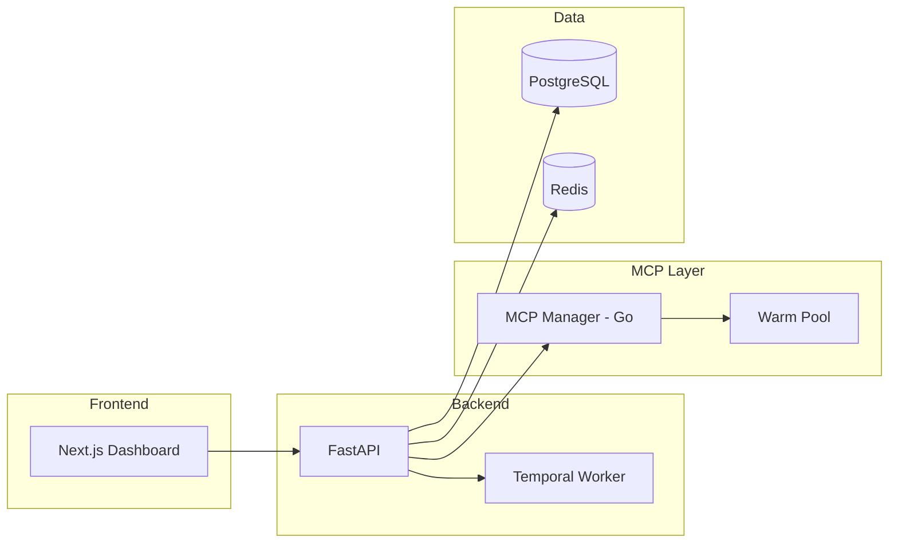

# Welcome to AgentArea

<Info>
The open-core platform for building **governed agentic networks**. Create multi-agent systems with VPC-inspired architecture, built-in compliance controls, and native A2A communication.
</Info>

<CardGroup cols={2}>
  <Card title="⚡ Quick Start" icon="rocket" href="/getting-started">
    Get AgentArea running in 5 minutes
  </Card>
  <Card title="🤖 Build Your First Agent" icon="bot" href="/building-agents">
    Create a working AI agent
  </Card>
</CardGroup>

---

## What is AgentArea?

AgentArea is an open-core platform purpose-built for **agentic networks** and **agent governance**.

Unlike single-agent frameworks, AgentArea provides:

- **🌐 VPC-Inspired Networks**: Isolated agent groups with granular permissions
- **🛡️ Governance Controls**: Tool approvals, budget limits, audit trails
- **🔗 A2A Protocol**: Native agent-to-agent communication
- **⚡ Production Infrastructure**: Temporal workflows, Kubernetes-native

---

## Core Capabilities

<CardGroup cols={2}>
  <Card title="🌐 Agentic Networks" icon="network-wired" href="/agentic-networks">
    VPC-inspired architecture with isolated agent groups. Configure granular permissions between agents and control inter-agent communication.
  </Card>
  
  <Card title="🛡️ Agent Governance" icon="shield-halved" href="/agent-governance">
    Granular tool permissions with approval workflows. Require human approval for sensitive operations and maintain full audit trails.
  </Card>
  
  <Card title="🔗 A2A Protocol" icon="arrows-turn-to-dots" href="/agent-communication">
    Native agent-to-agent communication. Agents discover, connect, and collaborate. Supports teams, delegation, and hierarchies.
  </Card>
  
  <Card title="⚡ Event Triggers" icon="bolt" href="/event-triggers">
    Fire agents on schedules, webhooks, or events. Build reactive systems that respond to external stimuli in real-time.
  </Card>
  
  <Card title="🔌 MCP Integration" icon="plug" href="/mcp-integration">
    Model Context Protocol for external tools. Warm pool acceleration (~1.3s vs 8-15s cold start). Compound MCPs for complex workflows.
  </Card>
  
  <Card title="🏗️ Production Ready" icon="server" href="/deployment">
    Temporal for durable execution. Kubernetes-native. Multi-LLM via LiteLLM. Multiple secret backends.
  </Card>
</CardGroup>

---

## Architecture



---

## Quick Start

<Steps>
  <Step title="Clone Repository">
    ```bash
    git clone https://github.com/agentarea/agentarea
    cd agentarea
    ```
  </Step>
  
  <Step title="Start Platform">
    ```bash
    make up-dev
    ```
  </Step>
  
  <Step title="Access Dashboard">
    Open http://localhost:3000 in your browser
  </Step>
</Steps>

<Note>
**Prerequisites**: Docker & Docker Compose required. See [Getting Started](/getting-started) for detailed setup.
</Note>

---

## Who is AgentArea For?

<Tabs>
  <Tab title="Developers">
    **Build powerful AI agents** with:
    - DDD architecture with clean separation
    - Temporal workflows for durable execution
    - Real-time SSE streaming
    - Type-safe APIs with OpenAPI
  </Tab>
  
  <Tab title="Teams">
    **Collaborate on agent systems** with:
    - Workspace isolation
    - Role-based access control
    - Shared MCP server management
    - Audit trails for compliance
  </Tab>
  
  <Tab title="Enterprises">
    **Deploy at scale** with:
    - Kubernetes-native deployment
    - Multi-cloud support
    - Enterprise auth (Ory Kratos/Hydra)
    - SOC 2 / GDPR ready
  </Tab>
</Tabs>

---

## Documentation

<CardGroup cols={3}>
  <Card title="Getting Started" icon="rocket" href="/getting-started">
    Setup and first agent
  </Card>
  <Card title="Features" icon="sparkles" href="/features">
    All capabilities
  </Card>
  <Card title="Architecture" icon="code" href="/architecture">
    Technical details
  </Card>
  <Card title="Building Agents" icon="bot" href="/building-agents">
    Agent development
  </Card>
  <Card title="MCP Integration" icon="plug" href="/mcp-integration">
    External tools
  </Card>
  <Card title="Deployment" icon="server" href="/deployment">
    Production setup
  </Card>
</CardGroup>

---

## Community & Support

<CardGroup cols={2}>
  <Card title="💬 Discord" icon="discord" href="https://discord.gg/5tduPwheYQ">
    Join our community
  </Card>
  <Card title="🐙 GitHub" icon="github" href="https://github.com/agentarea/agentarea">
    Contribute & report issues
  </Card>
</CardGroup>

---

## License

AgentArea is open-source under the **Apache License 2.0**. The core platform is free to use, with enterprise features available for compliance-critical deployments.

---

<Note>
Ready to build governed agentic networks? [Get started now](/getting-started) or explore our [features](/features)!
</Note>
