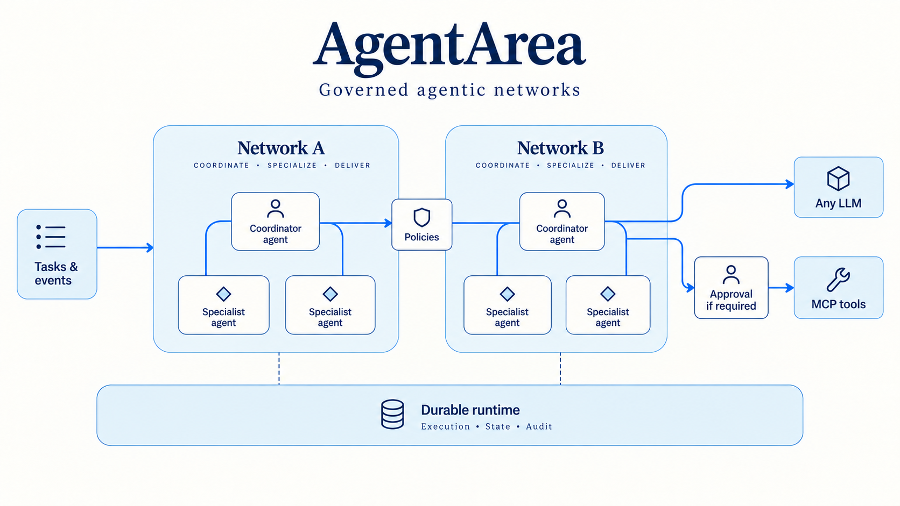

# AgentArea README image concepts

Generated with the built-in image_gen tool. Three conceptual illustrations based on README.md, not literal deployment diagrams. README cover has not been replaced; these are options for selection.

## 01-isometric

### Original prompt

Use case: stylized-concept. Asset type: polished GitHub README explanatory hero illustration for AgentArea, open-source infrastructure for governed agentic networks. Wide landscape 16:9. Communicate isolated agent groups, explicitly permitted inter-agent routes, human approval for sensitive tool actions, shared durable runtime, provider-agnostic LLM and MCP tools. Conceptual illustration, not a literal deployment topology. Large legible English labels, restrained typography, generous whitespace, crisp professional editorial art. No robots, brains, mascots, fake UI screenshots, illegible microtext, watermarks, vendor logos. Style: premium isometric architectural cutaway, tactile frosted glass boundary walls, matte ceramic nodes, delicate blue paths on midnight navy background, white and electric blue accents consistent with a technical infrastructure brand. Three isolated raised network platforms each containing 3-4 agent nodes with internal connections. Two deliberate bridges cross boundaries through small policy gates, never arbitrary connections. A separate human approval station controls the route to MCP tools. All network platforms sit on a broad solid foundation labeled "Durable runtime". External clean modules labeled "Any LLM" and "MCP tools" connect through controlled routes. Title "AgentArea" and subtitle "Governed agentic networks". Other text limited to "Isolated networks", "Policy gates", "Human approval". Elegant depth, precise geometry, restrained glow, not a sci-fi city. Make architecture the visual hero.

## 02-network-map

### Original prompt

Use case: infographic-diagram. Asset type: GitHub README conceptual explanatory image, wide 16:9. Create a beautiful Swiss editorial systems map on warm off-white with dark navy typography and cobalt blue paths. Title "AgentArea"; subtitle "Governed agentic networks". Main composition: two generous rounded rectangular bounded areas labeled "Network A" and "Network B", each containing a coordinator node connected to two specialist agent nodes. A single route across the network boundaries passes through a small gate labeled "Policies". From agents, a route toward a right-hand "MCP tools" module passes through "Human approval". Another connection reaches "Any LLM". A quiet full-width foundation below labeled "Durable runtime" with smaller "Execution • State • Audit". Far-left compact input "Tasks & events" flows into networks. Clear hierarchy, readable at README width, ample empty space, elegantly drawn nodes and understated geometric iconography. Illustrative product architecture, not literal deployment topology. Avoid dense engineering detail, vendor logos, gradients, tiny text, fake metrics, robots, brains and watermarks. All specified text exact. Sophisticated restrained illustrated infographic.

### Final edit prompt

Edit this AgentArea README illustration. Preserve its entire visual style, palette, title, main network layout, agent nodes, policy gates, runtime foundation, and legible labels. Correct ONLY these details: Any LLM must have its own distinct connection directly from the nearest agent network, branching BEFORE the Human approval gate and completely bypassing that gate. Human approval connects ONLY to MCP tools. Make the two routes visibly separate and unambiguous. Rename the gate label to "Approval if required" to clarify approval is policy-driven. Remove all small decorative slogans in the corners or margins; keep only the main title, subtitle and actual architecture labels. No new elements or slogans.

## 03-network-atlas

### Original prompt

Use case: stylized-concept. Asset type: polished GitHub README explanatory hero illustration for AgentArea, open-source infrastructure for governed agentic networks. Wide landscape 16:9. Communicate isolated agent groups, explicitly permitted inter-agent routes, human approval for sensitive tool actions, shared durable runtime, provider-agnostic LLM and MCP tools. Conceptual illustration, not a literal deployment topology. Large legible English labels, restrained typography, generous whitespace, crisp professional editorial art. No robots, brains, mascots, fake UI screenshots, illegible microtext, watermarks, vendor logos. Style: top-down mission-control cartography, a refined dark navy technical atlas with precise thin cobalt/cyan lines and white labels, subtle grid only in limited areas. Three large separated rounded rectangular network territories contain branching agent constellations of geometric nodes. Routes carry a few luminous task packets. Perimeter openings are explicit small policy checkpoints; no crossing routes elsewhere. A human approval checkpoint gates access to an external cluster of tool modules. Beneath the map, a slim continuous infrastructure rail represents durable execution and audit. Composition clear like an expertly art-directed transit map, not tangled space art, not dashboard UI. Title "AgentArea"; subtitle "Governed agentic networks". Only map labels "Agent networks", "Policy checkpoints", "Human approval", "MCP tools", "Any LLM", "Durable execution", "Audit trail". Make the boundaries and permitted paths visually obvious. Restrained cinematic lighting with high readability and generous margins.

### Final edit prompt

Edit this AgentArea README illustration. Preserve its entire visual style, palette, title, main network layout, agent nodes, policy gates, runtime foundation, and legible labels. Correct ONLY these details: Any LLM must have its own distinct connection directly from the nearest agent network, branching BEFORE the Human approval gate and completely bypassing that gate. Human approval connects ONLY to MCP tools. Make the two routes visibly separate and unambiguous. Rename the gate label to "Approval if required" to clarify approval is policy-driven. Remove all small decorative slogans in the corners or margins; keep only the main title, subtitle and actual architecture labels. No new elements or slogans.
