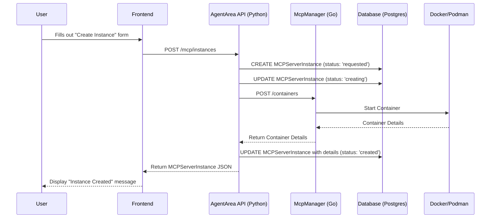

# MCP Server Instance Management Implementation Plan

This document outlines the plan to implement the end-to-end flow for creating and managing MCP server instances, triggered from the frontend.

## 1. High-Level Goal

The primary goal is to allow a user to create a new `mcp-server-instance` from a predefined `mcp-server-specification` (template) through the frontend UI. The request will be handled by the `core/agentarea` backend, which will then communicate with the `go-mcp-manager` service to provision the actual container instance.

## 2. Component Breakdown & Implementation Steps

### Step 1: `core/agentarea` - The Central Controller

The `core/agentarea` Python application will act as the main API and orchestration layer.

#### 1.1. MCP Manager Client (`core/agentarea/modules/mcp/client.py`) - **DONE**

- **Responsibility:** Communicate with the `go-mcp-manager` REST API.
- **Implementation:**
    - Create an `McpManagerClient` class using `httpx`.
    - Implement methods for each `go-mcp-manager` endpoint:
        - `get_templates()` -> `GET /templates`
        - `create_container(service_name, template, ...)` -> `POST /containers`
        - `get_container(service_name)` -> `GET /containers/{service}`
        - `delete_container(service_name)` -> `DELETE /containers/{service}`
    - Implement robust error handling (e.g., custom exceptions for HTTP errors).
    - Use Pydantic models to serialize requests and deserialize responses.
    - Use a singleton pattern (`get_mcp_manager_client`) to reuse the client instance.

#### 1.2. Application Service (`core/agentarea/modules/mcp/application/service.py`) - **DONE**

- **Responsibility:** Contain the business logic for managing server instances.
- **Implementation:**
    - Create an `MCPServerInstanceService` class.
    - Inject the `McpManagerClient` and the `MCPServerInstanceRepository`.
    - Implement the core method `create_instance_from_template(name, template, ...)`:
        1.  Create an `MCPServerInstance` record in the database with `status: 'requested'`.
        2.  Set status to `'creating'`.
        3.  Call `mcp_manager_client.create_container()`.
        4.  On success, update the instance record with the container details (ID, port, URL) and set `status: 'created'`.
        5.  On failure, update the instance record with the error message and set `status: 'failed'`.
    - Implement other methods like `get_instance()`, `list_instances()`, and `delete_instance()`.

#### 1.3. API Handlers (`core/agentarea/modules/mcp/handlers.py`)

- **Responsibility:** Expose the instance management functionality via a REST API.
- **Implementation:**
    - Remove the deprecation notice.
    - Create a new FastAPI `APIRouter`.
    - Define the following endpoints:
        - `POST /mcp/instances`: Creates a new server instance.
            - **Request Body:** A Pydantic model (`MCPServerInstanceCreateRequest`) containing `name`, `template`, `environment`, etc.
            - **Logic:** Calls `MCPServerInstanceService.create_instance_from_template()`.
            - **Response:** The created `MCPServerInstance` details.
        - `GET /mcp/instances`: Lists all server instances.
        - `GET /mcp/instances/{instance_id}`: Gets details for a specific instance.
        - `DELETE /mcp/instances/{instance_id}`: Deletes a server instance.

#### 1.4. API Router Registration (`core/main.py`)

- **Responsibility:** Make the new MCP API endpoints available.
- **Implementation:**
    - Import the router from `handlers.py`.
    - Register it with the main FastAPI app using `app.include_router()`.

### Step 2: `go-mcp-manager` - The Container Provisioner

The `go-mcp-manager` service is largely complete and functional. No major changes are needed, but we rely on its existing API.

- **`POST /containers`:** Expects a `CreateContainerRequest` with `service_name` and `template`. It creates a container and returns its details.
- **`GET /templates`:** Returns a list of available container templates. This can be used to populate the frontend UI.

### Step 3: Frontend Application

- **Responsibility:** Provide the user interface for creating and managing MCP server instances.
- **Implementation:**
    - Create a form for creating a new instance.
        - The "template" field should be a dropdown populated by calling the `core/agentarea` backend, which in turn calls `go-mcp-manager`'s `/templates` endpoint.
        - Allow the user to specify a name and environment variables.
    - On form submission, make a `POST` request to the new `/mcp/instances` endpoint on the `core/agentarea` backend.
    - Display the status of the instances (e.g., "creating", "running", "failed").
    - Provide options to view instance details and delete instances.

## 3. Data Flow Diagram

## 4. Next Steps

1.  **Implement `handlers.py` in `core/agentarea`.**
2.  **Register the new API router in `main.py`.**
3.  Develop the frontend components for instance management.
4.  Thoroughly test the end-to-end flow.
5.  (Future) Deprecate and remove the old event-based creation logic in `MCPServerInstanceService` once the new direct-call method is stable. 